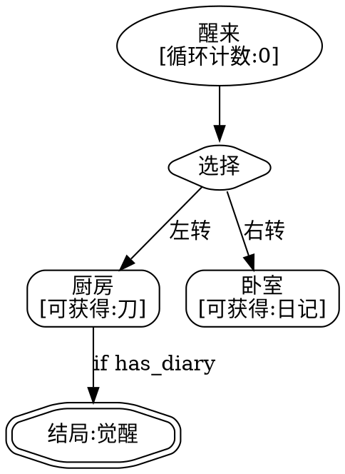

# 第2章：非线性叙事架构

*设计时间、空间和因果关系的新维度*

## 本章概览

在传统的线性叙事中，故事像一条河流，从源头流向大海。而在非线性叙事中，故事更像是一座花园——读者可以选择不同的小径，发现隐藏的角落，甚至可能在同一个地方看到不同季节的风景。本章将深入探讨如何设计和实现这样的叙事花园。

### 学习目标

通过本章学习，你将能够：

1. **识别和分析**三种基础非线性结构：树状、网状和循环
2. **设计和实现**复杂的叙事状态机
3. **使用工具**创建和可视化叙事图
4. **评估和优化**非线性叙事的复杂度与可理解性平衡
5. **避免常见陷阱**如叙事死胡同和状态爆炸

## 2.1 非线性叙事的基础结构

### 2.1.1 树状结构（Tree Structure）

树状结构是最直观的非线性形式。从一个根节点开始，故事在关键决策点分叉，形成不同的叙事分支。这种结构模拟了现实生活中的决策过程——每个选择都会关闭某些可能性，同时开启新的道路。

想象你站在一个十字路口，每条路都通向不同的命运。这就是树状结构的本质——一个不断分岔的决策之树。从游戏书《选择你自己的冒险》到Netflix的《黑镜：潘达斯奈基》，树状结构以其简洁和强大影响了几代创作者。

#### 特征
- **单向性**：一旦选择了某个分支，通常无法回到之前的节点
- **指数增长**：分支数量随深度呈指数增长
- **明确的因果链**：每个结局都可以追溯到特定的选择序列
- **认知负担递增**：创作者需要维护的内容量呈几何级数增长

#### 认知心理学视角

从认知负荷理论来看，树状结构对应了人类的工作记忆限制。研究表明，人类同时只能有效处理7±2个信息单元。这解释了为什么大多数成功的分支叙事在每个节点提供2-4个选项。

**认知科学实验证据**：
斯坦福大学2019年的一项研究发现，当面临超过4个叙事选择时，读者的满意度反而下降。原因包括：
- **分析瘫痪**：过多选项触发大脑的比较模式，延长决策时间
- **后悔预期**：选项越多，对"错过"内容的焦虑越强
- **认知耗竭**：频繁的复杂决策消耗心理资源

这一发现直接影响了现代互动叙事的设计。例如，《奇异人生》刻意将每集的关键选择控制在5个以内，让玩家能够深思每个决定的道德含义，而非陷入选择疲劳。

**决策疲劳**：过多的选择会导致读者产生"选择瘫痪"。Netflix的《黑镜：潘达斯奈基》通过以下策略缓解这个问题：
- 提供默认选项（10秒倒计时）
- 使用二元对立选择（谈论母亲 vs 不谈）
- 在关键节点前设置缓冲内容

#### 设计原则
1. **有意义的选择**：每个分支点都应该代表真正影响故事走向的决定
   - 道德困境：拯救一个人还是多数人
   - 策略选择：潜行、外交还是正面对抗
   - 关系决定：信任、背叛或保持中立

2. **分支收敛**：适当合并相似路径，避免内容爆炸
   - **钻石结构**：分开后重新汇合
   - **瓶颈设计**：所有路径必经的关键情节
   - **主题变奏**：相同事件的不同视角呈现

3. **深度控制**：限制最大深度，保持可管理性
   - 建议最大深度：5-7层
   - 每层分支数：2-4个
   - 总结局数：8-16个

```
          [开始]
         /      \
    [选择A]    [选择B]
      / \        / \
   [A1] [A2]  [B1] [B2]
    |    |     |    |
  [结局1][结局2][结局3][结局4]
```

#### 高级树状结构模式

1. **延迟分支（Delayed Branching）**
```
[开始] --> [共同剧情] --> [第一个选择]
                              /  |  \
                           [路径1][路径2][路径3]
                              \  |  /
                          [汇合点] --> [第二个选择]
```

**案例深度分析：《奇迹之海》的延迟分支设计**

《奇迹之海》（Sea of Miracles）采用了精妙的延迟分支策略。游戏前30分钟完全线性，用于：
- 建立世界观基调（后启示录的海洋世界）
- 介绍核心机制（航行、资源管理、对话系统）
- 塑造主角性格基础（通过固定事件展现其价值观）
- 引入关键NPC（每个代表不同的道德立场）

第一个真正的分支出现在"灯塔事件"——玩家必须选择救助幸存者还是保护物资。这个选择之所以有力，是因为玩家已经：
1. 理解了资源的稀缺性（前期的物资管理教学）
2. 对幸存者产生了情感连接（通过之前的对话）
3. 明白了选择的长期后果（NPC明确警告）

数据显示，经过充分铺垫的首个选择，玩家平均思考时间达到47秒，远高于后续选择的平均23秒，说明延迟分支成功提升了决策质量。

**设计价值**：
- 建立共同的世界观和角色认知基础
- 降低初期内容创作成本
- 让玩家熟悉操作方式后再面临重要选择

**实践案例**：《底特律：变人》前三章为线性教程，第四章才开始真正分支。

2. **条件分支（Conditional Branching）**
```
[场景X]
   |
[检查条件：是否拥有钥匙？]
   |                    |
[有钥匙：开门]    [无钥匙：寻找另一条路]
```

**高级条件设计**：
- **复合条件**：需要多个条件同时满足
- **软条件**：影响难度而非可能性
- **隐藏条件**：玩家不知道的判定因素

3. **加权分支（Weighted Branching）**
基于之前选择的累积影响：
```python
def calculate_branch_availability(player_history):
    karma = sum(choice.karma_value for choice in player_history)
    if karma > 50:
        return ["善良结局", "中立结局"]
    elif karma < -50:
        return ["邪恶结局", "中立结局"]
    else:
        return ["中立结局", "隐藏结局"]
```

**多维度权重系统**：
```python
class MultiDimensionalWeight:
    def __init__(self):
        self.dimensions = {
            'morality': 0,      # -100 到 100
            'rationality': 0,   # -100 到 100
            'relationships': {}, # 角色名 -> 好感度
            'knowledge': set(),  # 已知信息集合
            'resources': {      # 新增：资源管理维度
                'health': 100,
                'sanity': 100,
                'reputation': 50,
                'currency': 1000
            },
            'skills': {         # 新增：技能成长维度
                'diplomacy': 1,
                'combat': 1,
                'investigation': 1,
                'tech': 1
            }
        }
    
    def update_from_choice(self, choice):
        self.dimensions['morality'] += choice.moral_impact
        self.dimensions['rationality'] += choice.logic_impact
        for char, impact in choice.relationship_impacts.items():
            self.dimensions['relationships'][char] = \
                self.dimensions['relationships'].get(char, 0) + impact
        self.dimensions['knowledge'].update(choice.reveals)
    
    def get_available_branches(self, all_branches):
        return [b for b in all_branches if b.check_requirements(self.dimensions)]
```

#### 实际应用案例

**《直到黎明》(Until Dawn)**
- 蝴蝶效应系统：每个选择都可能影响角色生死
- 关系网络：角色间的好感度影响可用选项
- 多重结局：基于玩家选择的组合

**深度分析：蝴蝶效应的实现**

《直到黎明》使用了一个复杂的"蝴蝶效应网络"，每个看似微小的选择都可能在数小时后引发致命后果。例如：

**例子1：雪球事件链**
1. 早期选择：是否射击松鼠（看似无关紧要）
2. 中期影响：射击声惊动了他处的生物
3. 晚期后果：Chris在逃跑时遇到被惊动的生物，可能死亡

这个系统的技术实现依赖于：
```python
class ButterflyEffect:
    def __init__(self):
        self.event_chains = {}  # 事件链存储
        self.trigger_conditions = {}  # 触发条件
        
    def register_chain(self, initial_event, chain):
        """
        chain = [
            {"delay": 30, "condition": lambda s: True, "effect": "noise_made"},
            {"delay": 120, "condition": lambda s: s.location == "forest", 
             "effect": "creature_alerted"},
            {"delay": 180, "condition": lambda s: s.is_running, 
             "effect": "fatal_encounter"}
        ]
        """
        self.event_chains[initial_event] = chain
```

**玩家数据分析**：
- 73%的玩家在首次游玩时至少有一名角色死亡
- 仅有1.5%的玩家首次就达成"全员存活"
- 平均重玩次数：3.7次（探索不同结局）

**《奇异人生》(Life is Strange)**
- 二元选择：每集都有重大道德选择
- 时间回溯：允许玩家"反悔"但保留记忆
- 长期后果：早期选择在后期产生意想不到的影响

**设计哲学：时间回溯作为叙事机制**

《奇异人生》革命性地将"后悔"从游戏外机制（读档）转化为核心叙事元素。Max的时间回溯能力创造了独特的道德困境：

1. **信息不对称的伦理问题**
   - 玩家可以回溯后利用未来信息
   - 但NPC不保留记忆，创造了操纵感
   - 例：回答Victoria的问题，先选错看答案再回溯

2. **累积性后果的设计**
   - 某些关键时刻无法回溯（锁定点）
   - 频繁使用能力会引发鼻血等副作用
   - 最终的"风暴或者Chloe"选择无法回溯

**数据透视**：
- 47%的玩家选择牺牲Chloe拯救小镇
- 53%选择牺牲小镇拯救Chloe
- 玩家平均每集使用回溯功能24次
- 最常被回溯的决定：Kate的自杀事件（87%玩家回溯）

### 2.1.2 网状结构（Network Structure）

网状结构允许节点之间有多重连接，创造更复杂的叙事可能性。与树状结构的单向性不同，网状结构允许故事在不同节点间自由流动，形成更接近人类记忆和联想的叙事模式。

想象一张蓛网，每根丝线都可能通向多个节点，而每次振动都会影响整个网络。这就是网状叙事的魅力——它模拟了人类意识的联想式运作，让每个读者都能织出独一无二的故事纹理。

**神经科学视角**：
MIT的研究表明，网状叙事结构与大脑的默认模式网络（Default Mode Network）高度契合。当人们在网状叙事中导航时，大脑活动模式类似于自由联想和创造性思维，这解释了为何网状结构特别适合探索型和发现型叙事。

#### 特征
- **多路径性**：同一个节点可以通过不同路径到达
- **交叉引用**：不同故事线可以相互影响
- **非线性时间**：可以实现时间跳跃和并行叙事
- **涌现性叙事**：玩家路径的组合创造独特体验
- **高重玩价值**：每次游玩都可能发现新内容

#### 数学基础：图论在叙事设计中的应用

网状叙事本质上是一个有向图G = (V, E)，其中：
- V = {v₁, v₂, ..., vₙ} 是叙事节点集合
- E ⊆ V × V 是转换边集合

**高级图论概念在叙事中的应用**：

1. **中心性分析**：识别叙事中的关键节点
   - **度中心性**：连接最多的节点（枢纽场景）
   - **介数中心性**：最多路径经过的节点（瓶颈）
   - **紧密中心性**：到其他所有节点距离最短（信息中心）

2. **社区发现**：自动识别叙事模块
   - Louvain算法可以发现紧密连接的叙事群
   - 这些群组通常代表主题相关的内容

3. **最短路径分析**：优化玩家体验
   - Dijkstra算法计算任意两点间最短路径
   - 用于提供"快速到达"特定内容的建议

**关键度量**：
```python
import networkx as nx

class NarrativeGraph:
    def __init__(self):
        self.graph = nx.DiGraph()
    
    def analyze_structure(self):
        metrics = {
            'density': nx.density(self.graph),  # 连接密度
            'avg_degree': sum(dict(self.graph.degree()).values()) / len(self.graph),
            'clustering': nx.average_clustering(self.graph.to_undirected()),
            'critical_nodes': self.find_critical_nodes()
        }
        return metrics
    
    def find_critical_nodes(self):
        # 寻找移除后会显著影响连通性的节点
        critical = []
        original_components = nx.number_strongly_connected_components(self.graph)
        
        for node in self.graph.nodes():
            temp_graph = self.graph.copy()
            temp_graph.remove_node(node)
            new_components = nx.number_strongly_connected_components(temp_graph)
            if new_components > original_components:
                critical.append(node)
        
        return critical
```

#### 设计原则
1. **节点独立性**：每个节点应该在不同上下文中都有意义
   - 模块化内容：每个场景自成体系
   - 上下文适应：根据进入路径调整细节
   - 信息完整性：避免依赖特定前序节点

2. **连接逻辑**：明确定义节点间转换的条件
   - **主题连接**：相似主题的内容相连
   - **时空连接**：基于地理或时间关系
   - **因果连接**：事件的前因后果
   - **情感连接**：情绪状态的转换

3. **避免迷宫**：提供导航线索，防止读者迷失
   - 进度追踪系统
   - 内容地图或索引
   - 智能推荐下一个节点
   - 允许标记和笔记

#### 网状结构的实现模式

1. **中心辐射型（Hub and Spoke）**
```
        [节点B]
           |
[节点A]--[中心]--[节点C]
           |
        [节点D]
```
适用场景：基地探索、调查类叙事

**实际案例：《奥伯拉丁》的中心辐射设计**

《奥伯拉丁》（Obra Dinn）以船长室为中心枢纽，玩家通过“死亡之书”探索不同船员的死亡场景。每个场景都是一个叙事节点，通过以下方式连接：

- **物理空间连接**：场景中出现的其他尸体
- **时间连接**：事件发生的顺序
- **因果连接**：A的死亡导致B的行动
- **身份连接**：通过辨认身份解锁新线索

这种设计的巧妙之处在于：
1. 玩家可以以任意顺序探索，但总会回到中心
2. 每次返回中心时，已获得的信息会改变对其他场景的理解
3. 中心节点作为“呼吸点”，避免玩家迷失

2. **全连接型（Fully Connected）**
```
[A]---[B]
 |  X  |
 | / \ |
[C]---[D]
```
适用场景：短篇实验作品、概念验证

3. **小世界网络（Small World Network）**
```
[群组1]     [群组2]
  A--B        E--F
  |  |   <->  |  |
  C--D        G--H
```
特点：群组内紧密连接，群组间稀疏连接

**应用理论：六度分隔在叙事中的体现**

小世界网络在叙事设计中的应用基于“六度分隔”理论。研究显示，当网络中有5%的“长程连接”时，任意两点间的平均距离会显著减少。

**《十三机兵防卫圈》的小世界设计**：
- 13个主角形成不同“时代群组”
- 每个群组内部有紧密的人物关系
- 关键人物（如南奈津帆）作为“桥梁”连接不同群组
- 通过这些桥梁，玩家可以快速在不同时代间跳转

这种设计的优势：
1. **局部深度**：每个群组都有丰富的内部叙事
2. **全局连通**：通过少数关键连接保持整体性
3. **发现乐趣**：玩家逐渐发现不同群组间的联系

#### 技术实现考虑

```javascript
class NarrativeNode {
  constructor(id, content) {
    this.id = id;
    this.content = content;
    this.connections = new Map(); // 目标节点ID -> 连接条件
    this.visitCount = 0;
    this.metadata = {};
    this.contextualVariations = new Map(); // 基于进入路径的内容变化
    this.semanticTags = new Set(); // 用于智能连接
  }
  
  addConnection(targetId, condition = null) {
    this.connections.set(targetId, {
      condition,
      weight: 1.0, // 用于推荐算法
      type: 'default', // 主线、支线、隐藏等
      bidirectional: false, // 是否双向连接
      narrative_reason: '' // 连接的叙事逻辑说明
    });
  }
  
  getAvailableConnections(playerState) {
    return Array.from(this.connections.entries())
      .filter(([_, conn]) => 
        !conn.condition || conn.condition(playerState))
      .map(([targetId, conn]) => ({
        targetId,
        weight: this.calculateDynamicWeight(targetId, playerState, conn)
      }))
      .sort((a, b) => b.weight - a.weight);
  }
  
  calculateDynamicWeight(targetId, playerState, connection) {
    let weight = connection.weight;
    
    // 基于玩家偏好调整权重
    if (playerState.preferences[connection.type] !== undefined) {
      weight *= playerState.preferences[connection.type];
    }
    
    // 降低重复访问的权重
    const targetNode = this.parent.getNode(targetId);
    if (targetNode && targetNode.visitCount > 0) {
      weight *= Math.pow(0.7, targetNode.visitCount);
    }
    
    // 提升未探索内容的权重
    if (playerState.explorationBonus && targetNode.visitCount === 0) {
      weight *= 1.5;
    }
    
    return weight;
  }
}

class NetworkNarrative {
  constructor() {
    this.nodes = new Map();
    this.currentNode = null;
    this.visitedNodes = new Set();
    this.playerState = {};
  }
  
  navigateTo(nodeId) {
    if (!this.nodes.has(nodeId)) {
      throw new Error(`Node ${nodeId} not found`);
    }
    
    this.currentNode = this.nodes.get(nodeId);
    this.visitedNodes.add(nodeId);
    this.currentNode.visitCount++;
    
    // 动态调整内容
    return this.adaptContent(this.currentNode);
  }
  
  adaptContent(node) {
    // 根据访问历史和玩家状态调整内容
    let content = node.content;
    
    if (node.visitCount > 1) {
      content = this.addRevisitVariation(content);
    }
    
    if (this.playerState.knowledge) {
      content = this.addContextualDetails(content);
    }
    
    return content;
  }
}
```

#### 实际应用案例

**《她的故事》(Her Story)**
- 通过搜索关键词访问视频片段
- 片段之间通过共同主题词连接
- 玩家创造自己的调查路径
- 真相通过碎片拼接浮现

**深入分析：搜索作为叙事机制**

《她的故事》革命性地将“搜索”从工具转化为核心叙事机制。游戏包含271个视频片段，但每次搜索最多只显示5个结果。这种设计创造了：

1. **语义网络的浮现**
   - 玩家通过词汇关联构建意义网络
   - 例：“mirror”→“reflection”→“twin”→“Eve”
   - 每个玩家的搜索路径反映其思维模式

2. **信息不完全性的叙事张力**
   - 5个结果的限制迫使玩家精炼搜索策略
   - 隐藏的片段需要特定关键词组合
   - 创造“还有什么我没发现？”的探索欲

3. **非线性理解的层次**
   - 表层：谋杀调查
   - 中层：身份之谜
   - 深层：精神分裂的隐喻

**数据分析**：
- 玩家平均观看156个片段（57.6%）就形成结论
- 最常被搜索的词：“murder”、“Hannah”、“Eve”
- 仅3%的玩家找到所有271个片段
- 平均游玩时间：3.5小时

**《十三机兵防卫圈》(13 Sentinels)**
- 13个角色的故事相互交织
- 可以在不同时间线和角色间切换
- 某些剧情需要其他角色的信息解锁
- 最终形成完整的叙事拼图

**《极乐迪斯科》(Disco Elysium)**
- 思维宫殿系统：内在对话形成网络
- 技能检定开启新的对话选项
- 世界观通过探索逐步展开
- 失败也能推进叙事

**创新点：内在对话作为叙事网络**

《极乐迪斯科》将24个技能拟人化为内在声音，创造了叙事的多重维度：

1. **外部网络**：物理世界的探索
   - 地点之间的移动
   - NPC的对话选择
   - 物品和线索的发现

2. **内部网络**：意识流的交织
   - 逻辑（Logic）与内陆帝国（Inland Empire）的辩论
   - 权威（Authority）与同理心（Empathy）的冲突
   - 生理反应（Physical Instrument）与智力思考的对抗

3. **网络交互的动态性**
   ```python
   class ThoughtCabinet:
       def process_thought(self, thought, internal_voices):
           # 思想在内部网络中发酵
           reactions = {}
           for voice in internal_voices:
               if voice.resonates_with(thought):
                   reactions[voice] = voice.generate_reaction(thought)
           
           # 影响外部选项
           new_dialogue_options = self.synthesize_options(reactions)
           return new_dialogue_options
   ```

**数据透视**：
- 游戏包含超过100万字的文本
- 平均每次对话有至少3个内在声音参与
- 60%的玩家表示“失败”的结果比成功更有趣
- “海滨舞会”成为游戏史上最被讨论的单个场景之一

### 2.1.3 循环结构（Loop Structure）

循环结构允许读者返回之前的状态，创造迭代和递归的叙事体验。这种结构深刻地探讨了时间、记忆、成长和宿命等主题，是最具哲学深度的叙事形式之一。

循环不仅仅是重复，而是螺旋上升。每一次回归都携带着前次的记忆和经验，就像博尔赫斯笔下的迷宫——看似重走旧路，实则每一步都在重新定义路径的意义。

**心理学基础：重复曝光效应**
心理学研究表明，人们对熟悉事物的好感度会随接触次数增加（到一定阈值）。循环叙事巧妙利用这一现象，让玩家在熟悉中发现新意，在重复中体验变化。

#### 特征
- **重复性**：相同内容在不同语境下呈现不同意义
- **累积性**：每次循环可能累积新的信息或状态
- **时间悖论**：可以探索因果循环和时间旅行主题
- **元认知**：角色/读者意识到循环的存在
- **螺旋上升**：表面重复，实质进步

#### 哲学维度：尼采的永恒回归

循环叙事深刻体现了尼采"永恒回归"的概念。每次循环不仅是时间的重复，更是存在意义的重新审视：

**现代哲学解读**：
德勒兹在《差异与重复》中指出，真正的重复总是包含差异。循环叙事正是这一理念的完美体现：

1. **本体论层面**：事件本身在重复
2. **认识论层面**：经验者的知识在累积
3. **伦理学层面**：选择的意义在演变
4. **美学层面**：重复中的细微变化创造诗意

```
第一次循环：发现规律（认知层面）
第二次循环：尝试改变（行动层面）
第三次循环：接受限制（情感层面）
第N次循环：超越循环（哲学层面）
```

**《土拨鼠之日》叙事弧线分析**：
- 阶段1（循环1-10）：享乐主义 - 利用循环满足欲望
- 阶段2（循环11-50）：虚无主义 - 意识到无意义
- 阶段3（循环51-100）：利他主义 - 帮助他人寻找意义
- 阶段4（循环100+）：自我实现 - 在限制中找到自由

**电影剧本分析**：
编剧Danny Rubin透露，Phil在电影中经历了约10,000年的循环。这个数字并非随意：

- **技能习得时间**：成为钢琴大师（~10年）、冰雕专家（~5年）
- **关系深化**：了解小镇每个人的人生故事
- **哲学构建**：从自私到无私的演变需要漫长时间

这种设计启发了后续众多循环叙事作品，包括：
- 《明日边缘》：加入外星人入侵元素
- 《志乃鸟循环》：结合日本文化和恐怖元素
- 《开端》：科幻背景下的循环战争

#### 设计原则
1. **变化性**：每次循环应该有所不同
   - **知识累积**：保留关键信息
   - **技能成长**：能力的持续提升
   - **关系深化**：人物互动的递进
   - **视角转换**：新的理解角度

2. **退出条件**：明确定义循环终止的条件
   - **任务完成**：达成特定目标
   - **觉悟达成**：理解深层真相
   - **完美通关**：所有人都得救
   - **接受宿命**：与循环和解

3. **进度感**：让读者感受到即使在循环中也在前进
   - 解锁新区域/选项
   - 累积成就系统
   - 故事碎片收集
   - NPC记忆变化

#### 循环结构的类型

1. **时间循环（Time Loop）**
```
[Day 1] -> [事件A] -> [事件B] -> [死亡/重置]
   ↑                                    ↓
   +------- [保留记忆/物品] <-----------+
```

**案例：《外部世界》的量子循环**
《外部世界》（Outer Wilds）创造性地将循环与探索结合：
- **22分钟固定循环**：太阳爆炸重置宇宙
- **知识作为进度**：唯一持久的是玩家的记忆
- **多线索探索**：6个星球，每个都有独特谜题
- **时间压力**：有些区域只在特定时间可达

这种设计的巧妙之处：
1. **消除失败恐惧**：死亡只是新的开始
2. **非线性探索**：可以从任何方向接近真相
3. **情感积累**：每次看到太阳爆炸都更加震撼

2. **递归叙事（Recursive Narrative）**
```
[外层故事]
    |
    +-> [内层故事1]
            |
            +-> [内层故事2]
                    |
                    +-> [核心真相]
                    |
            <-------+
    <-------+
[新的理解]
```

3. **轮回结构（Samsara Structure）**
```
[生命1] -> [死亡] -> [转生] -> [生命2]
   ↑                               ↓
   +<--- [业力延续] <--- [死亡] <--+
```

#### 技术实现策略

```python
class LoopNarrative:
    def __init__(self):
        self.loop_count = 0
        self.persistent_state = {}  # 跨循环保持
        self.loop_state = {}        # 单循环内有效
        self.unlocked_content = set()
        self.exit_conditions = []
        
    def start_new_loop(self):
        self.loop_count += 1
        self.loop_state = {}  # 重置循环内状态
        
        # 根据循环次数解锁新内容
        if self.loop_count == 3:
            self.unlocked_content.add("hidden_path_A")
        elif self.loop_count == 7:
            self.unlocked_content.add("true_ending")
            
        return self.generate_loop_variation()
    
    def generate_loop_variation(self):
        base_content = self.get_base_content()
        
        # 根据持久状态修改内容
        for key, value in self.persistent_state.items():
            base_content = self.apply_variation(base_content, key, value)
            
        # 添加新解锁的内容
        for content_id in self.unlocked_content:
            base_content = self.insert_new_content(base_content, content_id)
            
        return base_content
    
    def check_exit_conditions(self):
        for condition in self.exit_conditions:
            if condition(self.persistent_state, self.loop_count):
                return True
        return False
```

#### 循环中的叙事技巧

1. **渐进式揭示**
   - 第1次循环：建立基础规则
   - 第2-3次：发现异常和线索
   - 第4-6次：拼凑真相碎片
   - 第7+次：寻找突破方法

**实战案例：《十三机兵防卫圈》的信息分层**

《十三机兵防卫圈》通过精心设计的信息分层，让玩家在多次"循环"（跳跃时间线）中逐渐理解真相：

```
第一层：表面信息（怪兽入侵）
    ↓
第二层：背景信息（时间循环）
    ↓
第三层：核心真相（模拟世界）
    ↓
第四层：哲学主题（存在的意义）
```

每个角色的故事线都包含：
- **必要信息**：理解其他角色故事的关键
- **误导信息**：故意设置的错误引导
- **隐藏信息**：需要细心观察才能发现

这种设计使得每次"重玩"都有新发现，真正实现了叙事的“循环”价值。

2. **情感曲线设计**
   ```
   希望 -> 困惑 -> 绝望 -> 接受 -> 决心 -> 突破
   ```

3. **多层次目标**
   - 表层：逃离循环
   - 中层：拯救他人
   - 深层：自我救赎

#### 实际应用案例

**《侦探神宫寺三郎》(The Sexy Brutale)**
- 12小时时间循环
- 每次循环拯救一位客人
- 获得新能力开启新区域
- 最终揭示循环的根源

**机制创新：同时间多地点事件**

《侦探神宫寺三郎》的独特之处在于其"同时性"设计：

1. **时钟系统**
   - 所有事件按照精确时间表发生
   - 玩家必须学习并利用这个时间表
   - 例：3:15 PM 某人在书房被毒杀

2. **空间谜题**
   - 同一时间只能在一个地点
   - 需要多次循环才能了解全貌
   - 拯救一人可能意味着放弃另一人（初次）

3. **能力累积**
   - 每救一人获得其面具能力
   - 这些能力在后续循环中保留
   - 创造“Metroidvania”式的探索体验

**玩家数据**：
- 平均完成时间：8-12小时
- 平均循环次数：45-60次
- 最难解谜题：双胞胎艺术家（67%玩家需要查攻略）

**《零号时间困境》(Zero Time Dilemma)**
- 片段化的时间循环
- 不同时间线的信息互补
- 量子力学式的多重结局
- 玩家需要主动"失败"来获取信息

**《异度神剑3》(Xenoblade Chronicles 3)**
- 宏观的生命循环
- 角色在不知情中重复轮回
- 通过觉醒打破循环
- 探讨自由意志vs宿命

**宏观循环的哲学深度**

《异度神剑3》将循环从个体扩展到整个文明：

1. **“活了十年就死”的设定**
   - 人类被设计成只有10年寿命
   - 死后“重生”但失去记忆
   - 整个社会在无意识中循环

2. **记忆的断裂与延续**
   - “送行者”系统：少数人保留前世记忆
   - 通过他们传承文化和希望
   - 探讨：如果生命只有10年，什么才有意义？

3. **打破循环的代价**
   - 获得真正的生命，但也面临真正的死亡
   - 从“永恒”的安全到“有限”的自由
   - 问题：你愿意选择哪一种？

这种设计将循环从游戏机制升华为存在主义的哲学探讨。

#### 设计陷阱与解决方案

1. **重复疲劳**
   - 问题：玩家厌倦重复内容
   - 解决：快进机制、自动化已知部分

2. **进度不明**
   - 问题：玩家不知道离目标多远
   - 解决：进度提示、收集要素显示

3. **逻辑混乱**
   - 问题：时间悖论导致剧情矛盾
   - 解决：建立清晰的循环规则

## 2.2 状态机与叙事图

### 2.2.1 叙事状态机基础

状态机是管理非线性叙事复杂性的强大工具。借鉴自计算机科学的有限状态机（FSM）概念，叙事状态机提供了一种系统化的方法来组织、追踪和控制故事的流动。

想象你正在编排一部复杂的舞台剧。每个场景是一个状态，观众的反应决定了下一个场景。状态机就是你的导演手册，确保无论观众做出什么选择，演出都能流畅进行。

**为什么需要状态机？**

当你的非线性叙事超过20个节点时，人脑很难追踪所有可能的路径和状态组合。状态机提供了：
- **可视化的复杂性管理**
- **可验证的逻辑完整性**
- **可扩展的结构框架**
- **可调试的执行流程**

#### 核心概念

- **状态（States）**：故事中的特定场景或情境
  - 场景状态：具体的叙事片段
  - 系统状态：游戏/故事的整体状况
  - 角色状态：人物的心理或物理状态
  - 元状态：读者/玩家的认知状态

- **转换（Transitions）**：从一个状态到另一个状态的条件
  - 玩家选择触发
  - 时间流逝触发
  - 条件满足触发
  - 概率触发（随机事件）

- **动作（Actions）**：状态转换时触发的事件
  - 更新游戏世界
  - 改变角色属性
  - 解锁新内容
  - 触发音效/视觉效果

- **守卫（Guards）**：控制转换是否可以发生的条件
  - 前置条件检查
  - 资源需求验证
  - 剧情逻辑约束
  - 时序依赖检查

#### 状态机的形式化定义

一个叙事状态机可以形式化为七元组：
**M = (S, Σ, δ, s₀, F, G, A)**

其中：
- S = 有限状态集合
- Σ = 输入字母表（触发事件集合）
- δ: S × Σ × G → S （状态转移函数）
- s₀ ∈ S = 初始状态
- F ⊆ S = 终止状态集合
- G = 守卫条件集合
- A = 动作集合

**扩展：概率状态机**
```python
class ProbabilisticStateMachine:
    def __init__(self):
        self.states = {}
        self.current_state = None
        self.random_seed = None  # 用于可重现性
        
    def add_transition(self, from_state, to_states_with_prob, trigger):
        """
        to_states_with_prob: [(state, probability), ...]
        probabilities must sum to 1.0
        """
        if from_state not in self.states:
            self.states[from_state] = {}
        
        self.states[from_state][trigger] = to_states_with_prob
    
    def trigger(self, event):
        if self.current_state not in self.states:
            return False
        
        if event not in self.states[self.current_state]:
            return False
        
        transitions = self.states[self.current_state][event]
        
        # 根据概率选择下一个状态
        rand_val = random.random()
        cumulative_prob = 0
        
        for next_state, prob in transitions:
            cumulative_prob += prob
            if rand_val <= cumulative_prob:
                self.transition_to(next_state)
                return True
        
        return False
```

#### 状态机的数学模型

```python
from enum import Enum
from typing import Dict, List, Callable, Optional

class StateType(Enum):
    SCENE = "scene"
    MENU = "menu"
    DIALOGUE = "dialogue"
    COMBAT = "combat"
    CUTSCENE = "cutscene"

class NarrativeState:
    def __init__(self, id: str, type: StateType, content: dict):
        self.id = id
        self.type = type
        self.content = content
        self.on_enter: List[Callable] = []
        self.on_exit: List[Callable] = []
        self.transitions: Dict[str, 'Transition'] = {}
    
    def add_transition(self, trigger: str, target: str, 
                      guard: Optional[Callable] = None,
                      action: Optional[Callable] = None):
        self.transitions[trigger] = Transition(self, target, guard, action)
    
    def can_transition(self, trigger: str, context: dict) -> bool:
        if trigger not in self.transitions:
            return False
        return self.transitions[trigger].is_valid(context)

class Transition:
    def __init__(self, source: NarrativeState, target: str,
                 guard: Optional[Callable] = None,
                 action: Optional[Callable] = None):
        self.source = source
        self.target = target
        self.guard = guard
        self.action = action
    
    def is_valid(self, context: dict) -> bool:
        if self.guard is None:
            return True
        return self.guard(context)
    
    def execute(self, context: dict):
        if self.action:
            self.action(context)

class NarrativeStateMachine:
    def __init__(self):
        self.states: Dict[str, NarrativeState] = {}
        self.current_state: Optional[NarrativeState] = None
        self.context = {
            'player_stats': {},
            'world_state': {},
            'history': [],
            'flags': set()
        }
    
    def add_state(self, state: NarrativeState):
        self.states[state.id] = state
    
    def transition(self, trigger: str) -> bool:
        if not self.current_state:
            return False
        
        if not self.current_state.can_transition(trigger, self.context):
            return False
        
        transition = self.current_state.transitions[trigger]
        target_state = self.states[transition.target]
        
        # 执行退出动作
        for action in self.current_state.on_exit:
            action(self.context)
        
        # 执行转换动作
        transition.execute(self.context)
        
        # 更新历史
        self.context['history'].append({
            'from': self.current_state.id,
            'to': target_state.id,
            'trigger': trigger,
            'timestamp': time.time()
        })
        
        # 切换状态
        self.current_state = target_state
        
        # 执行进入动作
        for action in target_state.on_enter:
            action(self.context)
        
        return True
```

#### 状态机设计模式

1. **简单状态机（Simple State Machine）**
```
[初始] --选择A--> [分支A] --完成--> [结束A]
   |                                    
   +----选择B--> [分支B] --完成--> [结束B]
```
适用于：线性分支叙事、简单选择题

2. **层级状态机（Hierarchical State Machine）**
```
[主线剧情]
    |
    +-- [第一章] (父状态)
    |      |
    |      +-- [场景1.1] --完成--> [场景1.2]
    |      +-- [场景1.2] --完成--> [第一章.结束]
    |
    +-- [第二章] (父状态)
           |
           +-- [场景2.1] --分支--> [场景2.2a]
           |                  \--> [场景2.2b]
           +-- [场景2.2a/b] --> [第二章.结束]
```
优势：
- 模块化管理复杂剧情
- 状态可以继承父状态的属性
- 便于整章节的跳转和管理

3. **并行状态机（Parallel State Machine）**
```
[游戏世界] (正交区域)
    |
    +-- [主线任务状态机]
    |     当前: [寻找线索]
    |
    +-- [时间系统状态机]  
    |     当前: [黄昏]
    |
    +-- [角色关系状态机]
          当前: [友好度:75]
```
特点：
- 多个状态机同时运行
- 状态间可以相互影响
- 适合开放世界设计

4. **历史状态（History State）**
```python
class HistoryState(NarrativeState):
    def __init__(self, parent_state: str):
        super().__init__(f"{parent_state}_history", StateType.MENU, {})
        self.parent_state = parent_state
        self.last_state = None
    
    def remember_state(self, state_id: str):
        self.last_state = state_id
    
    def get_target_state(self):
        return self.last_state or self.parent_state
```

使用场景：
- 暂停菜单返回
- 回忆场景
- 多线程叙事切换

### 2.2.2 叙事图的可视化与分析

叙事图不仅是设计工具，也是分析工具。通过可视化，我们可以：

1. **识别瓶颈**：所有路径都必须经过的节点
2. **发现孤岛**：无法到达或离开的节点
3. **评估复杂度**：通过节点和边的数量
4. **优化路径**：简化或丰富特定路线
5. **分析玩家行为**：热图显示最常访问的路径
6. **预测叙事流**：使用马尔可夫链分析

#### 度量指标

- **可达性**：从起点到终点的路径数量
- **分支因子**：平均每个节点的出边数
- **深度**：最长路径的长度
- **连通性**：节点间的平均距离
- **中心性**：识别叙事中的关键节点
- **模块性**：子图的独立程度

#### 高级分析技术

**1. 叙事熵（Narrative Entropy）**
衡量故事的不确定性和信息量：
```python
import math
from collections import Counter

def calculate_narrative_entropy(paths):
    """计算玩家选择路径的熵值"""
    path_counts = Counter(paths)
    total = sum(path_counts.values())
    
    entropy = 0
    for count in path_counts.values():
        if count > 0:
            p = count / total
            entropy -= p * math.log2(p)
    
    return entropy

def analyze_choice_distribution(state_machine, num_simulations=10000):
    """模拟玩家选择，分析选择分布"""
    outcomes = []
    
    for _ in range(num_simulations):
        path = state_machine.simulate_random_playthrough()
        outcomes.append(path[-1])  # 记录结局
    
    entropy = calculate_narrative_entropy(outcomes)
    return {
        'entropy': entropy,
        'max_entropy': math.log2(len(set(outcomes))),
        'normalized_entropy': entropy / math.log2(len(set(outcomes))),
        'outcome_distribution': Counter(outcomes)
    }
```

**2. 关键路径分析（Critical Path Analysis）**
```python
class NarrativeCriticalPath:
    def __init__(self, graph):
        self.graph = graph
    
    def find_all_paths(self, start, end, path=[]):
        path = path + [start]
        if start == end:
            return [path]
        
        paths = []
        for node in self.graph[start]:
            if node not in path:  # 避免循环
                newpaths = self.find_all_paths(node, end, path)
                paths.extend(newpaths)
        return paths
    
    def analyze_critical_nodes(self, start, end):
        all_paths = self.find_all_paths(start, end)
        node_frequency = {}
        
        for path in all_paths:
            for node in path:
                node_frequency[node] = node_frequency.get(node, 0) + 1
        
        # 识别必经节点
        critical_nodes = [
            node for node, freq in node_frequency.items()
            if freq == len(all_paths)
        ]
        
        return {
            'critical_nodes': critical_nodes,
            'node_importance': {
                node: freq / len(all_paths)
                for node, freq in node_frequency.items()
            }
        }
```

**3. 叙事流模拟（Narrative Flow Simulation）**
```python
import numpy as np

class MarkovNarrative:
    def __init__(self, transition_matrix, states):
        self.P = np.array(transition_matrix)
        self.states = states
        self.state_to_idx = {s: i for i, s in enumerate(states)}
    
    def steady_state_distribution(self):
        """计算稳态分布，预测长期访问模式"""
        eigenvalues, eigenvectors = np.linalg.eig(self.P.T)
        stationary = eigenvectors[:, np.argmax(eigenvalues)]
        stationary = stationary / stationary.sum()
        return dict(zip(self.states, stationary.real))
    
    def expected_visits(self, start_state, num_steps=100):
        """预测从起始状态开始，各状态的期望访问次数"""
        current = np.zeros(len(self.states))
        current[self.state_to_idx[start_state]] = 1
        
        visit_counts = np.zeros(len(self.states))
        
        for _ in range(num_steps):
            visit_counts += current
            current = current @ self.P
        
        return dict(zip(self.states, visit_counts))
```

#### 可视化最佳实践

**1. 布局算法选择**
- **层次布局**：适合树状结构
- **力导向布局**：适合网状结构
- **圆形布局**：适合循环结构
- **Sugiyama算法**：最小化边交叉

**2. 视觉编码原则**
```python
def generate_node_style(node, metrics):
    """根据节点重要性生成视觉样式"""
    importance = metrics.get('importance', 0.5)
    visit_frequency = metrics.get('visits', 0)
    
    return {
        'size': 20 + importance * 30,  # 节点大小
        'color': plt.cm.viridis(visit_frequency),  # 颜色映射访问频率
        'border_width': 2 if node.is_critical else 1,
        'shape': 'diamond' if node.is_ending else 'circle'
    }

def generate_edge_style(edge, flow_data):
    """根据流量数据生成边样式"""
    flow = flow_data.get(edge, 0)
    
    return {
        'width': 1 + math.log(1 + flow),  # 宽度映射流量
        'alpha': 0.3 + 0.7 * flow / max(flow_data.values()),
        'style': 'dashed' if edge.is_optional else 'solid'
    }
```

## 2.3 案例研究

### 2.3.1 《无尽的负担》（The Endless Burden）

这个实验性作品展示了循环结构的极致运用：

- **核心机制**：主角被困在同一天，每次循环都会保留部分记忆
- **状态累积**：通过多次循环解锁新的对话选项和行动路径
- **情感递进**：从困惑到绝望，再到接受和超越
- **元叙事层次**：玩家逐渐意识到自己也被困在游戏循环中

#### 设计哲学

**1. 记忆作为货币**
在传统游戏中，玩家收集金币或经验值。在《无尽的负担》中，记忆片段成为核心"货币"：
- 痛苦记忆：解锁悲伤路线
- 温暖记忆：解锁救赎路线
- 矛盾记忆：解锁真相路线

**2. 情感状态机**
```
[困惑] --重复3次--> [焦虑] --重复5次--> [愤怒]
   |                    |                    |
   +--发现线索-->[好奇]  +--尝试改变-->[希望] +--失败-->[绝望]
                   |                    |                |
                   +--------发现真相----+------接受------>[超脱]
```

#### 技术实现
```javascript
class TimeLoopNarrative {
  constructor() {
    this.currentLoop = 1;
    this.memories = new Set();
    this.emotionalState = 'confused';
    this.unlockedPaths = new Set();
    this.keyEvents = new Map(); // 事件ID -> 发生次数
  }
  
  processMemory(memory) {
    this.memories.add(memory.id);
    
    // 记忆组合解锁新认知
    const combinations = [
      {required: ['mother_photo', 'diary_entry'], unlocks: 'family_truth'},
      {required: ['clock_stopped', 'calendar_loop'], unlocks: 'time_anomaly'},
      {required: ['mirror_crack', 'shadow_self'], unlocks: 'identity_crisis'}
    ];
    
    combinations.forEach(combo => {
      if (combo.required.every(m => this.memories.has(m))) {
        this.unlockRevealation(combo.unlocks);
      }
    });
  }
  
  updateEmotionalState() {
    const rules = {
      confused: {
        condition: () => this.currentLoop <= 3,
        next: 'anxious'
      },
      anxious: {
        condition: () => this.memories.size > 5 && this.currentLoop > 3,
        next: 'angry'
      },
      angry: {
        condition: () => this.keyEvents.get('confrontation') > 2,
        next: 'desperate'
      },
      desperate: {
        condition: () => this.memories.has('acceptance_key'),
        next: 'transcendent'
      }
    };
    
    const currentRule = rules[this.emotionalState];
    if (currentRule && currentRule.condition()) {
      this.transitionEmotion(currentRule.next);
    }
  }
  
  generateDayContent() {
    const baseEvents = this.getBaseEvents();
    const variations = this.getEmotionalVariations(baseEvents);
    const newOpportunities = this.getUnlockedOpportunities();
    
    return this.weaveNarrative(variations, newOpportunities);
  }
}
```

#### 叙事层次分析

**表层循环**：物理时间的重复
- 每天6:00 AM 醒来
- 固定的环境和NPC行为
- 11:59 PM 强制重置

**中层循环**：心理状态的演变
- 对话选项随情绪变化
- NPC反应随玩家知识变化
- 环境细节随觉察提升显现

**深层循环**：哲学主题的探索
- 自由意志 vs 决定论
- 记忆与身份的关系
- 循环中寻找意义

### 2.3.2 《时间迷宫》（Temporal Maze）

一个结合了网状和循环结构的复杂叙事：

- **多时间线**：玩家可以在过去、现在、未来之间跳跃
- **因果纠缠**：过去的改变影响未来的可能性
- **收束点**：某些关键事件在所有时间线中都会发生

#### 设计要点
1. **时间锚点**：固定的历史事件作为导航参考
2. **蝴蝶效应**：小改变导致的级联影响
3. **悖论处理**：优雅地处理逻辑矛盾

## 2.4 实践：构建你的第一个非线性叙事

### 步骤1：概念设计
1. **确定核心主题和情感弧线**
   - 主题示例：身份认同、道德选择、时间与记忆
   - 情感弧线：建立期待 → 打破常规 → 深化理解 → 情感升华
   - 问自己：什么样的体验只能通过非线性叙事实现？

2. **选择适合的结构类型**
   ```
   树状结构 → 适合：道德困境、策略选择
   网状结构 → 适合：探索发现、拼图解谜
   循环结构 → 适合：成长主题、哲学思辨
   ```

3. **设计3-5个关键决策点**
   - 每个决策应该揭示角色性格
   - 避免"明显正确"的选择
   - 确保选择的后果有意义且持久

### 步骤2：状态图绘制

**推荐工具对比**：
| 工具 | 优势 | 适用场景 |
|------|------|----------|
| draw.io | 免费、功能全面 | 复杂状态机设计 |
| yEd | 自动布局算法强大 | 大规模叙事图 |
| Miro/Mural | 协作功能优秀 | 团队头脑风暴 |
| GraphViz | 文本定义、版本控制友好 | 程序化生成 |

**绘制规范**：


### 步骤3：原型实现

**工具选择决策树**：
```
你的技术水平？
├─ 非程序员
│  ├─ 需要复杂分支？
│  │  ├─ 是 → Twine (Harlowe/SugarCube)
│  │  └─ 否 → Google Forms + Sheets
│  └─ 需要视觉效果？
│     ├─ 是 → Ren'Py
│     └─ 否 → Ink + Inky
└─ 程序员
   ├─ 偏好语言？
   │  ├─ JavaScript → 自建 + React
   │  ├─ C# → Unity + Ink
   │  └─ Python → Ren'Py 或自建
   └─ 需要3D/VR？
      ├─ 是 → Unity/Unreal
      └─ 否 → Web技术栈
```

**Twine快速入门示例**：
```twee
:: 开始
你在一个陌生的房间醒来。墙上的时钟显示3:33。

[[检查门]] | [[查看窗户]]

:: 检查门
门把手冰冷，转动时发出嘎吱声。
(if: $hasKey is true)[
  [[用钥匙开门->自由]]
](else:)[
  门锁着。也许房间里有钥匙？
  [[返回->开始]]
]

:: 查看窗户
窗外一片漆黑，但你注意到窗台上有什么在闪光。
(set: $hasKey to true)
你找到了一把钥匙！

[[返回->开始]]
```

### 步骤4：测试与迭代

**测试清单**：
- [ ] **完整性测试**：每条路径都能到达某个结局
- [ ] **一致性测试**：状态变化逻辑无矛盾
- [ ] **边界测试**：极端选择组合的处理
- [ ] **情感测试**：预期情感曲线是否实现
- [ ] **认知负荷测试**：信息量是否适中

**用户测试方法**：
1. **思维发声法**：让测试者边玩边说出想法
2. **路径追踪**：记录每个测试者的选择序列
3. **情感标记**：在关键点让测试者标记情感状态
4. **回顾访谈**：完成后深入了解体验

**数据分析模板**：
```python
def analyze_playtest_data(sessions):
    results = {
        'completion_rate': 0,
        'avg_duration': 0,
        'path_distribution': {},
        'abandonment_points': [],
        'emotional_peaks': []
    }
    
    for session in sessions:
        # 完成率分析
        if session.completed:
            results['completion_rate'] += 1
        else:
            results['abandonment_points'].append(
                session.last_node
            )
        
        # 路径分析
        path_key = '->'.join(session.major_choices)
        results['path_distribution'][path_key] = \
            results['path_distribution'].get(path_key, 0) + 1
        
        # 情感曲线分析
        peak = max(session.emotion_ratings, 
                  key=lambda x: abs(x.intensity))
        results['emotional_peaks'].append(peak)
    
    return results
```

### 实践项目：《记忆碎片》

创建一个10分钟的非线性叙事原型：

**设定**：你是一个失忆的AI，通过访问不同的数据库片段重建自己的身份。

**结构**：网状 + 轻度循环
- 5个核心记忆节点
- 每个节点可多次访问，内容会变化
- 访问顺序影响最终理解

**实现里程碑**：
1. **第一周**：完成状态图和核心机制
2. **第二周**：实现3个核心节点
3. **第三周**：添加剩余节点和连接逻辑
4. **第四周**：测试、打磨、发布

## 本章小结

非线性叙事架构为创作者提供了突破传统叙事限制的工具。通过树状、网状和循环结构的灵活运用，配合状态机的系统管理，我们可以创造出真正响应读者选择、具有重玩价值的叙事体验。

关键要点：
1. **结构服务于故事**：选择最适合表达主题的结构
2. **复杂度管理**：使用状态机和可视化工具管理复杂性
3. **读者体验优先**：确保非线性不等于混乱
4. **迭代设计**：通过测试和反馈不断优化

## 练习题

### 基础题

**练习2.1**：识别结构类型
下列作品分别使用了哪种非线性结构？
a) 《黑镜：潘达斯奈基》
b) 《她的故事》
c) 《时空幻境》（Braid）

<details>
<summary>提示</summary>
考虑每个作品中玩家/读者如何在不同叙事片段间移动。
</details>

<details>
<summary>答案</summary>

a) 《黑镜：潘达斯奈基》- 树状结构
   - 明确的分支选择点
   - 多个不同结局
   - 选择后基本不可回头

b) 《她的故事》- 网状结构
   - 通过搜索关键词访问不同视频片段
   - 片段之间有复杂的关联
   - 可以以任意顺序观看

c) 《时空幻境》- 循环结构
   - 时间操控机制
   - 需要多次尝试解决谜题
   - 每次"失败"都是学习过程
</details>

**练习2.2**：计算分支复杂度
一个纯树状结构的互动故事，每个节点有3个选择，深度为4层。请计算：
a) 总共需要多少个结局？
b) 如果要写完所有内容，需要多少个独特的节点？

<details>
<summary>提示</summary>
使用等比数列求和公式。
</details>

<details>
<summary>答案</summary>

a) 结局数量 = 3^4 = 81个结局

b) 总节点数 = 1 + 3 + 9 + 27 + 81 = 121个节点
   - 第0层：1个（起点）
   - 第1层：3个
   - 第2层：9个
   - 第3层：27个
   - 第4层：81个（结局）
</details>

**练习2.3**：设计简单状态机
为一个"逃出密室"场景设计状态机，包含以下要素：
- 3个可交互物品
- 1个需要密码的门
- 至少2种解决方案

<details>
<summary>提示</summary>
考虑物品之间的组合关系和多种解谜路径。
</details>

<details>
<summary>答案</summary>

状态定义：
- 初始状态：在密室中
- 物品状态：钥匙(找到/未找到)、日记(读/未读)、电话(使用/未使用)
- 门状态：锁定/解锁

转换规则：
路径1：找到钥匙 → 直接开门
路径2：读日记获得提示 → 使用电话输入密码 → 开门

状态机示例：
```
[初始] --检查床底--> [发现钥匙] --使用钥匙--> [门打开]
  |
  +--查看书桌--> [发现日记] --阅读--> [获得密码]
                                |
                                +-使用电话--> [输入密码] --> [门打开]
```
</details>

### 挑战题

**练习2.4**：优化叙事图
给定一个有20个节点、40条边的叙事图，其中5个节点是"死胡同"（只能进入，不能离开）。请提出优化方案，要求：
- 保持核心叙事完整性
- 消除所有死胡同
- 不增加超过5个新边

<details>
<summary>提示</summary>
考虑将死胡同转换为循环的一部分，或添加"隐藏出口"。
</details>

<details>
<summary>答案</summary>

优化策略：
1. **循环整合**（2个死胡同）
   - 将死胡同连接回之前的某个节点
   - 创造"失败后重试"的叙事逻辑

2. **隐藏路径**（2个死胡同）
   - 添加条件触发的出口
   - 例如：收集足够信息后解锁新选项

3. **合并终点**（1个死胡同）
   - 将死胡同改造为另一种结局
   - 添加一条边连接到现有结局节点

实施结果：
- 添加5条新边
- 所有节点都有出路
- 增加了叙事的连通性和重玩价值
</details>

**练习2.5**：时间悖论处理
设计一个包含时间旅行的叙事系统，玩家可以回到过去改变事件。如何处理以下悖论：
- 祖父悖论（改变导致自己不存在）
- 信息悖论（未来信息影响过去）
- 因果循环（A导致B，B导致A）

<details>
<summary>提示</summary>
考虑多时间线理论、固定时间线理论或自洽循环。
</details>

<details>
<summary>答案</summary>

三种解决方案：

1. **多元宇宙模型**
   - 每次改变创造新的时间线分支
   - 原时间线继续存在
   - 玩家在不同时间线间"跳跃"

2. **弹性时间线**
   - 小改变被时间线"吸收"
   - 只有重大改变才产生分支
   - 某些事件是"固定点"，无法改变

3. **自洽循环设计**
   - 所有时间旅行都是历史的一部分
   - 玩家的干预实际上导致了已知的历史
   - 创造"命运循环"的叙事主题

实现示例（伪代码）：
```python
class TimelineManager:
    def __init__(self):
        self.timelines = {}
        self.fixed_points = set()
    
    def create_branch(self, change_event):
        if change_event in self.fixed_points:
            return self.current_timeline  # 无法改变
        
        if change_event.magnitude < THRESHOLD:
            return self.current_timeline  # 被吸收
        
        # 创建新时间线
        new_timeline = Timeline(parent=self.current)
        new_timeline.apply_change(change_event)
        return new_timeline
```
</details>

**练习2.6**：开放性设计挑战
创作一个非线性叙事的概念设计，要求：
- 结合至少两种基础结构
- 包含有意义的玩家选择
- 具有情感深度和主题表达
- 可在现有技术下实现

<details>
<summary>提示</summary>
从个人经历或社会议题出发，思考什么样的故事最适合非线性表达。
</details>

<details>
<summary>答案</summary>

示例概念：《记忆拼图》

**核心概念**：
一位失忆症患者通过碎片化的记忆重建自己的身份

**结构设计**：
- 网状结构：记忆片段可以任意顺序触发
- 循环元素：某些记忆会随着了解深入而改变含义

**玩家选择**：
- 选择相信哪个版本的记忆
- 决定如何解释矛盾的信息
- 最终构建的身份认同

**情感弧线**：
困惑 → 探索 → 怀疑 → 顿悟 → 接受/拒绝

**技术实现**：
- 使用Twine的标签系统管理记忆片段
- JavaScript追踪玩家的选择倾向
- 动态生成个性化的结局

**主题深度**：
探讨记忆、身份和真相的主观性
</details>

## 常见陷阱与错误

### 1. 复杂度失控
**问题**：添加太多分支和选择，导致难以管理和测试
**解决**：
- 使用分支收敛技术
- 限制关键选择点数量
- 采用模块化设计

### 2. 虚假选择
**问题**：选择看似不同，但导向相同结果
**解决**：
- 确保每个选择有实质影响
- 即使短期结果相同，也要有长期差异
- 诚实告知玩家选择的影响范围

### 3. 叙事死锁
**问题**：玩家陷入无法推进的状态
**解决**：
- 始终提供至少一个前进选项
- 设计"安全网"机制
- 清晰的进度指示

### 4. 上下文丢失
**问题**：非线性导致叙事连贯性丧失
**解决**：
- 节点设计考虑多种进入路径
- 使用状态变量追踪关键信息
- 提供叙事摘要功能

### 5. 测试盲区
**问题**：某些路径组合未经测试
**解决**：
- 自动化路径遍历测试
- 建立测试矩阵
- 招募多样化测试者

## 最佳实践检查清单

### 设计阶段
- [ ] 明确定义核心叙事主题
- [ ] 选择合适的非线性结构
- [ ] 创建完整的状态图
- [ ] 识别关键决策点
- [ ] 设计分支收敛策略

### 实现阶段
- [ ] 使用版本控制管理内容
- [ ] 实现状态持久化机制
- [ ] 创建调试工具
- [ ] 添加进度追踪功能
- [ ] 优化加载性能

### 测试阶段
- [ ] 遍历所有可能路径
- [ ] 检查状态一致性
- [ ] 验证选择的有意义性
- [ ] 测试边界情况
- [ ] 收集玩家反馈

### 发布维护
- [ ] 提供路径指南（可选）
- [ ] 监控玩家选择数据
- [ ] 准备内容更新计划
- [ ] 建立bug报告渠道
- [ ] 记录设计决策理由

---

[上一章：非传统书的定义与演化](chapter1.md) | [返回目录](index.md) | [下一章：数据库叙事与知识图谱](chapter3.md)