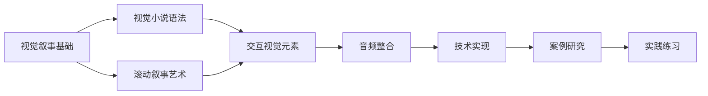
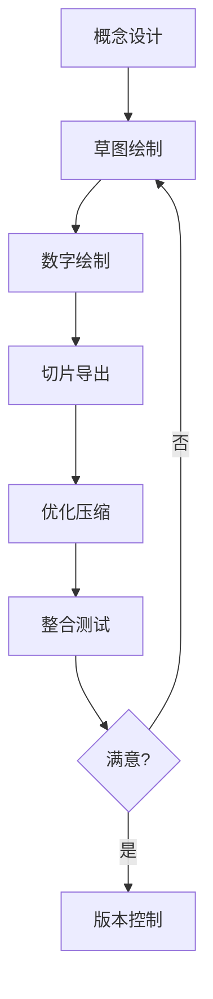

# 第4章：视觉与多媒体叙事

*超越文字：图像、声音、动画的叙事潜力*

> "一图胜千言，但千言道不尽一种感受。" — Eiji Tsuburaya

当我们谈论"书"的时候，大脑中浮现的往往是密密麻麻的文字。但在数字时代，叙事的载体已经远远超越了单纯的文本。本章将探索如何运用视觉、声音、动画等多媒体元素，创造出文字无法达到的情感深度和沉浸体验。

从最早的图文并茂的手抄本，到现代的互动图像小说，视觉元素一直是增强叙事表现力的重要手段。而数字技术的发展，让我们能够创造出前所未有的多感官体验：动态的图像可以响应读者的行为，声音可以营造氛围并引导节奏，动画可以让抽象的概念具象化。这不仅仅是技术的进步，更是叙事艺术的演化。

## 🎯 学习目标

在本章结束时，你将能够：

1. **理解视觉语法**：掌握视觉小说的基本构成要素和演出技巧
2. **设计滚动叙事**：创造随滚动展开的时空体验
3. **整合多媒体**：有机结合图像、声音、动画服务于叙事
4. **技术实现**：选择合适的工具和框架实现视觉叙事
5. **优化体验**：平衡视觉丰富性与加载性能
6. **创新表达**：探索视觉媒介独特的叙事可能性

## 📊 本章导航



## 1. 视觉叙事的理论基础

### 1.1 从文字到图像：认知的转变

人类大脑处理视觉信息的速度是文字的60,000倍。这个惊人的数字背后，隐藏着视觉叙事的巨大潜力。当我们阅读文字时，大脑需要经历解码、理解、想象的过程；而面对图像，理解几乎是瞬间完成的。

#### 认知科学视角

从认知科学的角度来看，视觉处理和语言处理使用大脑的不同区域：

- **视觉皮层**：位于大脑后部，专门处理形状、颜色、运动
- **语言中枢**：包括布洛卡区和韦尼克区，负责语言的产生和理解
- **镜像神经元**：观看图像中的动作会激活观察者相同的运动神经元

这种生理基础决定了视觉叙事具有独特的优势：

- **即时性**：图像可以瞬间传达复杂的空间关系和情感氛围
- **多义性**：同一幅图像可以承载多重解读，增加叙事深度
- **情感直达**：绕过语言中枢，直接触发情感反应
- **记忆深刻**：图像记忆比文字记忆更持久（图像优势效应）

### 1.2 视觉叙事的独特优势

```markdown
文字叙事：线性 → 抽象 → 想象 → 个人化
视觉叙事：并行 → 具象 → 体验 → 共享化
混合叙事：选择性 → 层次化 → 沉浸 → 交互化
```

#### 对比案例：描述一个废弃的房间

**纯文字版本：**
> 房间里弥漫着霉味，墙纸剥落露出斑驳的墙面。地板上散落着泛黄的照片，有些被撕成碎片。角落里，一把椅子倒在地上，仿佛经历过激烈的争执。窗帘半掩，透进来的光线中，灰尘缓缓飘动，像是时间凝固的证据。

**视觉增强版本：**
```javascript
// 伪代码描述视觉呈现
scene.render({
  lighting: 'dim_dusty_sunbeam',
  particles: 'floating_dust',
  textures: {
    walls: 'peeling_wallpaper',
    floor: 'scattered_photos'
  },
  animations: {
    curtain: 'gentle_sway',
    dust: 'slow_float'
  },
  interactables: ['photos', 'chair', 'hidden_diary']
});
```

视觉版本可以在瞬间传达：
- 空间布局和氛围
- 时间的流逝感
- 潜在的故事线索
- 可探索的交互点

### 1.3 多媒体叠加的维度

视觉叙事不是单一维度的，而是多个感官通道的协同：

#### 视觉维度
- **静态图像**：场景、人物、物品
- **动态效果**：动画、转场、粒子
- **界面元素**：UI作为叙事的一部分

#### 听觉维度
- **环境音**：风声、雨声、城市噪音
- **音效**：脚步声、心跳声、碰撞声
- **音乐**：情绪引导、节奏控制

#### 时间维度
- **节奏控制**：快慢变化影响紧张感
- **停顿艺术**：适时的静止增强冲击力
- **循环与重复**：强化主题或情绪

### 1.4 多媒体叙事的演化谱系

```
1. 图文并茂时代（15世纪-19世纪）
   - 插图本圣经
   - 绘本童话
   - 图解百科全书

2. 早期数字时代（1980s-1990s）
   - 文字冒险游戏配图
   - CD-ROM互动百科
   - 早期网页设计

3. 视觉小说黄金期（1990s-2000s）
   - 日式视觉小说兴起
   - Flash动画叙事
   - 图像主导的叙事结构

4. 富媒体融合期（2000s-2010s）
   - HTML5多媒体整合
   - 移动设备的触控叙事
   - 社交媒体的视觉语言

5. 沉浸式体验期（2010s-现在）
   - VR/AR叙事实验
   - 实时渲染的动态叙事
   - AI生成的适应性视觉
```

### 1.5 视觉叙事的心理学基础

#### 格式塔原理在叙事中的应用

格式塔心理学的原则可以指导视觉叙事设计：

1. **接近性原则**：相近的元素被视为一组
   - 应用：相关的叙事元素在空间上靠近

2. **相似性原则**：相似的元素被归为一类
   - 应用：用颜色、形状区分不同叙事线索

3. **连续性原则**：倾向于看到连续的形式
   - 应用：视线引导和场景转换

4. **闭合性原则**：倾向于填补缺失部分
   - 应用：留白激发想象，片段暗示整体

5. **图底关系**：区分前景和背景
   - 应用：突出重要信息，创造层次感

#### 视觉注意力的管理

成功的视觉叙事需要精心管理读者的注意力：

```javascript
// 注意力引导策略
const attentionStrategies = {
  contrast: {
    brightness: 'highlight_important_elements',
    color: 'use_complementary_colors',
    size: 'larger_elements_draw_attention'
  },
  motion: {
    subtle: 'gentle_animations_for_ambiance',
    sudden: 'quick_movements_for_alerts',
    rhythmic: 'repetitive_motion_for_hypnosis'
  },
  composition: {
    rule_of_thirds: 'place_key_elements_at_intersections',
    leading_lines: 'guide_eye_movement',
    framing: 'use_natural_frames_to_focus'
  }
};
```

### 1.6 文化差异与视觉语言

不同文化背景下，视觉符号的解读可能截然不同：

#### 东西方视觉叙事传统

**东方（以日本为例）：**
- 强调氛围和情绪（间接表达）
- 大量使用符号化表情
- 静态画面承载动态信息
- 重视留白和想象空间

**西方传统：**
- 强调动作和因果（直接表达）
- 写实主义倾向
- 动态表现优先
- 信息密度较高

#### 符号系统的本地化

创作跨文化的视觉叙事时需要考虑：

1. **颜色含义**：
   - 红色：西方=危险/激情，东方=喜庆/幸运
   - 白色：西方=纯洁，东方=哀悼

2. **阅读方向**：
   - 从左到右 vs 从右到左
   - 横排 vs 竖排

3. **肢体语言**：
   - 手势的文化差异
   - 个人空间的概念

4. **视觉隐喻**：
   - 文化特定的象征物
   - 共通的原型符号

### 1.7 视觉叙事的情感机制

#### 神经美学与情感反应

视觉刺激如何转化为情感体验？神经美学研究揭示了大脑处理视觉美感的机制：

**情感触发路径：**
```
视觉刺激 → 初级视觉皮层 → 高级视觉区域 → 情感中枢（杏仁核、岛叶）
    ↓           ↓              ↓                 ↓
  形状识别    模式分析      意义解读         情感反应
```

**关键发现：**
1. **快速情感通道**：某些视觉刺激（如面部表情）可以绕过意识处理，直接触发情感
2. **美感神经回路**：欣赏美的事物会激活奖赏系统，释放多巴胺
3. **共情镜像**：看到他人的情感表达会激活观察者相同的情感区域
4. **预期与满足**：视觉节奏的建立与打破会产生紧张-释放的情感循环

#### 色彩心理学的深层应用

色彩不仅影响情绪，还能影响时间感知、空间感知甚至生理反应：

```javascript
const colorPsychology = {
  temperature: {
    warm: {
      colors: ['red', 'orange', 'yellow'],
      effects: {
        timePerception: 'faster', // 时间似乎过得更快
        spacePerception: 'closer', // 空间显得更近
        arousal: 'increased',      // 提高唤醒水平
        appetite: 'stimulated'     // 刺激食欲
      }
    },
    cool: {
      colors: ['blue', 'green', 'purple'],
      effects: {
        timePerception: 'slower',
        spacePerception: 'farther',
        arousal: 'decreased',
        focus: 'enhanced'
      }
    }
  },
  
  saturation: {
    high: {
      emotion: 'intense',
      attention: 'immediate',
      memory: 'vivid'
    },
    low: {
      emotion: 'subtle',
      attention: 'gentle',
      memory: 'nostalgic'
    }
  }
};
```

#### 动态视觉的心理影响

运动和变化对心理状态的影响：

1. **速度感知与情绪**
   - 缓慢移动：平静、沉思、忧郁
   - 快速移动：兴奋、紧张、混乱
   - 加速运动：期待、紧张升级
   - 减速运动：释放、解决、结束

2. **运动模式的含义**
   ```javascript
   const motionPatterns = {
     linear: '目标明确、理性、机械',
     curved: '自然、优雅、情感化',
     erratic: '混乱、不安、疯狂',
     circular: '循环、永恒、困境',
     spiral: '深入、迷失、成长'
   };
   ```

3. **视觉节律与生理同步**
   - 呼吸节奏：2-3秒的循环最舒适
   - 心跳节奏：60-80 BPM的视觉节奏产生平静感
   - 眨眼节奏：每3-4秒的视觉变化符合自然眨眼

### 1.8 视觉叙事的空间设计

#### 画面空间的心理学

画面不同区域承载着不同的心理权重和象征意义：

```javascript
class FramePsychology {
  constructor() {
    this.zones = {
      topLeft: {
        meaning: '过去、起源、已知',
        weight: 0.7,
        emotion: '怀旧、安全'
      },
      topRight: {
        meaning: '未来、目标、理想',
        weight: 0.8,
        emotion: '希望、憧憬'
      },
      center: {
        meaning: '现在、焦点、冲突',
        weight: 1.0,
        emotion: '紧张、重要'
      },
      bottomLeft: {
        meaning: '基础、潜意识、隐藏',
        weight: 0.6,
        emotion: '不安、神秘'
      },
      bottomRight: {
        meaning: '结果、行动、现实',
        weight: 0.9,
        emotion: '决心、落实'
      }
    };
  }
  
  calculateComposition(elements) {
    let totalTension = 0;
    let balanceVector = { x: 0, y: 0 };
    
    elements.forEach(element => {
      const zone = this.getZone(element.position);
      totalTension += zone.weight * element.importance;
      
      // 计算视觉平衡
      balanceVector.x += element.position.x * element.visualWeight;
      balanceVector.y += element.position.y * element.visualWeight;
    });
    
    return {
      tension: totalTension,
      balance: balanceVector,
      stable: Math.abs(balanceVector.x) < 0.1 && Math.abs(balanceVector.y) < 0.1
    };
  }
}
```

#### 深度层次的构建

创造视觉深度的技术手段及其叙事功能：

1. **透视深度**
   - 线性透视：理性世界、都市感
   - 大气透视：距离感、时间感
   - 色彩透视：情感距离

2. **遮挡关系**
   ```css
   /* 通过z-index创造叙事层次 */
   .past-memory {
     z-index: 1;
     opacity: 0.6;
     filter: blur(2px);
   }
   
   .present-reality {
     z-index: 10;
     opacity: 1;
   }
   
   .future-possibility {
     z-index: 5;
     opacity: 0.8;
     mix-blend-mode: screen;
   }
   ```

3. **焦点控制**
   - 景深模拟：引导注意力
   - 选择性清晰：暗示重要性
   - 焦点转换：叙事转折

### 1.9 视觉符号学与叙事

#### 符号的层次结构

皮尔斯符号学在视觉叙事中的应用：

1. **图像符号（Icon）**
   - 直接相似性：照片、写实插画
   - 简化相似性：图标、简笔画
   - 功能：快速识别、普遍理解

2. **指示符号（Index）**
   - 因果关系：烟→火、影子→光源
   - 痕迹关系：脚印、弹孔、裂纹
   - 功能：暗示、推理、悬念

3. **象征符号（Symbol）**
   - 文化约定：红心→爱情、骷髅→死亡
   - 个人象征：作品内建立的专属符号
   - 功能：深层含义、主题强化

#### 视觉修辞手法

将文学修辞转化为视觉表达：

```javascript
const visualRhetoric = {
  metaphor: {
    technique: '用一个视觉元素代表另一个概念',
    example: '破碎的镜子表现破碎的自我',
    implementation: {
      literal: false,
      symbolic: true,
      layers: ['surface_image', 'deep_meaning']
    }
  },
  
  synecdoche: {
    technique: '局部代表整体',
    example: '一双眼睛代表整个人物',
    implementation: {
      focus: 'detail',
      implication: 'whole',
      cinematicTechnique: 'extreme_closeup'
    }
  },
  
  juxtaposition: {
    technique: '对比并置产生新含义',
    example: '豪宅与贫民窟的画面对比',
    implementation: {
      layout: 'split_screen',
      transition: 'hard_cut',
      meaning: 'emerges_from_contrast'
    }
  },
  
  repetition: {
    technique: '重复强化主题',
    example: '循环出现的视觉母题',
    implementation: {
      frequency: 'rhythmic',
      variation: 'slight_changes',
      purpose: 'reinforce_theme'
    }
  }
};
```

### 1.10 视觉叙事的时间性

#### 静态图像中的时间

如何在静止画面中表现时间流逝：

1. **运动暗示**
   ```css
   /* 运动模糊效果 */
   .motion-blur {
     filter: blur(0);
     position: relative;
   }
   
   .motion-blur::after {
     content: '';
     position: absolute;
     top: 0;
     left: 0;
     right: 0;
     bottom: 0;
     background: inherit;
     filter: blur(10px);
     opacity: 0.6;
     transform: translateX(-20px);
   }
   ```

2. **时间标记**
   - 光线角度：表明一天中的时间
   - 季节元素：落叶、雪花、新芽
   - 人工标记：时钟、日历、老化痕迹

3. **序列暗示**
   - 连续动作的关键帧
   - 成长阶段的并置
   - 因果关系的视觉化

#### 时间密度的控制

```javascript
class TemporalDensity {
  constructor() {
    this.densityLevels = {
      sparse: {
        description: '大量留白，缓慢节奏',
        elementsPerScreen: '1-3',
        usage: '沉思、等待、孤独'
      },
      moderate: {
        description: '适中信息量，正常节奏',
        elementsPerScreen: '4-7',
        usage: '日常叙事、对话场景'
      },
      dense: {
        description: '信息密集，快速节奏',
        elementsPerScreen: '8+',
        usage: '高潮、混乱、信息过载'
      }
    };
  }
  
  calculateReadingTime(elements) {
    // 根据元素复杂度估算阅读时间
    let totalTime = 0;
    
    elements.forEach(element => {
      switch(element.type) {
        case 'text':
          totalTime += element.wordCount * 0.25; // 每词0.25秒
          break;
        case 'image':
          totalTime += element.complexity * 1.5; // 复杂度×1.5秒
          break;
        case 'animation':
          totalTime += element.duration;
          break;
      }
    });
    
    return totalTime;
  }
}
```

### 1.11 交互性与能动性

#### 读者视线的预测与引导

眼动研究揭示的视觉浏览模式：

1. **F模式**（文本密集页面）
   - 顶部横向浏览
   - 略低位置的第二次横向浏览
   - 左侧垂直浏览

2. **Z模式**（视觉为主页面）
   - 左上→右上
   - 对角线到左下
   - 左下→右下

3. **视觉引导技术**
   ```javascript
   const guidanceTechniques = {
     contrast: {
       method: '明暗对比引导',
       strength: 'high',
       subtlety: 'low'
     },
     motion: {
       method: '动态元素吸引',
       strength: 'very_high',
       subtlety: 'medium'
     },
     gaze: {
       method: '人物视线引导',
       strength: 'medium',
       subtlety: 'high'
     },
     path: {
       method: '视觉路径设计',
       strength: 'medium',
       subtlety: 'medium'
     }
   };
   ```

#### 交互的心理预期

用户对交互元素的心理模型：

```javascript
class InteractionExpectations {
  constructor() {
    this.affordances = {
      button: {
        visual: '凸起、阴影、边框',
        behavior: '点击后状态变化',
        feedback: '即时视觉/听觉反馈'
      },
      link: {
        visual: '下划线、颜色差异',
        behavior: '悬停变化、点击跳转',
        feedback: '光标变化'
      },
      draggable: {
        visual: '抓手光标、纹理暗示',
        behavior: '跟随鼠标移动',
        feedback: '拖动时半透明'
      }
    };
  }
  
  validateInteraction(element) {
    const expectedAffordances = this.affordances[element.type];
    const actualAffordances = element.getAffordances();
    
    return {
      meetsExpectations: this.compare(expectedAffordances, actualAffordances),
      suggestions: this.getSuggestions(element.type, actualAffordances)
    };
  }
}
```

### 1.8 视觉叙事的认知负荷管理

视觉叙事虽然能快速传达信息，但也容易造成认知过载。如何平衡信息丰富度与认知负荷是关键挑战。

#### 认知负荷的三个维度

根据认知负荷理论（Cognitive Load Theory），我们需要管理三种负荷：

1. **内在认知负荷（Intrinsic Load）**
   - 来源：叙事内容本身的复杂度
   - 管理策略：分层呈现、渐进披露

2. **外在认知负荷（Extraneous Load）**
   - 来源：不当的视觉设计和布局
   - 管理策略：简化界面、统一视觉语言

3. **相关认知负荷（Germane Load）**
   - 来源：理解和整合信息的心理努力
   - 管理策略：提供视觉线索、建立模式

#### 视觉层次的科学设计

```javascript
class VisualHierarchy {
  constructor() {
    this.levels = {
      primary: {    // 第一层：核心信息
        size: '100%',
        contrast: 'high',
        position: 'center',
        motionPriority: 1
      },
      secondary: {  // 第二层：支撑信息
        size: '70%',
        contrast: 'medium',
        position: 'periphery',
        motionPriority: 2
      },
      tertiary: {   // 第三层：背景信息
        size: '40%',
        contrast: 'low',
        position: 'background',
        motionPriority: 3
      }
    };
  }
  
  calculateCognitiveLoad(scene) {
    const elementCount = scene.elements.length;
    const motionComplexity = scene.animations.reduce((sum, anim) => 
      sum + anim.complexity, 0);
    const colorVariety = new Set(scene.colors).size;
    
    return {
      visual: elementCount * 0.3 + colorVariety * 0.2,
      temporal: motionComplexity * 0.5,
      total: this.visual + this.temporal,
      recommendation: this.total > 0.7 ? 'Simplify' : 'Optimal'
    };
  }
}
```

### 1.9 跨感官叙事的科学基础

#### 联觉（Synesthesia）在叙事中的应用

联觉是指一种感官刺激引发另一种感官体验的现象。在视觉叙事中，我们可以利用这种跨感官联系创造更丰富的体验。

**常见的联觉映射：**
- 高音 → 明亮色彩、尖锐形状
- 低音 → 暗色调、圆润形状
- 快节奏 → 暖色、动态线条
- 慢节奏 → 冷色、流畅曲线

**实践案例：音乐可视化叙事**
```javascript
class SynestheticVisualizer {
  constructor(audioAnalyzer) {
    this.analyzer = audioAnalyzer;
    this.mappings = {
      frequency: {
        low: { hue: 240, shape: 'circle', size: 1.5 },
        mid: { hue: 60, shape: 'square', size: 1.0 },
        high: { hue: 0, shape: 'triangle', size: 0.5 }
      },
      amplitude: {
        quiet: { saturation: 30, opacity: 0.3 },
        medium: { saturation: 60, opacity: 0.6 },
        loud: { saturation: 100, opacity: 0.9 }
      }
    };
  }
  
  visualizeAudio(timestamp) {
    const frequencies = this.analyzer.getFrequencyData();
    const amplitude = this.analyzer.getAmplitude();
    
    return frequencies.map((freq, index) => ({
      color: this.mapFrequencyToColor(freq),
      shape: this.mapFrequencyToShape(freq),
      size: this.mapAmplitudeToSize(amplitude),
      position: this.calculatePosition(index, timestamp)
    }));
  }
}
```

### 1.10 视觉记忆与叙事节奏

#### 视觉记忆的时间衰减

研究表明，视觉记忆遵循特定的衰减曲线：
- 感觉记忆：0.5-3秒（图标记忆）
- 工作记忆：15-30秒（活跃处理）
- 长期记忆：需要重复或情感连接

**叙事节奏设计原则：**
1. **3秒原则**：关键视觉信息至少保持3秒
2. **7±2原则**：同时呈现的独立元素不超过5-9个
3. **间隔重复**：重要信息在不同时间点重现
4. **情感锚定**：用情感高峰巩固记忆

### 1.11 空间叙事与导航隐喻

#### 空间认知在数字叙事中的应用

人类大脑有专门的空间导航系统（海马体），我们可以利用这一点创造直观的叙事体验。

**空间叙事模式：**

1. **线性通道**（Linear Corridor）
   - 适用：引导式体验、教程
   - 特点：明确的前进方向、受控的节奏

2. **开放世界**（Open World）
   - 适用：探索式叙事、数据库小说
   - 特点：多重路径、自主发现

3. **中心辐射**（Hub and Spoke）
   - 适用：章节式结构、主题集合
   - 特点：返回中心、分支探索

4. **垂直层级**（Vertical Layers）
   - 适用：深度挖掘、递进式理解
   - 特点：向下深入、层层剥离

```javascript
class SpatialNarrative {
  constructor(type) {
    this.type = type;
    this.spaces = new Map();
    this.connections = new Graph();
    this.playerPosition = null;
  }
  
  createSpace(id, properties) {
    const space = {
      id,
      content: properties.content,
      visualTheme: properties.theme,
      enterTransition: properties.transition,
      interactables: properties.interactables || [],
      metadata: {
        visitCount: 0,
        totalTime: 0,
        discoveries: []
      }
    };
    
    this.spaces.set(id, space);
    return space;
  }
  
  connectSpaces(fromId, toId, connection) {
    this.connections.addEdge(fromId, toId, {
      type: connection.type, // 'door', 'portal', 'fade'
      condition: connection.condition, // 解锁条件
      transition: connection.transition // 转场效果
    });
  }
  
  navigate(targetId) {
    const path = this.connections.findPath(
      this.playerPosition, 
      targetId
    );
    
    return this.animateNavigation(path);
  }
}
```

### 1.12 数据驱动的适应性视觉叙事

#### 个性化视觉体验

基于用户行为数据动态调整视觉叙事：

```javascript
class AdaptiveVisualNarrative {
  constructor(userProfile) {
    this.profile = userProfile;
    this.preferences = this.analyzePreferences();
    this.pacing = this.calculateOptimalPacing();
  }
  
  analyzePreferences() {
    return {
      colorPalette: this.profile.colorHistory.getMostEngaged(),
      complexity: this.profile.attentionSpan.average,
      interactionStyle: this.profile.clickPatterns.primary,
      readingSpeed: this.profile.scrollVelocity.median
    };
  }
  
  adaptScene(baseScene) {
    return {
      ...baseScene,
      colors: this.adaptColors(baseScene.colors),
      timing: this.adaptTiming(baseScene.timing),
      layout: this.adaptLayout(baseScene.layout),
      details: this.adaptDetailLevel(baseScene.details)
    };
  }
  
  adaptColors(originalColors) {
    // 基于用户偏好调整色彩方案
    const userHuePreference = this.preferences.colorPalette.dominantHue;
    return originalColors.map(color => 
      this.shiftTowardsPreference(color, userHuePreference)
    );
  }
  
  adaptTiming(originalTiming) {
    // 基于用户阅读速度调整节奏
    const speedMultiplier = this.preferences.readingSpeed / AVERAGE_SPEED;
    return {
      ...originalTiming,
      duration: originalTiming.duration * speedMultiplier,
      transitions: originalTiming.transitions * speedMultiplier
    };
  }
}
```

## 2. 视觉小说的语法系统

视觉小说作为一种成熟的叙事形式，已经发展出了自己独特的"语法"——一套被创作者和读者共同理解的视觉表达规则。这套语法借鉴了电影、漫画、戏剧等多种艺术形式，但又根据交互性媒介的特点进行了创新。

### 2.1 核心要素的层次结构

视觉小说的构成要素可以分为多个层次，每个层次都承担着特定的叙事功能：

```javascript
// 视觉小说的层次结构
const visualNovelLayers = {
  background: {
    priority: 0,
    purpose: '建立场景和氛围',
    elements: ['location', 'time', 'weather', 'mood']
  },
  midground: {
    priority: 1,
    purpose: '环境细节和道具',
    elements: ['furniture', 'objects', 'environmental_effects']
  },
  characters: {
    priority: 2,
    purpose: '角色表现和互动',
    elements: ['sprites', 'expressions', 'positions', 'costumes']
  },
  effects: {
    priority: 3,
    purpose: '强调和过渡',
    elements: ['particles', 'filters', 'transitions', 'animations']
  },
  interface: {
    priority: 4,
    purpose: '信息展示和交互',
    elements: ['dialogue_box', 'choices', 'system_ui']
  }
};
```

### 2.2 立绘系统的深度解析

#### 立绘（Character Sprites）的设计哲学

立绘不仅仅是角色的视觉呈现，更是情感传达的核心工具：

1. **表情差分系统**
   ```yaml
   # 高级立绘配置
   character:
     name: "Alice"
     base_sprite: "alice_base.png"
     expressions:
       # 基础表情
       neutral: { eyes: "normal", mouth: "closed", brows: "relaxed" }
       happy: { eyes: "curved", mouth: "smile", brows: "raised" }
       sad: { eyes: "downcast", mouth: "frown", brows: "worried" }
       # 复合表情
       embarrassed: 
         base: "happy"
         modifiers: ["blush", "sweat_drop"]
       shocked:
         base: "neutral"
         modifiers: ["wide_eyes", "open_mouth", "speed_lines"]
   ```

2. **动态立绘技术**
   ```javascript
   class DynamicSprite {
     constructor(character) {
       this.baseSprite = character.base;
       this.breathing = new BreathingAnimation();
       this.blinking = new BlinkingSystem();
       this.microExpressions = new MicroExpressionEngine();
     }
     
     update(emotion, intensity) {
       // 呼吸频率反映情绪状态
       this.breathing.setRate(this.getBreathingRate(emotion));
       
       // 眨眼频率和模式
       this.blinking.setPattern(this.getBlinkPattern(emotion));
       
       // 微表情叠加
       this.microExpressions.apply(emotion, intensity);
     }
   }
   ```

3. **服装与道具系统**
   - **叙事功能**：服装变化标记时间推进或角色发展
   - **情境适应**：根据场景自动切换合适服装
   - **细节表现**：通过配饰暗示角色心理状态

#### 立绘的空间语言

角色在画面中的位置不是随意的，而是有着明确的语义：

```javascript
const spatialSemantics = {
  positions: {
    far_left: '疏远、旁观、即将离开',
    left: '次要地位、倾听者',
    center: '焦点、主导对话、重要时刻',
    right: '平等对话、亲密关系',
    far_right: '神秘、刚到达、外来者'
  },
  
  movements: {
    approach: '关系拉近、兴趣增加',
    retreat: '关系疏远、情感退却',
    swap: '地位转换、观点改变'
  },
  
  grouping: {
    clustered: '团结、亲密、共识',
    spread: '分歧、独立、冲突',
    triangular: '复杂关系、三角恋情'
  }
};
```

### 2.3 背景的叙事功能

#### 背景不仅是舞台

在视觉小说中，背景承担着多重叙事责任：

1. **时空定位**
   ```javascript
   class NarrativeBackground {
     constructor(scene) {
       this.location = scene.location;
       this.timeOfDay = scene.time;
       this.weather = scene.weather;
       this.season = scene.season;
     }
     
     // 动态时间流逝
     advanceTime(hours) {
       this.timeOfDay += hours;
       this.updateLighting();
       this.updateAmbientSounds();
       
       // 特殊时刻触发叙事事件
       if (this.timeOfDay === 'golden_hour') {
         this.triggerEvent('romantic_atmosphere');
       }
     }
   }
   ```

2. **心理投射**
   - **色彩心理学**：暖色调表现温馨，冷色调表现疏离
   - **空间隐喻**：开阔空间象征自由，狭小空间象征压抑
   - **细节暗示**：背景中的物品暗示人物经历

3. **叙事节奏**
   ```javascript
   // 场景转换与叙事节奏
   const sceneTransitions = {
     quick_cuts: {
       purpose: '紧张、混乱、快节奏',
       duration: 0.2,
       effect: 'hard_cut'
     },
     slow_fade: {
       purpose: '时间流逝、情绪转换',
       duration: 2.0,
       effect: 'cross_fade'
     },
     match_cut: {
       purpose: '关联性、连续性',
       duration: 0.5,
       effect: 'morph_transition'
     }
   };
   ```

### 2.4 演出效果的语法规则

#### 转场的叙事含义

不同的转场方式传达不同的叙事信息：

```javascript
class TransitionGrammar {
  static transitions = {
    fade_to_black: {
      meaning: ['时间大跨度', '意识丧失', '场景结束'],
      duration: 1.5,
      usage: 'chapter_end, unconscious, death'
    },
    
    white_out: {
      meaning: ['回忆开始', '爆炸', '顿悟'],
      duration: 0.5,
      usage: 'flashback, explosion, realization'
    },
    
    iris_out: {
      meaning: ['聚焦', '回忆结束', '梦境转换'],
      duration: 1.0,
      usage: 'focus_shift, memory_end'
    },
    
    glitch: {
      meaning: ['现实扭曲', '记忆错乱', '系统故障'],
      duration: 0.3,
      usage: 'unreliable_narrator, sci_fi'
    },
    
    ripple: {
      meaning: ['时间倒流', '维度转换', '魔法效果'],
      duration: 2.0,
      usage: 'time_travel, fantasy'
    }
  };
  
  static getTransition(narrativeContext) {
    // 根据叙事上下文选择合适的转场
    const mood = narrativeContext.currentMood;
    const nextScene = narrativeContext.nextScene;
    
    if (mood === 'tense' && nextScene.type === 'action') {
      return 'quick_cut';
    } else if (nextScene.type === 'memory') {
      return 'ripple';
    }
    // ... 更多逻辑
  }
}
```

#### 动态效果的情感映射

```javascript
// 情感到视觉效果的映射系统
const emotionToEffect = {
  love: {
    particles: 'hearts_or_sparkles',
    filter: 'soft_glow',
    animation: 'gentle_float',
    color_adjustment: 'warm_tint'
  },
  
  fear: {
    particles: 'none',
    filter: 'vignette_darkness',
    animation: 'subtle_shake',
    color_adjustment: 'desaturate'
  },
  
  anger: {
    particles: 'embers',
    filter: 'high_contrast',
    animation: 'pulse',
    color_adjustment: 'red_tint'
  },
  
  confusion: {
    particles: 'floating_questions',
    filter: 'blur_edges',
    animation: 'slow_spin',
    color_adjustment: 'chromatic_aberration'
  }
};
```

### 2.5 界面作为叙事元素

#### 对话框的设计语言

对话框不仅仅是文字的容器，其设计本身就传达信息：

```css
/* 不同角色/情境的对话框样式 */
.dialogue-box.normal {
  background: linear-gradient(to bottom, #f0f0f0, #e0e0e0);
  border: 2px solid #333;
  font-family: 'Normal Font';
}

.dialogue-box.thoughts {
  background: rgba(100, 100, 200, 0.3);
  border: none;
  font-style: italic;
  /* 思维泡泡效果 */
}

.dialogue-box.shouting {
  background: #ff3333;
  border: 4px solid #aa0000;
  font-weight: bold;
  font-size: 120%;
  /* 震动动画 */
  animation: shake 0.5s;
}

.dialogue-box.whisper {
  background: rgba(0, 0, 0, 0.8);
  border: 1px dashed #666;
  font-size: 80%;
  opacity: 0.7;
}

.dialogue-box.system {
  background: transparent;
  border: 1px solid #00ff00;
  font-family: 'Courier New';
  /* 赛博朋克风格 */
}
```

#### 选择界面的心理学

选项的呈现方式影响玩家决策：

```javascript
class ChoicePresentation {
  // 标准选择
  standardChoice(options) {
    return {
      layout: 'vertical_list',
      animation: 'fade_in',
      timer: null,
      highlight: 'on_hover'
    };
  }
  
  // 时间压力选择
  timedChoice(options, seconds) {
    return {
      layout: 'vertical_list',
      animation: 'slide_in_urgent',
      timer: {
        visible: true,
        duration: seconds,
        consequence: 'default_choice'
      },
      highlight: 'pulse'
    };
  }
  
  // 道德困境选择
  moralChoice(options) {
    return {
      layout: 'opposing_sides',
      animation: 'scale_in',
      timer: null,
      highlight: 'gradient_shift',
      visual_weight: 'show_consequences'
    };
  }
}

### 2.6 高级演出技巧

#### 镜头语言的数字化转译

虽然视觉小说是静态为主的媒介，但可以模拟电影的镜头语言：

```javascript
class CameraEffects {
  constructor(scene) {
    this.scene = scene;
    this.camera = {
      position: { x: 0, y: 0, z: 1 },
      rotation: 0,
      fov: 60
    };
  }
  
  // 推镜头（Dolly In）
  dollyIn(target, duration = 2) {
    return this.animate({
      scale: { from: 1, to: 1.5 },
      focus: target,
      blur: { background: true, strength: 5 },
      duration: duration,
      easing: 'easeInOutQuad'
    });
  }
  
  // 拉镜头（Dolly Out）
  dollyOut(duration = 2) {
    return this.animate({
      scale: { from: 1.5, to: 1 },
      blur: { background: false },
      duration: duration,
      easing: 'easeInOutQuad'
    });
  }
  
  // 摇镜头（Pan）
  pan(direction, distance, duration = 1.5) {
    const movements = {
      left: { x: -distance, y: 0 },
      right: { x: distance, y: 0 },
      up: { x: 0, y: -distance },
      down: { x: 0, y: distance }
    };
    
    return this.animate({
      position: movements[direction],
      duration: duration,
      easing: 'easeInOutSine'
    });
  }
  
  // 主观视角（POV）
  switchToPOV(character) {
    return {
      effect: 'vignette',
      blur: { edges: true, strength: 3 },
      shake: { intensity: 1, frequency: 60 }, // 模拟呼吸
      filter: character.visionFilter // 角色特定的视觉滤镜
    };
  }
  
  // 荷兰角（Dutch Angle）
  dutchAngle(degrees = 15, duration = 0.5) {
    return this.animate({
      rotation: degrees,
      duration: duration,
      purpose: 'disorientation' // 用于表现不安、混乱
    });
  }
}
```

#### 时间操纵技术

视觉小说可以自由操纵时间流动：

```javascript
class TimeManipulation {
  constructor() {
    this.timeEffects = {
      // 慢动作
      slowMotion: {
        implementation: () => {
          this.setAnimationSpeed(0.3);
          this.addMotionBlur();
          this.increaseFPS(); // 插帧使动作更流畅
        },
        usage: '强调重要时刻、情感冲击'
      },
      
      // 时间冻结
      freeze: {
        implementation: () => {
          this.pauseAllAnimations();
          this.addCrystallizeEffect();
          this.muteAmbientSounds();
        },
        usage: '思考时刻、重大决定前'
      },
      
      // 快进
      fastForward: {
        implementation: () => {
          this.setAnimationSpeed(5);
          this.addSpeedLines();
          this.pitchUpAudio(1.5);
        },
        usage: '跳过日常、时间流逝'
      },
      
      // 倒放
      rewind: {
        implementation: () => {
          this.reverseAnimations();
          this.addGlitchEffect();
          this.reverseAudio();
        },
        usage: '回忆、后悔、时间循环'
      },
      
      // 时间分层
      temporalLayers: {
        implementation: () => {
          return {
            past: { opacity: 0.5, filter: 'sepia', position: 'background' },
            present: { opacity: 1, filter: 'none', position: 'midground' },
            future: { opacity: 0.7, filter: 'blur', position: 'foreground' }
          };
        },
        usage: '展示不同时间线、因果关系'
      }
    };
  }
}
```

### 2.7 情感渲染系统

#### 内心独白的视觉化

将角色的内心世界外化为视觉元素：

```javascript
class InnerWorldVisualization {
  constructor(character) {
    this.character = character;
    this.emotionalPalette = this.generateEmotionalPalette();
  }
  
  // 思维泡泡系统
  thoughtBubbles(thoughts) {
    return thoughts.map((thought, index) => ({
      content: thought.text,
      style: {
        opacity: thought.clarity, // 清晰度表示确定性
        size: thought.importance * 100, // 重要性决定大小
        position: this.calculateThoughtPosition(index),
        animation: thought.recurring ? 'float-loop' : 'fade-in-out',
        color: this.emotionalPalette[thought.emotion]
      },
      connections: thought.associations.map(assoc => ({
        to: assoc.id,
        strength: assoc.strength,
        type: assoc.type // 'cause', 'contrast', 'memory'
      }))
    }));
  }
  
  // 情绪风暴效果
  emotionalStorm(emotions) {
    const particles = [];
    
    emotions.forEach(emotion => {
      for (let i = 0; i < emotion.intensity * 100; i++) {
        particles.push({
          type: emotion.name,
          position: this.randomPosition(),
          velocity: this.emotionVelocity(emotion),
          lifespan: emotion.duration,
          visual: this.emotionVisual(emotion)
        });
      }
    });
    
    return {
      particles: particles,
      turbulence: this.calculateTurbulence(emotions),
      centerPoint: this.findEmotionalCenter(emotions)
    };
  }
  
  // 记忆碎片可视化
  memoryFragments(memories) {
    return {
      layout: 'scattered', // 散落的布局
      fragments: memories.map(memory => ({
        image: memory.snapshot,
        completeness: memory.clarity, // 0-1，越模糊越不完整
        distortion: 1 - memory.accuracy, // 记忆的扭曲程度
        emotional_tint: this.getMemoryTint(memory.emotion),
        interactive: memory.importance > 0.7, // 重要记忆可交互
        decay_rate: memory.age * 0.1 // 老记忆逐渐消失
      }))
    };
  }
}
```

#### 共感觉设计

将不同感官体验转化为视觉表现：

```javascript
const synesthesiaDesign = {
  // 声音的视觉化
  soundToVisual: {
    volume: {
      quiet: { size: 'small', opacity: 0.3, ripples: 1 },
      normal: { size: 'medium', opacity: 0.7, ripples: 3 },
      loud: { size: 'large', opacity: 1, ripples: 5 }
    },
    pitch: {
      low: { color: 'deep_purple', waveform: 'sine' },
      medium: { color: 'blue', waveform: 'triangle' },
      high: { color: 'yellow', waveform: 'sawtooth' }
    },
    texture: {
      smooth: { particle_type: 'circles', flow: 'laminar' },
      rough: { particle_type: 'squares', flow: 'turbulent' },
      sharp: { particle_type: 'triangles', flow: 'explosive' }
    }
  },
  
  // 触感的视觉化
  touchToVisual: {
    temperature: {
      cold: { 
        filter: 'blue_tint', 
        particles: 'snowflakes',
        edges: 'crystalline'
      },
      warm: {
        filter: 'orange_glow',
        particles: 'soft_orbs',
        edges: 'blurred'
      },
      hot: {
        filter: 'red_shimmer',
        particles: 'embers',
        edges: 'wavering'
      }
    },
    texture: {
      smooth: { surface: 'glossy', reflection: 0.8 },
      rough: { surface: 'matte', noise: 0.6 },
      soft: { surface: 'fuzzy', blur: 0.3 }
    }
  },
  
  // 味觉的视觉化
  tasteToVisual: {
    sweet: { colors: ['pink', 'light_yellow'], shapes: 'rounded' },
    sour: { colors: ['green', 'yellow'], shapes: 'sharp' },
    bitter: { colors: ['dark_green', 'brown'], shapes: 'angular' },
    salty: { colors: ['white', 'grey'], shapes: 'crystalline' },
    umami: { colors: ['deep_red', 'brown'], shapes: 'complex' }
  }
};
```

### 2.8 动态构图系统

#### 情境响应式构图

根据叙事情境自动调整构图：

```javascript
class DynamicComposition {
  constructor() {
    this.compositionRules = {
      // 对话场景
      dialogue: {
        twoCharacter: {
          intimate: {
            distance: 'close',
            angle: 'slight_angle',
            overlap: 0.1, // 轻微重叠暗示亲密
            focusBalance: 'equal'
          },
          confrontational: {
            distance: 'medium',
            angle: 'facing',
            overlap: 0,
            focusBalance: 'alternating',
            divider: 'vertical_line' // 视觉分割
          },
          hierarchical: {
            distance: 'varied',
            angle: 'diagonal',
            heights: 'different', // 高度差表示地位
            focusBalance: 'weighted'
          }
        },
        group: {
          circle: 'equality',
          triangle: 'tension',
          line: 'hierarchy',
          scatter: 'chaos'
        }
      },
      
      // 动作场景
      action: {
        chase: {
          layout: 'diagonal_movement',
          speedLines: true,
          blurBackground: true,
          cameraShake: { intensity: 0.3 }
        },
        fight: {
          layout: 'dynamic_centers',
          impactFrames: true,
          splitSecond: true,
          focusShift: 'rapid'
        }
      },
      
      // 情感场景
      emotional: {
        revelation: {
          layout: 'center_focus',
          vignette: 'strong',
          backgroundFade: 0.8,
          lightSource: 'top_center'
        },
        despair: {
          layout: 'bottom_heavy',
          tilt: -5, // 轻微倾斜
          darkness: 'creeping',
          focusLoss: 'gradual'
        }
      }
    };
  }
  
  applyComposition(sceneType, subType, parameters) {
    const rules = this.compositionRules[sceneType][subType];
    return this.generateLayout(rules, parameters);
  }
}
```

### 2.9 界面语言的叙事整合

#### 对话框的表现力扩展

对话框不仅是文字容器，更是表达工具：

```javascript
class ExpressiveDialogueBox {
  constructor() {
    this.styles = new Map();
    this.animations = new Map();
  }
  
  // 根据说话方式生成样式
  generateStyle(speechType) {
    const styles = {
      whisper: {
        fontSize: '80%',
        opacity: 0.7,
        letterSpacing: '0.05em',
        animation: 'fade-pulse 3s infinite',
        borderStyle: 'dotted',
        backgroundColor: 'rgba(0, 0, 0, 0.8)',
        textShadow: 'none'
      },
      
      shout: {
        fontSize: '120%',
        fontWeight: 'bold',
        letterSpacing: '0.1em',
        animation: 'shake 0.3s',
        borderWidth: '4px',
        borderColor: '#ff0000',
        backgroundColor: '#ffcccc',
        textTransform: 'uppercase'
      },
      
      stutter: {
        fontSize: '100%',
        animation: 'stutter-text 2s',
        letterSpacing: 'normal',
        wordSpacing: '0.3em',
        textRendering: 'optimizeLegibility'
      },
      
      thought: {
        fontSize: '95%',
        fontStyle: 'italic',
        opacity: 0.85,
        borderRadius: '20px',
        border: 'none',
        background: 'radial-gradient(ellipse at center, #e0e0ff 0%, transparent 70%)',
        boxShadow: 'inset 0 0 20px rgba(0, 0, 100, 0.2)'
      },
      
      system: {
        fontFamily: 'monospace',
        fontSize: '90%',
        color: '#00ff00',
        backgroundColor: '#000000',
        border: '1px solid #00ff00',
        borderRadius: '0',
        padding: '15px',
        animation: 'terminal-blink 1s steps(2) infinite'
      },
      
      ancient: {
        fontFamily: 'serif',
        fontSize: '110%',
        color: '#d4af37',
        textShadow: '2px 2px 4px rgba(0, 0, 0, 0.8)',
        backgroundColor: '#2c1810',
        border: '3px ridge #8b6914',
        padding: '20px',
        backgroundImage: 'url(parchment-texture.png)'
      }
    };
    
    return styles[speechType] || styles.normal;
  }
  
  // 动态文字效果
  applyTextEffects(text, effects) {
    const effectProcessors = {
      // 逐字显示
      typewriter: (text, speed = 50) => {
        return {
          animation: `typewriter ${text.length * speed}ms steps(${text.length}) forwards`,
          overflow: 'hidden',
          whiteSpace: 'nowrap'
        };
      },
      
      // 颤抖效果
      tremble: (text, intensity = 1) => {
        return text.split('').map((char, i) => 
          `<span style="animation: tremble ${100 + i * 10}ms infinite; 
                         animation-delay: ${i * 20}ms;
                         display: inline-block;
                         animation-amplitude: ${intensity}px;">
            ${char}
          </span>`
        ).join('');
      },
      
      // 波浪效果
      wave: (text, amplitude = 10) => {
        return text.split('').map((char, i) => 
          `<span style="animation: wave 2s ease-in-out infinite;
                         animation-delay: ${i * 0.1}s;
                         display: inline-block;
                         transform-origin: bottom;">
            ${char}
          </span>`
        ).join('');
      },
      
      // 故障效果
      glitch: (text) => {
        return `
          <span class="glitch" data-text="${text}">
            ${text}
          </span>
        `;
      }
    };
    
    return effectProcessors[effects.type](text, effects.parameters);
  }
}
```

### 2.10 音画联动机制

#### 视觉与声音的精确同步

```javascript
class AudioVisualSync {
  constructor() {
    this.syncPoints = [];
    this.visualCues = new Map();
  }
  
  // 节拍同步系统
  beatSync(audioTrack) {
    const beats = this.detectBeats(audioTrack);
    
    return beats.map(beat => ({
      time: beat.time,
      strength: beat.strength,
      visualEffect: this.mapBeatToVisual(beat),
      characterReaction: this.mapBeatToCharacter(beat)
    }));
  }
  
  // 情绪音乐映射
  emotionalMusicMapping = {
    layers: {
      tension: {
        instruments: ['strings_tremolo', 'low_brass'],
        visualEffects: {
          vignette: { intensity: 0.3, color: 'dark_red' },
          shake: { amplitude: 2, frequency: 30 },
          particleSystem: 'dust_motes'
        }
      },
      
      romance: {
        instruments: ['piano_soft', 'strings_legato', 'harp'],
        visualEffects: {
          glow: { intensity: 0.5, color: 'warm_pink' },
          particles: 'rose_petals',
          depthOfField: { strength: 0.7 }
        }
      },
      
      mystery: {
        instruments: ['ambient_pads', 'prepared_piano', 'whispers'],
        visualEffects: {
          fog: { density: 0.6, movement: 'slow_swirl' },
          chromatic_aberration: { strength: 0.3 },
          shadows: { length: 'extended', sharpness: 0.2 }
        }
      }
    }
  };
  
  // 声音事件触发器
  soundEventTriggers = {
    footsteps: {
      visual: 'ripple_at_position',
      duration: 0.3,
      intensity: 'varies_with_volume'
    },
    
    heartbeat: {
      visual: 'screen_pulse',
      sync: 'exact',
      affectUI: true // UI元素也会脉动
    },
    
    clockTick: {
      visual: 'time_distortion',
      accumulative: true, // 效果累积
      breakpoint: 60 // 60次后触发特殊效果
    }
  };
}
```

### 2.11 高级界面效果

#### 打破第四面墙

```javascript
class FourthWallBreaking {
  constructor() {
    this.techniques = {
      // 界面故障
      interfaceGlitch: {
        trigger: 'story_event',
        effects: [
          'ui_corruption',
          'button_malfunction',
          'text_scramble'
        ],
        duration: 'until_player_action'
      },
      
      // 假崩溃
      fakeCrash: {
        sequence: [
          { action: 'freeze_game', duration: 2000 },
          { action: 'show_error', message: 'Memory corruption detected' },
          { action: 'glitch_screen', intensity: 'increasing' },
          { action: 'black_screen', duration: 1000 },
          { action: 'reveal_truth', method: 'slow_fade' }
        ]
      },
      
      // 选项入侵
      choiceInvasion: {
        normalChoices: ['Yes', 'No', 'Maybe'],
        invasionSequence: [
          { add: '...', position: 'random' },
          { modify: 'Maybe', to: 'Maybe?' },
          { add: 'HELP ME', style: 'glitched' },
          { remove: 'No', replaced_with: 'YOU CANNOT REFUSE' }
        ]
      },
      
      // 存档操纵
      saveManipulation: {
        effects: {
          corruptSaveNames: true,
          addFakeSaves: ['Unknown Player', 'HELP', '???'],
          preventSaving: { duration: 'chapter', reason: 'narrative' }
        }
      }
    };
  }
}
```

### 2.12 视觉小说的节奏控制

#### 微观节奏：场景内的时间掌控

```javascript
class MicroRhythm {
  constructor() {
    this.pacing = {
      // 紧张建立
      tensionBuildup: {
        textSpeed: 'gradually_slower',
        pauses: 'increasing_duration',
        music: 'crescendo',
        visual: 'zoom_in_slowly'
      },
      
      // 情感爆发
      emotionalClimax: {
        sequence: [
          { element: 'screen_flash', duration: 100 },
          { element: 'full_stop', duration: 1500 },
          { element: 'cg_reveal', effect: 'shatter_transition' },
          { element: 'music_peak', sync: 'exact' },
          { element: 'ui_hide', duration: 3000 }
        ]
      },
      
      // 平静过渡
      quietTransition: {
        fadeOut: ['music', 'ambient_sounds', 'ui_elements'],
        fadeIn: ['new_background', 'soft_ambient', 'minimal_ui'],
        duration: 4000,
        curve: 'ease-in-out'
      }
    };
  }
  
  // 呼吸感设计
  createBreathingRhythm() {
    return {
      inhale: {
        duration: 2000,
        elements: {
          background: 'slight_brighten',
          characters: 'subtle_scale_up',
          particles: 'slow_rise'
        }
      },
      hold: {
        duration: 1000,
        elements: 'all_pause'
      },
      exhale: {
        duration: 2500,
        elements: {
          background: 'slight_darken',
          characters: 'subtle_scale_down',
          particles: 'gentle_fall'
        }
      }
    };
  }
}
```

#### 宏观节奏：章节间的起承转合

```javascript
class MacroRhythm {
  constructor() {
    this.chapterStructure = {
      opening: {
        pace: 'moderate',
        visualDensity: 'low',
        interactionFrequency: 'minimal',
        purpose: 'establish_atmosphere'
      },
      
      development: {
        pace: 'variable',
        visualDensity: 'increasing',
        interactionFrequency: 'regular',
        purpose: 'build_engagement'
      },
      
      climax: {
        pace: 'rapid',
        visualDensity: 'maximum',
        interactionFrequency: 'critical_only',
        purpose: 'emotional_peak'
      },
      
      resolution: {
        pace: 'decelerating',
        visualDensity: 'decreasing',
        interactionFrequency: 'reflective',
        purpose: 'process_experience'
      }
    };
  }
  
  // 节奏变化曲线
  generatePacingCurve(chapter) {
    const points = [];
    const segments = 20;
    
    for (let i = 0; i < segments; i++) {
      const progress = i / segments;
      const intensity = this.calculateIntensity(chapter.type, progress);
      
      points.push({
        time: progress,
        intensity: intensity,
        elements: this.getElementsForIntensity(intensity)
      });
    }
    
    return points;
  }
}
```

## 3. 滚动叙事：纵向的时间轴

### 3.1 滚动作为叙事机制

网页的滚动不仅是浏览方式，更可以成为叙事的核心机制：

- **时间隐喻**：向下滚动 = 时间推进
- **空间探索**：滚动揭示新的空间层次
- **节奏控制**：通过内容密度控制阅读速度

### 3.2 视差滚动（Parallax Scrolling）

不同层次以不同速度移动，创造深度感：

```javascript
// 简单的视差效果实现
window.addEventListener('scroll', () => {
  const scrolled = window.pageYOffset;
  
  // 背景层移动较慢
  background.style.transform = `translateY(${scrolled * 0.5}px)`;
  
  // 中景层正常速度
  midground.style.transform = `translateY(${scrolled * 0.8}px)`;
  
  // 前景层移动较快
  foreground.style.transform = `translateY(${scrolled * 1.2}px)`;
});
```

### 3.3 滚动触发的叙事事件

```javascript
// 滚动触发器示例
const triggers = [
  {
    element: '#chapter1',
    onEnter: () => playSound('wind.mp3'),
    onLeave: () => fadeOutSound()
  },
  {
    element: '#revelation',
    onEnter: () => {
      revealText('#hidden-message');
      shakeScreen();
    }
  }
];
```

## 4. 交互视觉元素

### 4.1 响应式图像

图像不再是静态的，而是可以响应用户行为：

- **悬停效果**：鼠标悬停显示额外信息
- **点击交互**：点击图像不同区域触发不同事件
- **拖拽探索**：通过拖拽探索大型图像

### 4.2 动画叙事

动画可以承载叙事功能：

```css
/* 呼吸动画表现角色紧张 */
@keyframes nervous-breathing {
  0%, 100% { transform: scale(1); }
  50% { transform: scale(1.02); }
}

.character.nervous {
  animation: nervous-breathing 2s ease-in-out infinite;
}
```

### 4.3 生成式视觉

利用代码生成随机或响应式的视觉效果：

```javascript
// 情绪粒子系统
class EmotionParticles {
  constructor(emotion) {
    this.particles = [];
    this.emotion = emotion;
    this.colors = {
      joy: ['#FFD700', '#FFA500'],
      sadness: ['#4169E1', '#6495ED'],
      anger: ['#DC143C', '#FF6347']
    };
  }
  
  emit() {
    // 根据情绪生成不同的粒子效果
  }
}
```

## 5. 音频设计与整合

### 5.1 音频的叙事功能

声音在多媒体叙事中扮演多重角色：

- **环境音**：建立场景氛围
- **音效**：强调动作和转换
- **配乐**：引导情绪起伏
- **语音**：角色配音增加亲密感

### 5.2 音频的空间设计

```javascript
// 3D音频定位
const audioContext = new AudioContext();
const panner = audioContext.createPanner();

// 设置声源位置
panner.setPosition(x, y, z);

// 声音随角色移动
character.on('move', (position) => {
  panner.setPosition(position.x, position.y, 0);
});
```

### 5.3 动态音乐系统

音乐随叙事进展动态变化：

```javascript
// 分层音乐系统
class DynamicMusic {
  constructor() {
    this.layers = {
      base: 'music/base.ogg',
      tension: 'music/tension.ogg',
      action: 'music/action.ogg',
      emotion: 'music/emotion.ogg'
    };
  }
  
  updateMood(mood) {
    // 根据叙事情绪淡入淡出不同音轨
    switch(mood) {
      case 'tense':
        this.fadeIn('tension');
        break;
      case 'battle':
        this.fadeIn('action');
        this.fadeIn('tension');
        break;
    }
  }
}
```

## 6. 技术实现方案

### 6.1 工具链选择

根据项目需求选择合适的技术栈：

#### 轻量级方案
- **Twine + CSS动画**：适合简单的视觉效果
- **Markdown + reveal.js**：适合演示型叙事
- **HTML + CSS + vanilla JS**：完全控制，适合定制

#### 视觉小说引擎
- **Ren'Py**：Python基础，功能强大，社区活跃
- **Novel.js**：Web原生，易于部署
- **Fungus (Unity)**：适合3D视觉小说

#### 高级框架
- **React + Framer Motion**：组件化开发，丰富动画
- **Vue + GSAP**：响应式设计，专业动画库
- **Three.js**：3D场景和效果

### 6.2 性能优化策略

视觉丰富的叙事面临性能挑战：

```javascript
// 图片懒加载
const lazyImages = document.querySelectorAll('img[data-src]');
const imageObserver = new IntersectionObserver((entries) => {
  entries.forEach(entry => {
    if (entry.isIntersecting) {
      const img = entry.target;
      img.src = img.dataset.src;
      imageObserver.unobserve(img);
    }
  });
});

// 资源预加载策略
class ResourceManager {
  constructor() {
    this.cache = new Map();
    this.loadingQueue = [];
  }
  
  preloadChapter(chapterId) {
    const resources = this.getChapterResources(chapterId);
    resources.forEach(resource => {
      this.loadInBackground(resource);
    });
  }
}
```

### 6.3 响应式设计考虑

多设备适配的视觉叙事：

```css
/* 响应式立绘系统 */
.character-sprite {
  width: 30%;
  max-width: 400px;
  height: auto;
}

@media (max-width: 768px) {
  .character-sprite {
    width: 40%;
  }
  
  /* 移动端简化视差效果 */
  .parallax-layer {
    transform: none !important;
  }
}

/* 触摸优化 */
.interactive-element {
  min-height: 44px; /* 最小触摸目标 */
  cursor: pointer;
}
```

## 7. 案例深度分析

### 7.1 《17776》：体育的未来是什么？

Jon Bois的《17776》revolutionized网络叙事：

**创新点：**
- **滚动即时间**：17000年的时间跨度通过滚动体现
- **多媒体混搭**：GIF、视频、互动地图、聊天界面
- **打破常规**：故意的排版"错误"营造未来感

**技术分析：**
```html
<!-- 17776风格的时间跳跃 -->
<div class="time-jump">
  <div class="year" data-year="2017">现在</div>
  <div class="spacer" style="height: 2000vh;"></div>
  <div class="year" data-year="17776">未来</div>
</div>

<script>
// 滚动过程中年份递增
window.addEventListener('scroll', () => {
  const progress = window.scrollY / (document.body.scrollHeight - window.innerHeight);
  const year = Math.floor(2017 + progress * 15759);
  document.querySelector('.year-counter').textContent = year;
});
</script>
```

**叙事效果：**
- 物理上的滚动距离 = 时间的流逝
- 突然出现的媒体元素 = 意识的觉醒
- 界面故障 = 现实的不稳定

### 7.2 《朝花夕誓》（仮）：时间的视觉化

这个虚构的视觉小说展示了时间流逝的独特表现：

**视觉语言：**
- **花瓣系统**：不同时期用不同花瓣密度表现
- **色彩渐变**：从鲜艳到褪色暗示记忆消逝
- **层次叠加**：新旧图像半透明叠加

```javascript
// 时间流逝的视觉效果
class TimeFlowEffect {
  constructor(containerEl) {
    this.container = containerEl;
    this.petals = [];
    this.timeline = 0;
  }
  
  advance(years) {
    // 花瓣密度随时间减少
    const density = Math.max(0, 100 - years * 2);
    
    // 色彩饱和度降低
    this.container.style.filter = `saturate(${100 - years}%)`;
    
    // 添加岁月痕迹
    this.addAgeLayer(years);
  }
  
  addAgeLayer(years) {
    const layer = document.createElement('div');
    layer.className = 'age-layer';
    layer.style.opacity = years * 0.01;
    this.container.appendChild(layer);
  }
}
```

### 7.3 《Her Story》：碎片化的视觉叙事

虽然主要是视频，但其界面设计充满叙事性：

**界面即叙事：**
- **CRT效果**：营造90年代氛围
- **数据库界面**：强化调查感
- **视频缩略图**：视觉线索系统

```css
/* CRT显示器效果 */
.crt-screen {
  background: radial-gradient(ellipse at center, #045f04 0%, #001800 100%);
  position: relative;
  overflow: hidden;
}

.crt-screen::before {
  content: "";
  position: absolute;
  top: 0;
  left: 0;
  width: 100%;
  height: 100%;
  background: repeating-linear-gradient(
    0deg,
    rgba(0, 0, 0, 0.15),
    rgba(0, 0, 0, 0.15) 1px,
    transparent 1px,
    transparent 2px
  );
  pointer-events: none;
}

/* 闪烁效果 */
@keyframes flicker {
  0% { opacity: 0.97; }
  50% { opacity: 1; }
  100% { opacity: 0.98; }
}
```

## 8. 创作工作流程

### 8.1 视觉叙事的规划

1. **情绪板（Mood Board）**
   - 收集视觉参考
   - 确定色彩方案
   - 定义视觉风格

2. **故事板（Storyboard）**
   - 关键场景草图
   - 转场设计
   - 交互点标注

3. **原型制作**
   - 低保真原型测试节奏
   - 交互原型验证操作
   - 视觉原型确定风格

### 8.2 资源制作流程



### 8.3 团队协作模式

视觉叙事通常需要跨学科合作：

- **作家**：提供叙事框架和文本
- **美术**：创作视觉资源
- **程序**：实现交互逻辑
- **音效师**：制作音频资源
- **导演**：统一创作视野

## 9. 未来趋势

### 9.1 AI辅助的视觉生成

```python
# 使用AI生成场景变化
def generate_scene_variation(base_scene, mood, time_of_day):
    prompt = f"Modify {base_scene} to reflect {mood} mood during {time_of_day}"
    variation = ai_model.generate(prompt)
    return apply_style_transfer(variation, project_style)
```

### 9.2 实时渲染叙事

利用WebGL和实时渲染创造动态场景：

```javascript
// Three.js动态天气系统
class DynamicWeather {
  constructor(scene) {
    this.scene = scene;
    this.particles = new THREE.Points();
  }
  
  setMood(mood) {
    switch(mood) {
      case 'melancholic':
        this.startRain();
        this.dimLights();
        break;
      case 'hopeful':
        this.clearSky();
        this.addSunbeam();
        break;
    }
  }
}
```

### 9.3 多模态交互

结合视觉、触觉、体感的全方位叙事：

- **眼动追踪**：根据注视点展开叙事
- **手势识别**：手势控制视觉元素
- **情绪识别**：根据用户表情调整氛围

## 🏋️ 练习题

### 练习 4.1：视觉节奏设计 [基础]

为一个"告白场景"设计视觉节奏。场景包含：
- 两个角色（A向B告白）
- 教室背景
- 需要体现紧张→期待→结果的情绪变化

要求：
1. 列出至少5个视觉节奏点
2. 说明每个节奏点的视觉效果
3. 标注时间间隔

**Hint**: 考虑使用立绘位置变化、表情切换、背景光线变化、镜头焦距等手法。

<details>
<summary>参考答案</summary>

**视觉节奏设计方案：**

1. **开场（0-2秒）**
   - 背景：教室全景，夕阳斜照
   - A站在左侧，B站在右侧
   - 两人距离较远，营造距离感

2. **紧张建立（2-4秒）**
   - A的立绘微微颤抖（CSS animation）
   - 背景逐渐虚化（blur效果）
   - 环境音渐弱，心跳声渐强

3. **告白瞬间（4-5秒）**
   - A向前一步（位置从25%移到35%）
   - 切换到紧张表情
   - 画面轻微晃动表现内心波动

4. **等待反应（5-7秒）**
   - 时间似乎静止
   - 添加慢动作粒子效果
   - B的表情从惊讶逐渐转变

5. **情绪爆发（7-8秒）**
   - 根据结果切换：
     - 接受：画面变亮，樱花飘落
     - 拒绝：画面变暗，下雨效果
   - 镜头拉近到两人特写

关键技巧：通过视觉元素的渐变而非突变来引导情绪，让观众有时间消化每个情绪转折。
</details>

### 练习 4.2：滚动叙事原型 [基础]

设计一个"下坠"主题的滚动叙事原型。要求：
1. 利用滚动方向与下坠的隐喻关系
2. 至少包含3个视差层
3. 设计2个滚动触发事件

**Hint**: 思考如何让滚动速度影响下坠感，如何用视差表现深度。

<details>
<summary>参考答案</summary>

**"下坠"滚动叙事设计：**

**HTML结构：**
```html
<div class="fall-container">
  <div class="layer sky" data-speed="0.2">
    <div class="clouds"></div>
  </div>
  <div class="layer buildings" data-speed="0.5">
    
  </div>
  <div class="layer character" data-speed="1">
    <div class="falling-person"></div>
  </div>
  <div class="layer ground" data-speed="1.5">
    <div class="ground-approaching"></div>
  </div>
</div>
```

**视差效果：**
- 天空层：最慢（0.2x），营造高度感
- 建筑层：中速（0.5x），参考物
- 角色层：正常速度（1x），主体
- 地面层：最快（1.5x），营造加速感

**滚动触发事件：**
1. **中段触发**（scrollY > 50%）：
   - 添加风声音效
   - 角色旋转动画加快
   - 画面边缘模糊加强

2. **接近地面**（scrollY > 80%）：
   - 画面震动效果
   - 快速闪回片段
   - 颜色饱和度降低

**加速度模拟：**
```javascript
let velocity = 0;
const gravity = 0.98;

function updateFall() {
  velocity += gravity;
  character.style.transform = 
    `translateY(${scrollY * velocity}px) 
     rotate(${scrollY * 0.5}deg)`;
}
```
</details>

### 练习 4.3：多媒体情绪系统 [挑战]

设计一个能够根据故事情绪自动调整视觉和音频的系统。系统需要：
1. 定义至少4种情绪状态
2. 每种情绪对应的视觉效果
3. 音频的动态调整方案
4. 情绪之间的平滑过渡

**Hint**: 考虑使用色彩理论、音乐理论中的调式，以及如何用代码实现渐变。

<details>
<summary>参考答案</summary>

**多媒体情绪系统设计：**

```javascript
class EmotionSystem {
  constructor() {
    this.emotions = {
      joy: {
        color: { h: 45, s: 80, l: 65 },
        blur: 0,
        particles: 'bubbles',
        music: { 
          layers: ['melody', 'harmony'],
          tempo: 1.2,
          key: 'major'
        }
      },
      sadness: {
        color: { h: 220, s: 30, l: 40 },
        blur: 2,
        particles: 'rain',
        music: {
          layers: ['strings'],
          tempo: 0.8,
          key: 'minor'
        }
      },
      tension: {
        color: { h: 0, s: 50, l: 35 },
        blur: 0,
        particles: 'static',
        music: {
          layers: ['percussion', 'bass'],
          tempo: 1.0,
          key: 'diminished'
        }
      },
      peace: {
        color: { h: 160, s: 40, l: 70 },
        blur: 5,
        particles: 'leaves',
        music: {
          layers: ['ambient'],
          tempo: 0.6,
          key: 'pentatonic'
        }
      }
    };
    
    this.currentEmotion = 'peace';
    this.transitionDuration = 3000;
  }
  
  transitionTo(newEmotion) {
    const start = this.emotions[this.currentEmotion];
    const end = this.emotions[newEmotion];
    
    // 视觉过渡
    this.animateColorChange(start.color, end.color);
    this.animateBlur(start.blur, end.blur);
    this.crossfadeParticles(start.particles, end.particles);
    
    // 音频过渡
    this.crossfadeMusicLayers(start.music, end.music);
    this.adjustTempo(start.music.tempo, end.music.tempo);
    
    this.currentEmotion = newEmotion;
  }
  
  animateColorChange(startHSL, endHSL) {
    // 使用requestAnimationFrame实现平滑过渡
    const steps = 60;
    let currentStep = 0;
    
    const animate = () => {
      const progress = currentStep / steps;
      const h = this.lerp(startHSL.h, endHSL.h, progress);
      const s = this.lerp(startHSL.s, endHSL.s, progress);
      const l = this.lerp(startHSL.l, endHSL.l, progress);
      
      document.body.style.backgroundColor = 
        `hsl(${h}, ${s}%, ${l}%)`;
      
      if (currentStep < steps) {
        currentStep++;
        requestAnimationFrame(animate);
      }
    };
    
    animate();
  }
}
```

**实际应用示例：**
```javascript
// 故事节点触发情绪变化
story.on('chapter:climax', () => {
  emotionSystem.transitionTo('tension');
});

story.on('chapter:resolution', () => {
  emotionSystem.transitionTo('peace');
});

// 用户选择影响情绪
choice.on('select:aggressive', () => {
  emotionSystem.transitionTo('anger');
});
```
</details>

### 练习 4.4：视觉小说演出脚本 [挑战]

编写一个简化的视觉小说演出脚本系统，支持：
1. 角色进出场
2. 表情切换
3. 背景转换
4. 特效触发

要求使用类似舞台剧本的语法。

**Hint**: 参考现有VN引擎的脚本语法，思考如何设计既直观又强大的DSL。

<details>
<summary>参考答案</summary>

**视觉小说脚本系统设计：**

**脚本语法示例：**
```
# 场景：告白
@scene confession
@bg rooftop sunset
@bgm romantic_piano

alice: enter left
alice: expression nervous
"我...我有话想对你说"

bob: enter right  
bob: expression surprised
"怎么了？"

alice: move center
@effect heartbeat
alice: expression determined
"我喜欢你！"

@pause 2
@effect flash
@bg rooftop starry_night

bob: expression happy
"其实...我也是"

@effect sakura_petals
alice&bob: move close
@fade out
```

**解析器实现：**
```javascript
class VNScriptParser {
  constructor() {
    this.commands = {
      '@scene': this.setScene,
      '@bg': this.setBackground,
      '@bgm': this.setMusic,
      '@effect': this.playEffect,
      '@pause': this.pause,
      '@fade': this.fade,
      'enter': this.characterEnter,
      'exit': this.characterExit,
      'move': this.characterMove,
      'expression': this.setExpression
    };
  }
  
  parse(script) {
    const lines = script.split('\n');
    const timeline = [];
    
    for (let line of lines) {
      line = line.trim();
      if (!line || line.startsWith('#')) continue;
      
      const parsed = this.parseLine(line);
      if (parsed) timeline.push(parsed);
    }
    
    return timeline;
  }
  
  parseLine(line) {
    // 系统命令
    if (line.startsWith('@')) {
      const [cmd, ...args] = line.split(' ');
      return {
        type: 'system',
        command: cmd,
        args: args
      };
    }
    
    // 角色动作
    if (line.includes(':')) {
      const [character, action] = line.split(':');
      const [cmd, ...args] = action.trim().split(' ');
      
      // 处理多角色同时动作
      const characters = character.includes('&') 
        ? character.split('&').map(c => c.trim())
        : [character.trim()];
        
      return {
        type: 'character',
        characters: characters,
        command: cmd,
        args: args
      };
    }
    
    // 对话
    if (line.startsWith('"')) {
      return {
        type: 'dialogue',
        text: line.slice(1, -1)
      };
    }
  }
  
  async execute(timeline) {
    for (let action of timeline) {
      await this.executeAction(action);
    }
  }
}
```

**高级功能扩展：**
```javascript
// 条件分支
@if love_points > 10
  alice: expression love
  "我等这一天很久了..."
@else
  alice: expression sad  
  "我...我明白了"
@endif

// 并行执行
@parallel
  alice: move left
  bob: move right
  @effect split_screen
@end_parallel

// 循环
@repeat 3
  @effect shake
  @pause 0.5
@end_repeat
```
</details>

### 练习 4.5：响应式视觉叙事适配 [基础]

将一个桌面端的视觉小说场景适配到移动端。原场景包含：
- 左中右三个角色位置
- 复杂的视差背景
- 鼠标悬停触发的信息

要求保持叙事效果的同时优化移动体验。

**Hint**: 考虑触摸手势、屏幕方向、性能限制。

<details>
<summary>参考答案</summary>

**移动端适配方案：**

**1. 布局调整：**
```css
/* 桌面端：横向排列 */
@media (min-width: 768px) {
  .character-container {
    display: flex;
    justify-content: space-around;
  }
  .character {
    width: 30%;
  }
}

/* 移动端：焦点式布局 */
@media (max-width: 767px) {
  .character-container {
    position: relative;
    height: 60vh;
  }
  
  .character {
    position: absolute;
    width: 60%;
    transition: all 0.3s ease;
  }
  
  .character.active {
    z-index: 10;
    left: 20%;
    opacity: 1;
    transform: scale(1);
  }
  
  .character.inactive {
    z-index: 5;
    opacity: 0.6;
    transform: scale(0.8);
  }
  
  .character.inactive.left {
    left: -10%;
  }
  
  .character.inactive.right {
    right: -10%;
  }
}
```

**2. 交互方式转换：**
```javascript
// 桌面端：悬停
if (!isMobile) {
  character.addEventListener('mouseenter', showInfo);
  character.addEventListener('mouseleave', hideInfo);
} else {
  // 移动端：点击切换
  let activeCharacter = null;
  
  character.addEventListener('click', (e) => {
    e.stopPropagation();
    
    if (activeCharacter === character) {
      hideInfo();
      activeCharacter = null;
    } else {
      if (activeCharacter) hideInfo(activeCharacter);
      showInfo(character);
      activeCharacter = character;
    }
  });
  
  // 点击空白处取消选中
  document.addEventListener('click', () => {
    if (activeCharacter) {
      hideInfo(activeCharacter);
      activeCharacter = null;
    }
  });
}
```

**3. 性能优化：**
```javascript
// 移动端简化视差
if (isMobile) {
  // 减少视差层数
  document.querySelectorAll('.parallax-layer').forEach((layer, i) => {
    if (i > 2) layer.remove(); // 只保留3层
  });
  
  // 使用节流优化滚动
  let ticking = false;
  function updateParallax() {
    if (!ticking) {
      requestAnimationFrame(() => {
        // 简化的视差计算
        const scrolled = window.pageYOffset;
        bgLayer.style.transform = `translateY(${scrolled * 0.5}px)`;
        ticking = false;
      });
      ticking = true;
    }
  }
  
  window.addEventListener('scroll', updateParallax, { passive: true });
}
```

**4. 手势支持：**
```javascript
// 滑动切换角色焦点
let touchStartX = 0;
const threshold = 50;

container.addEventListener('touchstart', (e) => {
  touchStartX = e.touches[0].clientX;
});

container.addEventListener('touchend', (e) => {
  const touchEndX = e.changedTouches[0].clientX;
  const diff = touchStartX - touchEndX;
  
  if (Math.abs(diff) > threshold) {
    if (diff > 0) {
      focusNextCharacter();
    } else {
      focusPreviousCharacter();
    }
  }
});
```
</details>

### 练习 4.6：生成式视觉元素 [挑战]

创建一个根据文本情感生成抽象视觉背景的系统。要求：
1. 分析文本的情感倾向
2. 生成对应的颜色、形状、动态
3. 支持情感混合

**Hint**: 可以使用Canvas API或SVG，考虑如何将情感量化为视觉参数。

<details>
<summary>参考答案</summary>

**生成式情感视觉系统：**

```javascript
class EmotionVisualGenerator {
  constructor(canvas) {
    this.ctx = canvas.getContext('2d');
    this.width = canvas.width;
    this.height = canvas.height;
    
    // 情感-视觉映射
    this.emotionMappings = {
      joy: {
        colors: ['#FFD700', '#FFA500', '#FF69B4'],
        shapes: 'circles',
        movement: 'bounce',
        density: 0.8
      },
      sadness: {
        colors: ['#4169E1', '#000080', '#483D8B'],
        shapes: 'teardrops',
        movement: 'fall',
        density: 0.4
      },
      anger: {
        colors: ['#DC143C', '#8B0000', '#FF4500'],
        shapes: 'spikes',
        movement: 'shake',
        density: 0.9
      },
      fear: {
        colors: ['#2F4F4F', '#000000', '#696969'],
        shapes: 'fragments',
        movement: 'flee',
        density: 0.6
      },
      love: {
        colors: ['#FF1493', '#FF69B4', '#FFC0CB'],
        shapes: 'hearts',
        movement: 'float',
        density: 0.7
      }
    };
    
    this.particles = [];
  }
  
  analyzeText(text) {
    // 简化的情感分析
    const emotions = {
      joy: 0,
      sadness: 0,
      anger: 0,
      fear: 0,
      love: 0
    };
    
    // 关键词匹配（实际应用中使用NLP库）
    const keywords = {
      joy: ['happy', '开心', 'joy', '快乐', 'laugh', '笑'],
      sadness: ['sad', '悲伤', 'cry', '哭', 'tear', '泪'],
      anger: ['angry', '生气', 'rage', '愤怒', 'hate', '恨'],
      fear: ['afraid', '害怕', 'scared', '恐惧', 'worry', '担心'],
      love: ['love', '爱', 'heart', '心', 'dear', '亲爱']
    };
    
    // 计算各情感权重
    for (let [emotion, words] of Object.entries(keywords)) {
      for (let word of words) {
        if (text.includes(word)) {
          emotions[emotion] += 1;
        }
      }
    }
    
    // 归一化
    const total = Object.values(emotions).reduce((a, b) => a + b, 0);
    if (total > 0) {
      for (let emotion in emotions) {
        emotions[emotion] /= total;
      }
    }
    
    return emotions;
  }
  
  generate(text) {
    const emotions = this.analyzeText(text);
    this.particles = [];
    
    // 根据情感权重混合生成粒子
    for (let [emotion, weight] of Object.entries(emotions)) {
      if (weight > 0) {
        this.generateParticles(emotion, weight);
      }
    }
    
    this.animate();
  }
  
  generateParticles(emotion, weight) {
    const config = this.emotionMappings[emotion];
    const count = Math.floor(100 * weight * config.density);
    
    for (let i = 0; i < count; i++) {
      this.particles.push({
        x: Math.random() * this.width,
        y: Math.random() * this.height,
        vx: 0,
        vy: 0,
        color: config.colors[Math.floor(Math.random() * config.colors.length)],
        shape: config.shapes,
        movement: config.movement,
        size: Math.random() * 20 + 10,
        life: 1,
        emotion: emotion
      });
    }
  }
  
  updateParticle(particle) {
    // 根据运动类型更新位置
    switch (particle.movement) {
      case 'bounce':
        particle.vy += 0.5;
        if (particle.y > this.height - particle.size) {
          particle.vy *= -0.8;
          particle.y = this.height - particle.size;
        }
        break;
        
      case 'fall':
        particle.vy += 0.2;
        if (particle.y > this.height) {
          particle.y = -particle.size;
        }
        break;
        
      case 'shake':
        particle.x += (Math.random() - 0.5) * 5;
        particle.y += (Math.random() - 0.5) * 5;
        break;
        
      case 'flee':
        const centerX = this.width / 2;
        const centerY = this.height / 2;
        const dx = particle.x - centerX;
        const dy = particle.y - centerY;
        const distance = Math.sqrt(dx * dx + dy * dy);
        particle.vx = (dx / distance) * 2;
        particle.vy = (dy / distance) * 2;
        break;
        
      case 'float':
        particle.y -= 1;
        particle.x += Math.sin(particle.y * 0.01) * 2;
        if (particle.y < -particle.size) {
          particle.y = this.height + particle.size;
        }
        break;
    }
    
    particle.x += particle.vx;
    particle.y += particle.vy;
    particle.life -= 0.01;
  }
  
  drawParticle(particle) {
    this.ctx.save();
    this.ctx.globalAlpha = particle.life;
    this.ctx.fillStyle = particle.color;
    
    switch (particle.shape) {
      case 'circles':
        this.ctx.beginPath();
        this.ctx.arc(particle.x, particle.y, particle.size, 0, Math.PI * 2);
        this.ctx.fill();
        break;
        
      case 'hearts':
        this.drawHeart(particle.x, particle.y, particle.size);
        break;
        
      case 'teardrops':
        this.drawTeardrop(particle.x, particle.y, particle.size);
        break;
        
      case 'spikes':
        this.drawSpike(particle.x, particle.y, particle.size);
        break;
        
      case 'fragments':
        this.drawFragment(particle.x, particle.y, particle.size);
        break;
    }
    
    this.ctx.restore();
  }
  
  animate() {
    this.ctx.clearRect(0, 0, this.width, this.height);
    
    // 更新和绘制所有粒子
    this.particles = this.particles.filter(particle => {
      this.updateParticle(particle);
      this.drawParticle(particle);
      return particle.life > 0;
    });
    
    if (this.particles.length > 0) {
      requestAnimationFrame(() => this.animate());
    }
  }
}

// 使用示例
const canvas = document.getElementById('emotion-canvas');
const generator = new EmotionVisualGenerator(canvas);

// 文本变化时生成新的视觉
textInput.addEventListener('input', (e) => {
  generator.generate(e.target.value);
});
```
</details>

### 练习 4.7：音画同步系统 [挑战]

设计一个能够让视觉效果与音乐节奏同步的系统。要求：
1. 实时分析音频频谱
2. 将频谱数据映射到视觉参数
3. 创造至少3种不同的视觉化模式

**Hint**: 使用Web Audio API获取频谱数据，考虑如何让视觉变化感觉"音乐性"。

<details>
<summary>参考答案</summary>

**音画同步系统实现：**

```javascript
class AudioVisualSync {
  constructor(audioElement, canvas) {
    this.audio = audioElement;
    this.canvas = canvas;
    this.ctx = canvas.getContext('2d');
    
    // 音频分析设置
    this.audioContext = new AudioContext();
    this.analyser = this.audioContext.createAnalyser();
    this.analyser.fftSize = 256;
    
    // 连接音频源
    const source = this.audioContext.createMediaElementSource(this.audio);
    source.connect(this.analyser);
    this.analyser.connect(this.audioContext.destination);
    
    // 频谱数据
    this.bufferLength = this.analyser.frequencyBinCount;
    this.dataArray = new Uint8Array(this.bufferLength);
    
    // 视觉化模式
    this.modes = {
      'bars': this.drawBars.bind(this),
      'circles': this.drawCircles.bind(this),
      'particles': this.drawParticles.bind(this)
    };
    this.currentMode = 'bars';
    
    // 粒子系统（用于particles模式）
    this.particles = [];
    this.initParticles();
  }
  
  start() {
    this.animate();
  }
  
  animate() {
    requestAnimationFrame(() => this.animate());
    
    // 获取频谱数据
    this.analyser.getByteFrequencyData(this.dataArray);
    
    // 清空画布
    this.ctx.fillStyle = 'rgba(0, 0, 0, 0.1)';
    this.ctx.fillRect(0, 0, this.canvas.width, this.canvas.height);
    
    // 绘制当前模式
    this.modes[this.currentMode]();
  }
  
  // 模式1：频谱柱状图
  drawBars() {
    const barWidth = (this.canvas.width / this.bufferLength) * 2.5;
    let x = 0;
    
    for (let i = 0; i < this.bufferLength; i++) {
      const barHeight = this.dataArray[i] * 2;
      
      // 根据频率范围设置颜色
      const hue = (i / this.bufferLength) * 360;
      const lightness = 50 + (this.dataArray[i] / 255) * 50;
      this.ctx.fillStyle = `hsl(${hue}, 100%, ${lightness}%)`;
      
      // 绘制柱子
      this.ctx.fillRect(
        x, 
        this.canvas.height - barHeight, 
        barWidth, 
        barHeight
      );
      
      // 添加镜像效果
      this.ctx.globalAlpha = 0.3;
      this.ctx.fillRect(
        x, 
        0, 
        barWidth, 
        barHeight * 0.5
      );
      this.ctx.globalAlpha = 1;
      
      x += barWidth + 1;
    }
  }
  
  // 模式2：圆形波形
  drawCircles() {
    const centerX = this.canvas.width / 2;
    const centerY = this.canvas.height / 2;
    
    // 计算平均音量
    let average = 0;
    for (let i = 0; i < this.bufferLength; i++) {
      average += this.dataArray[i];
    }
    average /= this.bufferLength;
    
    // 绘制多个同心圆
    for (let ring = 0; ring < 5; ring++) {
      this.ctx.beginPath();
      
      for (let i = 0; i < this.bufferLength; i++) {
        const angle = (i / this.bufferLength) * Math.PI * 2;
        const amplitude = this.dataArray[i] / 255;
        const radius = 50 + ring * 30 + amplitude * 50;
        
        const x = centerX + Math.cos(angle) * radius;
        const y = centerY + Math.sin(angle) * radius;
        
        if (i === 0) {
          this.ctx.moveTo(x, y);
        } else {
          this.ctx.lineTo(x, y);
        }
      }
      
      this.ctx.closePath();
      
      // 渐变描边
      const gradient = this.ctx.createRadialGradient(
        centerX, centerY, 0,
        centerX, centerY, 200
      );
      gradient.addColorStop(0, `hsla(${average}, 100%, 50%, 0.8)`);
      gradient.addColorStop(1, `hsla(${average + 60}, 100%, 50%, 0.2)`);
      
      this.ctx.strokeStyle = gradient;
      this.ctx.lineWidth = 2;
      this.ctx.stroke();
    }
  }
  
  // 模式3：反应式粒子
  initParticles() {
    for (let i = 0; i < 200; i++) {
      this.particles.push({
        x: Math.random() * this.canvas.width,
        y: Math.random() * this.canvas.height,
        vx: 0,
        vy: 0,
        size: Math.random() * 3 + 1,
        frequencyBin: Math.floor(Math.random() * this.bufferLength)
      });
    }
  }
  
  drawParticles() {
    // 计算低中高频能量
    const bassEnergy = this.getFrequencyEnergy(0, 10);
    const midEnergy = this.getFrequencyEnergy(10, 50);
    const trebleEnergy = this.getFrequencyEnergy(50, this.bufferLength);
    
    this.particles.forEach(particle => {
      // 根据对应频段更新粒子
      const energy = this.dataArray[particle.frequencyBin] / 255;
      
      // 粒子运动
      particle.vx += (Math.random() - 0.5) * energy * 5;
      particle.vy += (Math.random() - 0.5) * energy * 5;
      
      // 阻尼
      particle.vx *= 0.95;
      particle.vy *= 0.95;
      
      // 更新位置
      particle.x += particle.vx;
      particle.y += particle.vy;
      
      // 边界处理
      if (particle.x < 0) particle.x = this.canvas.width;
      if (particle.x > this.canvas.width) particle.x = 0;
      if (particle.y < 0) particle.y = this.canvas.height;
      if (particle.y > this.canvas.height) particle.y = 0;
      
      // 绘制粒子
      const size = particle.size + energy * 10;
      const hue = (particle.frequencyBin / this.bufferLength) * 360;
      
      this.ctx.beginPath();
      this.ctx.arc(particle.x, particle.y, size, 0, Math.PI * 2);
      this.ctx.fillStyle = `hsla(${hue}, 100%, ${50 + energy * 50}%, ${0.5 + energy * 0.5})`;
      this.ctx.fill();
      
      // 连线效果
      this.particles.forEach(other => {
        const distance = Math.hypot(
          particle.x - other.x, 
          particle.y - other.y
        );
        
        if (distance < 100 && distance > 0) {
          this.ctx.beginPath();
          this.ctx.moveTo(particle.x, particle.y);
          this.ctx.lineTo(other.x, other.y);
          this.ctx.strokeStyle = `rgba(255, 255, 255, ${0.1 * (1 - distance / 100)})`;
          this.ctx.stroke();
        }
      });
    });
  }
  
  getFrequencyEnergy(startBin, endBin) {
    let sum = 0;
    for (let i = startBin; i < endBin && i < this.bufferLength; i++) {
      sum += this.dataArray[i];
    }
    return sum / (endBin - startBin) / 255;
  }
  
  setMode(mode) {
    if (this.modes[mode]) {
      this.currentMode = mode;
    }
  }
}

// 使用示例
const audio = document.getElementById('bgm');
const canvas = document.getElementById('visualizer');
const visualizer = new AudioVisualSync(audio, canvas);

audio.addEventListener('play', () => {
  visualizer.audioContext.resume();
  visualizer.start();
});

// 切换模式
document.querySelectorAll('.mode-btn').forEach(btn => {
  btn.addEventListener('click', () => {
    visualizer.setMode(btn.dataset.mode);
  });
});
```
</details>

### 练习 4.8：跨媒体叙事整合 [挑战]

设计一个整合文字、图像、声音、视频的叙事片段。主题："记忆的消逝"。要求：
1. 各媒体元素要有机结合，不是简单堆砌
2. 利用媒体特性强化主题
3. 设计至少一个创新的跨媒体交互

**Hint**: 思考如何用技术手段表现"消逝"，如何让不同媒体互相呼应。

<details>
<summary>参考答案</summary>

**"记忆的消逝"跨媒体叙事设计：**

**概念设计：**
通过技术手段模拟记忆逐渐模糊、片段化、最终消失的过程。

**HTML结构：**
```html
<div class="memory-container">
  <div class="memory-layer text-layer">
    <p class="memory-text">那是一个夏天的午后...</p>
  </div>
  
  <div class="memory-layer photo-layer">
    
    <canvas class="erosion-canvas"></canvas>
  </div>
  
  <div class="memory-layer video-layer">
    <video class="memory-video" src="memory-clip.mp4"></video>
  </div>
  
  <div class="memory-layer audio-layer">
    <audio class="memory-audio" src="voice-memo.mp3"></audio>
    <div class="waveform"></div>
  </div>
  
  <div class="interaction-prompt">
    <p>试图抓住记忆...</p>
  </div>
</div>
```

**核心实现：**
```javascript
class MemoryFade {
  constructor(container) {
    this.container = container;
    this.degradationLevel = 0;
    this.memories = {
      text: container.querySelector('.memory-text'),
      photo: container.querySelector('.memory-photo'),
      video: container.querySelector('.memory-video'),
      audio: container.querySelector('.memory-audio')
    };
    
    this.initInteractions();
    this.startDegradation();
  }
  
  // 文字逐渐消失
  degradeText() {
    const text = this.memories.text.textContent;
    const words = text.split(' ');
    
    // 随机删除单词
    const removeCount = Math.floor(this.degradationLevel * words.length);
    for (let i = 0; i < removeCount; i++) {
      const index = Math.floor(Math.random() * words.length);
      words[index] = '<span class="faded-word">...</span>';
    }
    
    this.memories.text.innerHTML = words.join(' ');
    
    // 添加模糊效果
    this.memories.text.style.filter = 
      `blur(${this.degradationLevel * 5}px)`;
  }
  
  // 图片像素化消失
  degradePhoto() {
    const canvas = this.container.querySelector('.erosion-canvas');
    const ctx = canvas.getContext('2d');
    const img = this.memories.photo;
    
    canvas.width = img.width;
    canvas.height = img.height;
    
    // 绘制原图
    ctx.drawImage(img, 0, 0);
    
    // 获取像素数据
    const imageData = ctx.getImageData(0, 0, canvas.width, canvas.height);
    const data = imageData.data;
    
    // 随机"腐蚀"像素
    const erosionRate = this.degradationLevel;
    for (let i = 0; i < data.length; i += 4) {
      if (Math.random() < erosionRate) {
        // 逐渐变白（消失）
        data[i] = 255;     // R
        data[i + 1] = 255; // G
        data[i + 2] = 255; // B
        data[i + 3] = 255 - Math.floor(this.degradationLevel * 255); // A
      }
    }
    
    ctx.putImageData(imageData, 0, 0);
    
    // 隐藏原图，显示画布
    img.style.display = 'none';
    canvas.style.display = 'block';
  }
  
  // 视频帧丢失
  degradeVideo() {
    const video = this.memories.video;
    
    // 随机跳帧
    video.addEventListener('timeupdate', () => {
      if (Math.random() < this.degradationLevel * 0.3) {
        video.currentTime += Math.random() * 2; // 跳过一些帧
      }
    });
    
    // 降低透明度
    video.style.opacity = 1 - this.degradationLevel * 0.7;
    
    // 添加噪点
    video.style.filter = 
      `contrast(${1 - this.degradationLevel * 0.5}) 
       grayscale(${this.degradationLevel * 100}%)`;
  }
  
  // 音频逐渐失真
  degradeAudio() {
    const audio = this.memories.audio;
    const audioContext = new AudioContext();
    const source = audioContext.createMediaElementSource(audio);
    
    // 创建滤波器
    const filter = audioContext.createBiquadFilter();
    filter.type = 'lowpass';
    filter.frequency.value = 20000 * (1 - this.degradationLevel);
    
    // 创建失真效果
    const distortion = audioContext.createWaveShaper();
    distortion.curve = this.makeDistortionCurve(
      this.degradationLevel * 100
    );
    
    // 连接音频节点
    source.connect(filter);
    filter.connect(distortion);
    distortion.connect(audioContext.destination);
    
    // 音量渐弱
    audio.volume = 1 - this.degradationLevel * 0.8;
  }
  
  // 创新交互：鼠标移动暂时恢复记忆
  initInteractions() {
    let lastMouseX = 0;
    let lastMouseY = 0;
    let mouseVelocity = 0;
    
    this.container.addEventListener('mousemove', (e) => {
      // 计算鼠标速度
      const deltaX = e.clientX - lastMouseX;
      const deltaY = e.clientY - lastMouseY;
      mouseVelocity = Math.sqrt(deltaX * deltaX + deltaY * deltaY);
      
      lastMouseX = e.clientX;
      lastMouseY = e.clientY;
      
      // 快速移动时暂时恢复记忆
      if (mouseVelocity > 10) {
        this.temporaryRestore(e.clientX, e.clientY);
      }
    });
    
    // 触摸交互
    this.container.addEventListener('touchmove', (e) => {
      const touch = e.touches[0];
      this.temporaryRestore(touch.clientX, touch.clientY);
    });
  }
  
  temporaryRestore(x, y) {
    // 创建涟漪效果
    const ripple = document.createElement('div');
    ripple.className = 'memory-ripple';
    ripple.style.left = x + 'px';
    ripple.style.top = y + 'px';
    this.container.appendChild(ripple);
    
    // 局部恢复清晰度
    const radius = 150;
    const elements = this.container.querySelectorAll('.memory-layer > *');
    
    elements.forEach(el => {
      const rect = el.getBoundingClientRect();
      const centerX = rect.left + rect.width / 2;
      const centerY = rect.top + rect.height / 2;
      const distance = Math.hypot(x - centerX, y - centerY);
      
      if (distance < radius) {
        const clarity = 1 - (distance / radius);
        el.style.filter = `blur(${(1 - clarity) * this.degradationLevel * 5}px)`;
        el.style.opacity = 0.3 + clarity * 0.7;
      }
    });
    
    // 涟漪动画后移除
    setTimeout(() => ripple.remove(), 1000);
  }
  
  // 自动退化过程
  startDegradation() {
    setInterval(() => {
      this.degradationLevel = Math.min(
        this.degradationLevel + 0.01, 
        1
      );
      
      this.degradeText();
      this.degradePhoto();
      this.degradeVideo();
      this.degradeAudio();
      
      // 完全消失时的处理
      if (this.degradationLevel >= 1) {
        this.onMemoryLost();
      }
    }, 1000);
  }
  
  onMemoryLost() {
    // 所有内容淡出
    this.container.style.transition = 'opacity 3s';
    this.container.style.opacity = '0';
    
    // 显示终章文字
    setTimeout(() => {
      this.container.innerHTML = `
        <div class="epilogue">
          <p>记忆如沙，终将随风而逝...</p>
          <button onclick="location.reload()">重温</button>
        </div>
      `;
      this.container.style.opacity = '1';
    }, 3000);
  }
}

// CSS关键样式
```css
.memory-container {
  position: relative;
  width: 100%;
  height: 100vh;
  overflow: hidden;
  background: linear-gradient(to bottom, #f0f0f0, #d0d0d0);
}

.memory-layer {
  position: absolute;
  width: 100%;
  height: 100%;
  display: flex;
  align-items: center;
  justify-content: center;
}

.faded-word {
  color: #ccc;
  font-style: italic;
}

.memory-ripple {
  position: absolute;
  width: 300px;
  height: 300px;
  border-radius: 50%;
  background: radial-gradient(
    circle,
    rgba(255, 255, 255, 0.8) 0%,
    transparent 70%
  );
  transform: translate(-50%, -50%);
  animation: ripple 1s ease-out;
  pointer-events: none;
}

@keyframes ripple {
  0% {
    transform: translate(-50%, -50%) scale(0);
    opacity: 1;
  }
  100% {
    transform: translate(-50%, -50%) scale(1);
    opacity: 0;
  }
}

.epilogue {
  text-align: center;
  color: #666;
  font-size: 24px;
  animation: fadeIn 3s;
}
```

// 启动
const memoryExperience = new MemoryFade(
  document.querySelector('.memory-container')
);
```

**设计亮点：**
1. **媒体退化**：每种媒体用符合其特性的方式"消失"
2. **交互恢复**：鼠标/触摸可暂时"唤醒"局部记忆
3. **情感递进**：从清晰到模糊到消失的过程营造情感
4. **技术诗意**：用代码实现"记忆消逝"的诗意表达
</details>

## 🚨 常见陷阱与错误 (Gotchas)

### 1. 视觉过载陷阱

**问题描述**：试图在单一画面中塞入过多视觉元素，导致读者注意力分散。

**常见症状：**
- 同时有超过3个动画元素在运动
- 使用超过5种主要颜色
- 没有明确的视觉焦点
- 信息层级混乱

**解决方案：**
```javascript
// 错误示例
scene.render({
  animations: [sparkles, floating, rotating, pulsing, sliding],
  colors: ['#ff0000', '#00ff00', '#0000ff', '#ffff00', '#ff00ff'],
  elements: 20 // 太多了！
});

// 正确示例
scene.render({
  animations: [subtlePulse], // 单一焦点动画
  colors: ['#primary', '#secondary', '#accent'], // 限制色彩
  elements: 5, // 7±2原则
  hierarchy: 'clear' // 明确层级
});
```

### 2. 文化符号误用

**问题描述**：使用了在特定文化中有负面含义的视觉符号。

**常见错误：**
- 在东亚市场使用白色作为喜庆色
- 手势符号的文化差异（如OK手势）
- 数字和颜色的禁忌（如4、13）
- 宗教符号的不当使用

**预防措施：**
- 进行本地化测试
- 咨询目标文化的顾问
- 建立符号使用指南
- 提供文化适配选项

### 3. 性能优化误区

**问题描述**：为了视觉效果牺牲了加载性能。

**常见问题：**
```javascript
// 错误：未优化的图片加载
 // 5MB文件

// 错误：同时加载所有资源
loadAllAssets().then(start); // 用户等待时间过长

// 正确：渐进式加载
const loader = new ProgressiveLoader();
loader.loadCritical().then(showSplash);
loader.loadSecondary().then(enableInteraction);
loader.loadOptional(); // 背景加载
```

### 4. 移动适配盲区

**问题描述**：只为桌面设计，忽略了移动设备的限制。

**常见疏忽：**
- 依赖hover效果传达信息
- 点击区域过小（<44px）
- 忽略触摸手势
- 不考虑竖屏布局

**移动优先策略：**
```css
/* 移动优先的响应式设计 */
.interactive-element {
  min-height: 44px; /* 触摸友好 */
  min-width: 44px;
}

@media (hover: hover) {
  /* 仅在支持hover的设备上添加hover效果 */
  .interactive-element:hover {
    transform: scale(1.1);
  }
}
```

### 5. 音画不同步

**问题描述**：音频和视觉元素的时间轴不匹配。

**常见原因：**
- 网络延迟导致的加载时差
- 不同设备的性能差异
- 缺乏同步机制

**同步策略：**
```javascript
class AudioVisualSync {
  constructor() {
    this.audioTime = 0;
    this.visualTime = 0;
    this.syncThreshold = 50; // 50ms容差
  }
  
  sync() {
    const drift = Math.abs(this.audioTime - this.visualTime);
    if (drift > this.syncThreshold) {
      // 调整视觉时间轴
      this.visualTime = this.audioTime;
      this.rewindVisuals();
    }
  }
}
```

### 6. 交互反馈缺失

**问题描述**：用户操作后没有即时的视觉反馈。

**影响：**
- 用户不确定操作是否成功
- 可能重复点击
- 体验断裂感

**必要的反馈类型：**
1. **即时反馈**（<100ms）：按钮按下效果
2. **过程反馈**（100ms-1s）：加载动画
3. **结果反馈**（>1s）：成功/失败提示

### 7. 可访问性忽视

**问题描述**：只依赖视觉传达信息，忽略了视觉障碍用户。

**常见问题：**
- 纯视觉的进度指示
- 缺少替代文本
- 对比度不足
- 依赖颜色区分

**无障碍设计要点：**
```html
<!-- 提供多重提示 -->
<button 
  aria-label="播放动画"
  title="点击播放动画"
  class="play-button">
  <span class="visually-hidden">播放</span>
  <svg>...</svg>
</button>
```

## ✅ 最佳实践检查清单

### 视觉设计检查

- [ ] **视觉层级清晰**
  - 主要元素突出
  - 次要元素适当弱化
  - 背景不干扰前景

- [ ] **色彩使用合理**
  - 色彩数量控制在3-5种
  - 对比度符合WCAG标准
  - 考虑色盲用户

- [ ] **动画适度**
  - 关键动画优先
  - 提供动画开关选项
  - 避免过度动效

### 性能优化检查

- [ ] **资源优化**
  - 图片格式选择合适（WebP/AVIF）
  - 实施懒加载策略
  - 使用CDN加速

- [ ] **渲染优化**
  - 避免强制同步布局
  - 使用CSS动画而非JS
  - 实施虚拟滚动

- [ ] **内存管理**
  - 及时清理不用的资源
  - 避免内存泄漏
  - 监控内存使用

### 用户体验检查

- [ ] **响应式设计**
  - 支持主流屏幕尺寸
  - 触摸目标足够大
  - 布局自适应

- [ ] **交互反馈**
  - 所有操作有反馈
  - 加载状态明确
  - 错误提示友好

- [ ] **导航清晰**
  - 用户知道身在何处
  - 可以轻松返回
  - 进度指示明确

### 可访问性检查

- [ ] **视觉无障碍**
  - 提供文字替代
  - 支持屏幕阅读器
  - 可键盘导航

- [ ] **听觉适配**
  - 提供字幕选项
  - 视觉提示补充音频
  - 音量可调节

- [ ] **操作无障碍**
  - 支持单手操作
  - 时间限制可调
  - 提供快捷键

### 技术实现检查

- [ ] **跨浏览器兼容**
  - 主流浏览器测试
  - 优雅降级方案
  - polyfill合理使用

- [ ] **错误处理**
  - 资源加载失败处理
  - 网络中断恢复
  - 状态保存机制

- [ ] **监控部署**
  - 性能监控就位
  - 错误上报机制
  - A/B测试准备

## 📚 本章小结

视觉与多媒体叙事开启了超越纯文字的表达维度。通过本章学习，我们探索了：

### 核心概念回顾

1. **视觉叙事的认知基础**
   - 视觉处理的即时性和情感直达性
   - 认知负荷的三维管理模型
   - 跨感官联觉的叙事应用

2. **视觉小说语法系统**
   - 立绘、背景、UI的层次结构
   - 镜头语言和演出技法
   - 时间控制和节奏设计

3. **滚动叙事艺术**
   - 垂直时间轴的隐喻运用
   - 视差滚动的深度营造
   - 触发机制的情感设计

4. **多媒体整合策略**
   - 音画同步的技术实现
   - 交互反馈的及时性
   - 跨平台适配方案

### 关键技术要点

```javascript
// 视觉叙事的核心架构
const visualNarrative = {
  // 静态层
  static: {
    layout: 'responsive',
    hierarchy: 'clear',
    consistency: 'maintained'
  },
  
  // 动态层
  dynamic: {
    animations: 'purposeful',
    transitions: 'smooth',
    interactions: 'intuitive'
  },
  
  // 适应层
  adaptive: {
    performance: 'optimized',
    accessibility: 'inclusive',
    culture: 'sensitive'
  }
};
```

### 创作原则总结

1. **少即是多**：精心选择的视觉元素胜过堆砌
2. **情感优先**：技术服务于情感表达，而非炫技
3. **用户中心**：始终考虑不同用户的需求和限制
4. **持续迭代**：基于数据和反馈不断优化

### 未来展望

视觉叙事的边界还在不断扩展：
- AR/VR带来的空间叙事革命
- AI生成的个性化视觉体验
- 实时渲染的无限可能性
- 跨媒体的无缝融合

记住：最好的视觉叙事是让人忘记技术存在的叙事。当读者完全沉浸在故事中时，所有的视觉元素、动画效果、交互设计都应该像呼吸一样自然。

下一章，我们将探索游戏机制如何与叙事深度融合，创造出独特的交互体验。

---

[← 第3章：数据库叙事](chapter3.md) | [目录](index.md) | [第5章：游戏机制与叙事融合 →](chapter5.md)