# 第4章：视觉与多媒体叙事

*超越文字：图像、声音、动画的叙事潜力*

> "一图胜千言，但千言道不尽一种感受。" — Eiji Tsuburaya

当我们谈论"书"的时候，大脑中浮现的往往是密密麻麻的文字。但在数字时代，叙事的载体已经远远超越了单纯的文本。本章将探索如何运用视觉、声音、动画等多媒体元素，创造出文字无法达到的情感深度和沉浸体验。

从最早的图文并茂的手抄本，到现代的互动图像小说，视觉元素一直是增强叙事表现力的重要手段。而数字技术的发展，让我们能够创造出前所未有的多感官体验：动态的图像可以响应读者的行为，声音可以营造氛围并引导节奏，动画可以让抽象的概念具象化。这不仅仅是技术的进步，更是叙事艺术的演化。

## 🎯 学习目标

在本章结束时，你将能够：

1. **理解视觉语法**：掌握视觉小说的基本构成要素和演出技巧
2. **设计滚动叙事**：创造随滚动展开的时空体验
3. **整合多媒体**：有机结合图像、声音、动画服务于叙事
4. **技术实现**：选择合适的工具和框架实现视觉叙事
5. **优化体验**：平衡视觉丰富性与加载性能
6. **创新表达**：探索视觉媒介独特的叙事可能性

## 📊 本章导航

```mermaid
graph LR
    A[视觉叙事基础] --> B[视觉小说语法]
    A --> C[滚动叙事艺术]
    B --> D[交互视觉元素]
    C --> D
    D --> E[音频整合]
    E --> F[技术实现]
    F --> G[案例研究]
    G --> H[实践练习]
```



## 1. 视觉叙事的理论基础

### 1.1 从文字到图像：认知的转变

人类大脑处理视觉信息的速度是文字的60,000倍。这个惊人的数字背后，隐藏着视觉叙事的巨大潜力。当我们阅读文字时，大脑需要经历解码、理解、想象的过程；而面对图像，理解几乎是瞬间完成的。

#### 认知科学视角

从认知科学的角度来看，视觉处理和语言处理使用大脑的不同区域：

- **视觉皮层**：位于大脑后部，专门处理形状、颜色、运动
- **语言中枢**：包括布洛卡区和韦尼克区，负责语言的产生和理解
- **镜像神经元**：观看图像中的动作会激活观察者相同的运动神经元

这种生理基础决定了视觉叙事具有独特的优势：

- **即时性**：图像可以瞬间传达复杂的空间关系和情感氛围
- **多义性**：同一幅图像可以承载多重解读，增加叙事深度
- **情感直达**：绕过语言中枢，直接触发情感反应
- **记忆深刻**：图像记忆比文字记忆更持久（图像优势效应）

### 1.2 视觉叙事的独特优势

```markdown
文字叙事：线性 → 抽象 → 想象 → 个人化
视觉叙事：并行 → 具象 → 体验 → 共享化
混合叙事：选择性 → 层次化 → 沉浸 → 交互化
```

#### 对比案例：描述一个废弃的房间

**纯文字版本：**
> 房间里弥漫着霉味，墙纸剥落露出斑驳的墙面。地板上散落着泛黄的照片，有些被撕成碎片。角落里，一把椅子倒在地上，仿佛经历过激烈的争执。窗帘半掩，透进来的光线中，灰尘缓缓飘动，像是时间凝固的证据。

**视觉增强版本：**
```javascript
// 伪代码描述视觉呈现
scene.render({
  lighting: 'dim_dusty_sunbeam',
  particles: 'floating_dust',
  textures: {
    walls: 'peeling_wallpaper',
    floor: 'scattered_photos'
  },
  animations: {
    curtain: 'gentle_sway',
    dust: 'slow_float'
  },
  interactables: ['photos', 'chair', 'hidden_diary']
});
```

视觉版本可以在瞬间传达：
- 空间布局和氛围
- 时间的流逝感
- 潜在的故事线索
- 可探索的交互点

### 1.3 多媒体叠加的维度

视觉叙事不是单一维度的，而是多个感官通道的协同：

#### 视觉维度
- **静态图像**：场景、人物、物品
- **动态效果**：动画、转场、粒子
- **界面元素**：UI作为叙事的一部分

#### 听觉维度
- **环境音**：风声、雨声、城市噪音
- **音效**：脚步声、心跳声、碰撞声
- **音乐**：情绪引导、节奏控制

#### 时间维度
- **节奏控制**：快慢变化影响紧张感
- **停顿艺术**：适时的静止增强冲击力
- **循环与重复**：强化主题或情绪

### 1.4 多媒体叙事的演化谱系

```
1. 图文并茂时代（15世纪-19世纪）
   - 插图本圣经
   - 绘本童话
   - 图解百科全书

2. 早期数字时代（1980s-1990s）
   - 文字冒险游戏配图
   - CD-ROM互动百科
   - 早期网页设计

3. 视觉小说黄金期（1990s-2000s）
   - 日式视觉小说兴起
   - Flash动画叙事
   - 图像主导的叙事结构

4. 富媒体融合期（2000s-2010s）
   - HTML5多媒体整合
   - 移动设备的触控叙事
   - 社交媒体的视觉语言

5. 沉浸式体验期（2010s-现在）
   - VR/AR叙事实验
   - 实时渲染的动态叙事
   - AI生成的适应性视觉
```

### 1.5 视觉叙事的心理学基础

#### 格式塔原理在叙事中的应用

格式塔心理学的原则可以指导视觉叙事设计：

1. **接近性原则**：相近的元素被视为一组
   - 应用：相关的叙事元素在空间上靠近

2. **相似性原则**：相似的元素被归为一类
   - 应用：用颜色、形状区分不同叙事线索

3. **连续性原则**：倾向于看到连续的形式
   - 应用：视线引导和场景转换

4. **闭合性原则**：倾向于填补缺失部分
   - 应用：留白激发想象，片段暗示整体

5. **图底关系**：区分前景和背景
   - 应用：突出重要信息，创造层次感

#### 视觉注意力的管理

成功的视觉叙事需要精心管理读者的注意力：

```javascript
// 注意力引导策略
const attentionStrategies = {
  contrast: {
    brightness: 'highlight_important_elements',
    color: 'use_complementary_colors',
    size: 'larger_elements_draw_attention'
  },
  motion: {
    subtle: 'gentle_animations_for_ambiance',
    sudden: 'quick_movements_for_alerts',
    rhythmic: 'repetitive_motion_for_hypnosis'
  },
  composition: {
    rule_of_thirds: 'place_key_elements_at_intersections',
    leading_lines: 'guide_eye_movement',
    framing: 'use_natural_frames_to_focus'
  }
};
```

### 1.6 文化差异与视觉语言

不同文化背景下，视觉符号的解读可能截然不同：

#### 东西方视觉叙事传统

**东方（以日本为例）：**
- 强调氛围和情绪（间接表达）
- 大量使用符号化表情
- 静态画面承载动态信息
- 重视留白和想象空间

**西方传统：**
- 强调动作和因果（直接表达）
- 写实主义倾向
- 动态表现优先
- 信息密度较高

#### 符号系统的本地化

创作跨文化的视觉叙事时需要考虑：

1. **颜色含义**：
   - 红色：西方=危险/激情，东方=喜庆/幸运
   - 白色：西方=纯洁，东方=哀悼

2. **阅读方向**：
   - 从左到右 vs 从右到左
   - 横排 vs 竖排

3. **肢体语言**：
   - 手势的文化差异
   - 个人空间的概念

4. **视觉隐喻**：
   - 文化特定的象征物
   - 共通的原型符号

## 2. 视觉小说的语法系统

视觉小说作为一种成熟的叙事形式，已经发展出了自己独特的"语法"——一套被创作者和读者共同理解的视觉表达规则。这套语法借鉴了电影、漫画、戏剧等多种艺术形式，但又根据交互性媒介的特点进行了创新。

### 2.1 核心要素的层次结构

视觉小说的构成要素可以分为多个层次，每个层次都承担着特定的叙事功能：

```javascript
// 视觉小说的层次结构
const visualNovelLayers = {
  background: {
    priority: 0,
    purpose: '建立场景和氛围',
    elements: ['location', 'time', 'weather', 'mood']
  },
  midground: {
    priority: 1,
    purpose: '环境细节和道具',
    elements: ['furniture', 'objects', 'environmental_effects']
  },
  characters: {
    priority: 2,
    purpose: '角色表现和互动',
    elements: ['sprites', 'expressions', 'positions', 'costumes']
  },
  effects: {
    priority: 3,
    purpose: '强调和过渡',
    elements: ['particles', 'filters', 'transitions', 'animations']
  },
  interface: {
    priority: 4,
    purpose: '信息展示和交互',
    elements: ['dialogue_box', 'choices', 'system_ui']
  }
};
```

### 2.2 立绘系统的深度解析

#### 立绘（Character Sprites）的设计哲学

立绘不仅仅是角色的视觉呈现，更是情感传达的核心工具：

1. **表情差分系统**
   ```yaml
   # 高级立绘配置
   character:
     name: "Alice"
     base_sprite: "alice_base.png"
     expressions:
       # 基础表情
       neutral: { eyes: "normal", mouth: "closed", brows: "relaxed" }
       happy: { eyes: "curved", mouth: "smile", brows: "raised" }
       sad: { eyes: "downcast", mouth: "frown", brows: "worried" }
       # 复合表情
       embarrassed: 
         base: "happy"
         modifiers: ["blush", "sweat_drop"]
       shocked:
         base: "neutral"
         modifiers: ["wide_eyes", "open_mouth", "speed_lines"]
   ```

2. **动态立绘技术**
   ```javascript
   class DynamicSprite {
     constructor(character) {
       this.baseSprite = character.base;
       this.breathing = new BreathingAnimation();
       this.blinking = new BlinkingSystem();
       this.microExpressions = new MicroExpressionEngine();
     }
     
     update(emotion, intensity) {
       // 呼吸频率反映情绪状态
       this.breathing.setRate(this.getBreathingRate(emotion));
       
       // 眨眼频率和模式
       this.blinking.setPattern(this.getBlinkPattern(emotion));
       
       // 微表情叠加
       this.microExpressions.apply(emotion, intensity);
     }
   }
   ```

3. **服装与道具系统**
   - **叙事功能**：服装变化标记时间推进或角色发展
   - **情境适应**：根据场景自动切换合适服装
   - **细节表现**：通过配饰暗示角色心理状态

#### 立绘的空间语言

角色在画面中的位置不是随意的，而是有着明确的语义：

```javascript
const spatialSemantics = {
  positions: {
    far_left: '疏远、旁观、即将离开',
    left: '次要地位、倾听者',
    center: '焦点、主导对话、重要时刻',
    right: '平等对话、亲密关系',
    far_right: '神秘、刚到达、外来者'
  },
  
  movements: {
    approach: '关系拉近、兴趣增加',
    retreat: '关系疏远、情感退却',
    swap: '地位转换、观点改变'
  },
  
  grouping: {
    clustered: '团结、亲密、共识',
    spread: '分歧、独立、冲突',
    triangular: '复杂关系、三角恋情'
  }
};
```

### 2.3 背景的叙事功能

#### 背景不仅是舞台

在视觉小说中，背景承担着多重叙事责任：

1. **时空定位**
   ```javascript
   class NarrativeBackground {
     constructor(scene) {
       this.location = scene.location;
       this.timeOfDay = scene.time;
       this.weather = scene.weather;
       this.season = scene.season;
     }
     
     // 动态时间流逝
     advanceTime(hours) {
       this.timeOfDay += hours;
       this.updateLighting();
       this.updateAmbientSounds();
       
       // 特殊时刻触发叙事事件
       if (this.timeOfDay === 'golden_hour') {
         this.triggerEvent('romantic_atmosphere');
       }
     }
   }
   ```

2. **心理投射**
   - **色彩心理学**：暖色调表现温馨，冷色调表现疏离
   - **空间隐喻**：开阔空间象征自由，狭小空间象征压抑
   - **细节暗示**：背景中的物品暗示人物经历

3. **叙事节奏**
   ```javascript
   // 场景转换与叙事节奏
   const sceneTransitions = {
     quick_cuts: {
       purpose: '紧张、混乱、快节奏',
       duration: 0.2,
       effect: 'hard_cut'
     },
     slow_fade: {
       purpose: '时间流逝、情绪转换',
       duration: 2.0,
       effect: 'cross_fade'
     },
     match_cut: {
       purpose: '关联性、连续性',
       duration: 0.5,
       effect: 'morph_transition'
     }
   };
   ```

### 2.4 演出效果的语法规则

#### 转场的叙事含义

不同的转场方式传达不同的叙事信息：

```javascript
class TransitionGrammar {
  static transitions = {
    fade_to_black: {
      meaning: ['时间大跨度', '意识丧失', '场景结束'],
      duration: 1.5,
      usage: 'chapter_end, unconscious, death'
    },
    
    white_out: {
      meaning: ['回忆开始', '爆炸', '顿悟'],
      duration: 0.5,
      usage: 'flashback, explosion, realization'
    },
    
    iris_out: {
      meaning: ['聚焦', '回忆结束', '梦境转换'],
      duration: 1.0,
      usage: 'focus_shift, memory_end'
    },
    
    glitch: {
      meaning: ['现实扭曲', '记忆错乱', '系统故障'],
      duration: 0.3,
      usage: 'unreliable_narrator, sci_fi'
    },
    
    ripple: {
      meaning: ['时间倒流', '维度转换', '魔法效果'],
      duration: 2.0,
      usage: 'time_travel, fantasy'
    }
  };
  
  static getTransition(narrativeContext) {
    // 根据叙事上下文选择合适的转场
    const mood = narrativeContext.currentMood;
    const nextScene = narrativeContext.nextScene;
    
    if (mood === 'tense' && nextScene.type === 'action') {
      return 'quick_cut';
    } else if (nextScene.type === 'memory') {
      return 'ripple';
    }
    // ... 更多逻辑
  }
}
```

#### 动态效果的情感映射

```javascript
// 情感到视觉效果的映射系统
const emotionToEffect = {
  love: {
    particles: 'hearts_or_sparkles',
    filter: 'soft_glow',
    animation: 'gentle_float',
    color_adjustment: 'warm_tint'
  },
  
  fear: {
    particles: 'none',
    filter: 'vignette_darkness',
    animation: 'subtle_shake',
    color_adjustment: 'desaturate'
  },
  
  anger: {
    particles: 'embers',
    filter: 'high_contrast',
    animation: 'pulse',
    color_adjustment: 'red_tint'
  },
  
  confusion: {
    particles: 'floating_questions',
    filter: 'blur_edges',
    animation: 'slow_spin',
    color_adjustment: 'chromatic_aberration'
  }
};
```

### 2.5 界面作为叙事元素

#### 对话框的设计语言

对话框不仅仅是文字的容器，其设计本身就传达信息：

```css
/* 不同角色/情境的对话框样式 */
.dialogue-box.normal {
  background: linear-gradient(to bottom, #f0f0f0, #e0e0e0);
  border: 2px solid #333;
  font-family: 'Normal Font';
}

.dialogue-box.thoughts {
  background: rgba(100, 100, 200, 0.3);
  border: none;
  font-style: italic;
  /* 思维泡泡效果 */
}

.dialogue-box.shouting {
  background: #ff3333;
  border: 4px solid #aa0000;
  font-weight: bold;
  font-size: 120%;
  /* 震动动画 */
  animation: shake 0.5s;
}

.dialogue-box.whisper {
  background: rgba(0, 0, 0, 0.8);
  border: 1px dashed #666;
  font-size: 80%;
  opacity: 0.7;
}

.dialogue-box.system {
  background: transparent;
  border: 1px solid #00ff00;
  font-family: 'Courier New';
  /* 赛博朋克风格 */
}
```

#### 选择界面的心理学

选项的呈现方式影响玩家决策：

```javascript
class ChoicePresentation {
  // 标准选择
  standardChoice(options) {
    return {
      layout: 'vertical_list',
      animation: 'fade_in',
      timer: null,
      highlight: 'on_hover'
    };
  }
  
  // 时间压力选择
  timedChoice(options, seconds) {
    return {
      layout: 'vertical_list',
      animation: 'slide_in_urgent',
      timer: {
        visible: true,
        duration: seconds,
        consequence: 'default_choice'
      },
      highlight: 'pulse'
    };
  }
  
  // 道德困境选择
  moralChoice(options) {
    return {
      layout: 'opposing_sides',
      animation: 'scale_in',
      timer: null,
      highlight: 'gradient_shift',
      visual_weight: 'show_consequences'
    };
  }
}

### 2.2 视觉节奏与时机

优秀的视觉小说懂得控制"视觉节奏"：

```python
# 视觉节奏示例
scene morning_confession:
    bg school_rooftop day  # 背景：学校天台，白天
    with fade              # 淡入效果，1秒
    
    show alice neutral at left  # Alice出现在左侧
    with dissolve              # 溶解效果，0.5秒
    
    alice "我有话要说..."     # 对话
    
    show alice happy          # 切换到开心表情
    with move                # 移动动画
    
    pause 0.5               # 停顿，营造期待
    
    show cg confession      # 显示特殊CG
    with flash             # 闪光效果
```

### 2.3 构图原则

借鉴电影和漫画的构图技巧：

- **三分法则**：将画面分成九宫格，重要元素放在交叉点
- **视线引导**：利用线条、光影引导读者视线
- **留白的力量**：适当的空白创造想象空间

## 3. 滚动叙事：纵向的时间轴

### 3.1 滚动作为叙事机制

网页的滚动不仅是浏览方式，更可以成为叙事的核心机制：

- **时间隐喻**：向下滚动 = 时间推进
- **空间探索**：滚动揭示新的空间层次
- **节奏控制**：通过内容密度控制阅读速度

### 3.2 视差滚动（Parallax Scrolling）

不同层次以不同速度移动，创造深度感：

```javascript
// 简单的视差效果实现
window.addEventListener('scroll', () => {
  const scrolled = window.pageYOffset;
  
  // 背景层移动较慢
  background.style.transform = `translateY(${scrolled * 0.5}px)`;
  
  // 中景层正常速度
  midground.style.transform = `translateY(${scrolled * 0.8}px)`;
  
  // 前景层移动较快
  foreground.style.transform = `translateY(${scrolled * 1.2}px)`;
});
```

### 3.3 滚动触发的叙事事件

```javascript
// 滚动触发器示例
const triggers = [
  {
    element: '#chapter1',
    onEnter: () => playSound('wind.mp3'),
    onLeave: () => fadeOutSound()
  },
  {
    element: '#revelation',
    onEnter: () => {
      revealText('#hidden-message');
      shakeScreen();
    }
  }
];
```

## 4. 交互视觉元素

### 4.1 响应式图像

图像不再是静态的，而是可以响应用户行为：

- **悬停效果**：鼠标悬停显示额外信息
- **点击交互**：点击图像不同区域触发不同事件
- **拖拽探索**：通过拖拽探索大型图像

### 4.2 动画叙事

动画可以承载叙事功能：

```css
/* 呼吸动画表现角色紧张 */
@keyframes nervous-breathing {
  0%, 100% { transform: scale(1); }
  50% { transform: scale(1.02); }
}

.character.nervous {
  animation: nervous-breathing 2s ease-in-out infinite;
}
```

### 4.3 生成式视觉

利用代码生成随机或响应式的视觉效果：

```javascript
// 情绪粒子系统
class EmotionParticles {
  constructor(emotion) {
    this.particles = [];
    this.emotion = emotion;
    this.colors = {
      joy: ['#FFD700', '#FFA500'],
      sadness: ['#4169E1', '#6495ED'],
      anger: ['#DC143C', '#FF6347']
    };
  }
  
  emit() {
    // 根据情绪生成不同的粒子效果
  }
}
```

## 5. 音频设计与整合

### 5.1 音频的叙事功能

声音在多媒体叙事中扮演多重角色：

- **环境音**：建立场景氛围
- **音效**：强调动作和转换
- **配乐**：引导情绪起伏
- **语音**：角色配音增加亲密感

### 5.2 音频的空间设计

```javascript
// 3D音频定位
const audioContext = new AudioContext();
const panner = audioContext.createPanner();

// 设置声源位置
panner.setPosition(x, y, z);

// 声音随角色移动
character.on('move', (position) => {
  panner.setPosition(position.x, position.y, 0);
});
```

### 5.3 动态音乐系统

音乐随叙事进展动态变化：

```javascript
// 分层音乐系统
class DynamicMusic {
  constructor() {
    this.layers = {
      base: 'music/base.ogg',
      tension: 'music/tension.ogg',
      action: 'music/action.ogg',
      emotion: 'music/emotion.ogg'
    };
  }
  
  updateMood(mood) {
    // 根据叙事情绪淡入淡出不同音轨
    switch(mood) {
      case 'tense':
        this.fadeIn('tension');
        break;
      case 'battle':
        this.fadeIn('action');
        this.fadeIn('tension');
        break;
    }
  }
}
```

## 6. 技术实现方案

### 6.1 工具链选择

根据项目需求选择合适的技术栈：

#### 轻量级方案
- **Twine + CSS动画**：适合简单的视觉效果
- **Markdown + reveal.js**：适合演示型叙事
- **HTML + CSS + vanilla JS**：完全控制，适合定制

#### 视觉小说引擎
- **Ren'Py**：Python基础，功能强大，社区活跃
- **Novel.js**：Web原生，易于部署
- **Fungus (Unity)**：适合3D视觉小说

#### 高级框架
- **React + Framer Motion**：组件化开发，丰富动画
- **Vue + GSAP**：响应式设计，专业动画库
- **Three.js**：3D场景和效果

### 6.2 性能优化策略

视觉丰富的叙事面临性能挑战：

```javascript
// 图片懒加载
const lazyImages = document.querySelectorAll('img[data-src]');
const imageObserver = new IntersectionObserver((entries) => {
  entries.forEach(entry => {
    if (entry.isIntersecting) {
      const img = entry.target;
      img.src = img.dataset.src;
      imageObserver.unobserve(img);
    }
  });
});

// 资源预加载策略
class ResourceManager {
  constructor() {
    this.cache = new Map();
    this.loadingQueue = [];
  }
  
  preloadChapter(chapterId) {
    const resources = this.getChapterResources(chapterId);
    resources.forEach(resource => {
      this.loadInBackground(resource);
    });
  }
}
```

### 6.3 响应式设计考虑

多设备适配的视觉叙事：

```css
/* 响应式立绘系统 */
.character-sprite {
  width: 30%;
  max-width: 400px;
  height: auto;
}

@media (max-width: 768px) {
  .character-sprite {
    width: 40%;
  }
  
  /* 移动端简化视差效果 */
  .parallax-layer {
    transform: none !important;
  }
}

/* 触摸优化 */
.interactive-element {
  min-height: 44px; /* 最小触摸目标 */
  cursor: pointer;
}
```

## 7. 案例深度分析

### 7.1 《17776》：体育的未来是什么？

Jon Bois的《17776》revolutionized网络叙事：

**创新点：**
- **滚动即时间**：17000年的时间跨度通过滚动体现
- **多媒体混搭**：GIF、视频、互动地图、聊天界面
- **打破常规**：故意的排版"错误"营造未来感

**技术分析：**
```html
<!-- 17776风格的时间跳跃 -->
<div class="time-jump">
  <div class="year" data-year="2017">现在</div>
  <div class="spacer" style="height: 2000vh;"></div>
  <div class="year" data-year="17776">未来</div>
</div>

<script>
// 滚动过程中年份递增
window.addEventListener('scroll', () => {
  const progress = window.scrollY / (document.body.scrollHeight - window.innerHeight);
  const year = Math.floor(2017 + progress * 15759);
  document.querySelector('.year-counter').textContent = year;
});
</script>
```

**叙事效果：**
- 物理上的滚动距离 = 时间的流逝
- 突然出现的媒体元素 = 意识的觉醒
- 界面故障 = 现实的不稳定

### 7.2 《朝花夕誓》（仮）：时间的视觉化

这个虚构的视觉小说展示了时间流逝的独特表现：

**视觉语言：**
- **花瓣系统**：不同时期用不同花瓣密度表现
- **色彩渐变**：从鲜艳到褪色暗示记忆消逝
- **层次叠加**：新旧图像半透明叠加

```javascript
// 时间流逝的视觉效果
class TimeFlowEffect {
  constructor(containerEl) {
    this.container = containerEl;
    this.petals = [];
    this.timeline = 0;
  }
  
  advance(years) {
    // 花瓣密度随时间减少
    const density = Math.max(0, 100 - years * 2);
    
    // 色彩饱和度降低
    this.container.style.filter = `saturate(${100 - years}%)`;
    
    // 添加岁月痕迹
    this.addAgeLayer(years);
  }
  
  addAgeLayer(years) {
    const layer = document.createElement('div');
    layer.className = 'age-layer';
    layer.style.opacity = years * 0.01;
    this.container.appendChild(layer);
  }
}
```

### 7.3 《Her Story》：碎片化的视觉叙事

虽然主要是视频，但其界面设计充满叙事性：

**界面即叙事：**
- **CRT效果**：营造90年代氛围
- **数据库界面**：强化调查感
- **视频缩略图**：视觉线索系统

```css
/* CRT显示器效果 */
.crt-screen {
  background: radial-gradient(ellipse at center, #045f04 0%, #001800 100%);
  position: relative;
  overflow: hidden;
}

.crt-screen::before {
  content: "";
  position: absolute;
  top: 0;
  left: 0;
  width: 100%;
  height: 100%;
  background: repeating-linear-gradient(
    0deg,
    rgba(0, 0, 0, 0.15),
    rgba(0, 0, 0, 0.15) 1px,
    transparent 1px,
    transparent 2px
  );
  pointer-events: none;
}

/* 闪烁效果 */
@keyframes flicker {
  0% { opacity: 0.97; }
  50% { opacity: 1; }
  100% { opacity: 0.98; }
}
```

## 8. 创作工作流程

### 8.1 视觉叙事的规划

1. **情绪板（Mood Board）**
   - 收集视觉参考
   - 确定色彩方案
   - 定义视觉风格

2. **故事板（Storyboard）**
   - 关键场景草图
   - 转场设计
   - 交互点标注

3. **原型制作**
   - 低保真原型测试节奏
   - 交互原型验证操作
   - 视觉原型确定风格

### 8.2 资源制作流程

```mermaid
graph TD
    A[概念设计] --> B[草图绘制]
    B --> C[数字绘制]
    C --> D[切片导出]
    D --> E[优化压缩]
    E --> F[整合测试]
    F --> G{满意?}
    G -->|否| B
    G -->|是| H[版本控制]
```



### 8.3 团队协作模式

视觉叙事通常需要跨学科合作：

- **作家**：提供叙事框架和文本
- **美术**：创作视觉资源
- **程序**：实现交互逻辑
- **音效师**：制作音频资源
- **导演**：统一创作视野

## 9. 未来趋势

### 9.1 AI辅助的视觉生成

```python
# 使用AI生成场景变化
def generate_scene_variation(base_scene, mood, time_of_day):
    prompt = f"Modify {base_scene} to reflect {mood} mood during {time_of_day}"
    variation = ai_model.generate(prompt)
    return apply_style_transfer(variation, project_style)
```

### 9.2 实时渲染叙事

利用WebGL和实时渲染创造动态场景：

```javascript
// Three.js动态天气系统
class DynamicWeather {
  constructor(scene) {
    this.scene = scene;
    this.particles = new THREE.Points();
  }
  
  setMood(mood) {
    switch(mood) {
      case 'melancholic':
        this.startRain();
        this.dimLights();
        break;
      case 'hopeful':
        this.clearSky();
        this.addSunbeam();
        break;
    }
  }
}
```

### 9.3 多模态交互

结合视觉、触觉、体感的全方位叙事：

- **眼动追踪**：根据注视点展开叙事
- **手势识别**：手势控制视觉元素
- **情绪识别**：根据用户表情调整氛围

## 🏋️ 练习题

### 练习 4.1：视觉节奏设计 [基础]

为一个"告白场景"设计视觉节奏。场景包含：
- 两个角色（A向B告白）
- 教室背景
- 需要体现紧张→期待→结果的情绪变化

要求：
1. 列出至少5个视觉节奏点
2. 说明每个节奏点的视觉效果
3. 标注时间间隔

**Hint**: 考虑使用立绘位置变化、表情切换、背景光线变化、镜头焦距等手法。

<details>
<summary>参考答案</summary>

**视觉节奏设计方案：**

1. **开场（0-2秒）**
   - 背景：教室全景，夕阳斜照
   - A站在左侧，B站在右侧
   - 两人距离较远，营造距离感

2. **紧张建立（2-4秒）**
   - A的立绘微微颤抖（CSS animation）
   - 背景逐渐虚化（blur效果）
   - 环境音渐弱，心跳声渐强

3. **告白瞬间（4-5秒）**
   - A向前一步（位置从25%移到35%）
   - 切换到紧张表情
   - 画面轻微晃动表现内心波动

4. **等待反应（5-7秒）**
   - 时间似乎静止
   - 添加慢动作粒子效果
   - B的表情从惊讶逐渐转变

5. **情绪爆发（7-8秒）**
   - 根据结果切换：
     - 接受：画面变亮，樱花飘落
     - 拒绝：画面变暗，下雨效果
   - 镜头拉近到两人特写

关键技巧：通过视觉元素的渐变而非突变来引导情绪，让观众有时间消化每个情绪转折。
</details>

### 练习 4.2：滚动叙事原型 [基础]

设计一个"下坠"主题的滚动叙事原型。要求：
1. 利用滚动方向与下坠的隐喻关系
2. 至少包含3个视差层
3. 设计2个滚动触发事件

**Hint**: 思考如何让滚动速度影响下坠感，如何用视差表现深度。

<details>
<summary>参考答案</summary>

**"下坠"滚动叙事设计：**

**HTML结构：**
```html
<div class="fall-container">
  <div class="layer sky" data-speed="0.2">
    <div class="clouds"></div>
  </div>
  <div class="layer buildings" data-speed="0.5">
    
  </div>
  <div class="layer character" data-speed="1">
    <div class="falling-person"></div>
  </div>
  <div class="layer ground" data-speed="1.5">
    <div class="ground-approaching"></div>
  </div>
</div>
```

**视差效果：**
- 天空层：最慢（0.2x），营造高度感
- 建筑层：中速（0.5x），参考物
- 角色层：正常速度（1x），主体
- 地面层：最快（1.5x），营造加速感

**滚动触发事件：**
1. **中段触发**（scrollY > 50%）：
   - 添加风声音效
   - 角色旋转动画加快
   - 画面边缘模糊加强

2. **接近地面**（scrollY > 80%）：
   - 画面震动效果
   - 快速闪回片段
   - 颜色饱和度降低

**加速度模拟：**
```javascript
let velocity = 0;
const gravity = 0.98;

function updateFall() {
  velocity += gravity;
  character.style.transform = 
    `translateY(${scrollY * velocity}px) 
     rotate(${scrollY * 0.5}deg)`;
}
```
</details>

### 练习 4.3：多媒体情绪系统 [挑战]

设计一个能够根据故事情绪自动调整视觉和音频的系统。系统需要：
1. 定义至少4种情绪状态
2. 每种情绪对应的视觉效果
3. 音频的动态调整方案
4. 情绪之间的平滑过渡

**Hint**: 考虑使用色彩理论、音乐理论中的调式，以及如何用代码实现渐变。

<details>
<summary>参考答案</summary>

**多媒体情绪系统设计：**

```javascript
class EmotionSystem {
  constructor() {
    this.emotions = {
      joy: {
        color: { h: 45, s: 80, l: 65 },
        blur: 0,
        particles: 'bubbles',
        music: { 
          layers: ['melody', 'harmony'],
          tempo: 1.2,
          key: 'major'
        }
      },
      sadness: {
        color: { h: 220, s: 30, l: 40 },
        blur: 2,
        particles: 'rain',
        music: {
          layers: ['strings'],
          tempo: 0.8,
          key: 'minor'
        }
      },
      tension: {
        color: { h: 0, s: 50, l: 35 },
        blur: 0,
        particles: 'static',
        music: {
          layers: ['percussion', 'bass'],
          tempo: 1.0,
          key: 'diminished'
        }
      },
      peace: {
        color: { h: 160, s: 40, l: 70 },
        blur: 5,
        particles: 'leaves',
        music: {
          layers: ['ambient'],
          tempo: 0.6,
          key: 'pentatonic'
        }
      }
    };
    
    this.currentEmotion = 'peace';
    this.transitionDuration = 3000;
  }
  
  transitionTo(newEmotion) {
    const start = this.emotions[this.currentEmotion];
    const end = this.emotions[newEmotion];
    
    // 视觉过渡
    this.animateColorChange(start.color, end.color);
    this.animateBlur(start.blur, end.blur);
    this.crossfadeParticles(start.particles, end.particles);
    
    // 音频过渡
    this.crossfadeMusicLayers(start.music, end.music);
    this.adjustTempo(start.music.tempo, end.music.tempo);
    
    this.currentEmotion = newEmotion;
  }
  
  animateColorChange(startHSL, endHSL) {
    // 使用requestAnimationFrame实现平滑过渡
    const steps = 60;
    let currentStep = 0;
    
    const animate = () => {
      const progress = currentStep / steps;
      const h = this.lerp(startHSL.h, endHSL.h, progress);
      const s = this.lerp(startHSL.s, endHSL.s, progress);
      const l = this.lerp(startHSL.l, endHSL.l, progress);
      
      document.body.style.backgroundColor = 
        `hsl(${h}, ${s}%, ${l}%)`;
      
      if (currentStep < steps) {
        currentStep++;
        requestAnimationFrame(animate);
      }
    };
    
    animate();
  }
}
```

**实际应用示例：**
```javascript
// 故事节点触发情绪变化
story.on('chapter:climax', () => {
  emotionSystem.transitionTo('tension');
});

story.on('chapter:resolution', () => {
  emotionSystem.transitionTo('peace');
});

// 用户选择影响情绪
choice.on('select:aggressive', () => {
  emotionSystem.transitionTo('anger');
});
```
</details>

### 练习 4.4：视觉小说演出脚本 [挑战]

编写一个简化的视觉小说演出脚本系统，支持：
1. 角色进出场
2. 表情切换
3. 背景转换
4. 特效触发

要求使用类似舞台剧本的语法。

**Hint**: 参考现有VN引擎的脚本语法，思考如何设计既直观又强大的DSL。

<details>
<summary>参考答案</summary>

**视觉小说脚本系统设计：**

**脚本语法示例：**
```
# 场景：告白
@scene confession
@bg rooftop sunset
@bgm romantic_piano

alice: enter left
alice: expression nervous
"我...我有话想对你说"

bob: enter right  
bob: expression surprised
"怎么了？"

alice: move center
@effect heartbeat
alice: expression determined
"我喜欢你！"

@pause 2
@effect flash
@bg rooftop starry_night

bob: expression happy
"其实...我也是"

@effect sakura_petals
alice&bob: move close
@fade out
```

**解析器实现：**
```javascript
class VNScriptParser {
  constructor() {
    this.commands = {
      '@scene': this.setScene,
      '@bg': this.setBackground,
      '@bgm': this.setMusic,
      '@effect': this.playEffect,
      '@pause': this.pause,
      '@fade': this.fade,
      'enter': this.characterEnter,
      'exit': this.characterExit,
      'move': this.characterMove,
      'expression': this.setExpression
    };
  }
  
  parse(script) {
    const lines = script.split('\n');
    const timeline = [];
    
    for (let line of lines) {
      line = line.trim();
      if (!line || line.startsWith('#')) continue;
      
      const parsed = this.parseLine(line);
      if (parsed) timeline.push(parsed);
    }
    
    return timeline;
  }
  
  parseLine(line) {
    // 系统命令
    if (line.startsWith('@')) {
      const [cmd, ...args] = line.split(' ');
      return {
        type: 'system',
        command: cmd,
        args: args
      };
    }
    
    // 角色动作
    if (line.includes(':')) {
      const [character, action] = line.split(':');
      const [cmd, ...args] = action.trim().split(' ');
      
      // 处理多角色同时动作
      const characters = character.includes('&') 
        ? character.split('&').map(c => c.trim())
        : [character.trim()];
        
      return {
        type: 'character',
        characters: characters,
        command: cmd,
        args: args
      };
    }
    
    // 对话
    if (line.startsWith('"')) {
      return {
        type: 'dialogue',
        text: line.slice(1, -1)
      };
    }
  }
  
  async execute(timeline) {
    for (let action of timeline) {
      await this.executeAction(action);
    }
  }
}
```

**高级功能扩展：**
```javascript
// 条件分支
@if love_points > 10
  alice: expression love
  "我等这一天很久了..."
@else
  alice: expression sad  
  "我...我明白了"
@endif

// 并行执行
@parallel
  alice: move left
  bob: move right
  @effect split_screen
@end_parallel

// 循环
@repeat 3
  @effect shake
  @pause 0.5
@end_repeat
```
</details>

### 练习 4.5：响应式视觉叙事适配 [基础]

将一个桌面端的视觉小说场景适配到移动端。原场景包含：
- 左中右三个角色位置
- 复杂的视差背景
- 鼠标悬停触发的信息

要求保持叙事效果的同时优化移动体验。

**Hint**: 考虑触摸手势、屏幕方向、性能限制。

<details>
<summary>参考答案</summary>

**移动端适配方案：**

**1. 布局调整：**
```css
/* 桌面端：横向排列 */
@media (min-width: 768px) {
  .character-container {
    display: flex;
    justify-content: space-around;
  }
  .character {
    width: 30%;
  }
}

/* 移动端：焦点式布局 */
@media (max-width: 767px) {
  .character-container {
    position: relative;
    height: 60vh;
  }
  
  .character {
    position: absolute;
    width: 60%;
    transition: all 0.3s ease;
  }
  
  .character.active {
    z-index: 10;
    left: 20%;
    opacity: 1;
    transform: scale(1);
  }
  
  .character.inactive {
    z-index: 5;
    opacity: 0.6;
    transform: scale(0.8);
  }
  
  .character.inactive.left {
    left: -10%;
  }
  
  .character.inactive.right {
    right: -10%;
  }
}
```

**2. 交互方式转换：**
```javascript
// 桌面端：悬停
if (!isMobile) {
  character.addEventListener('mouseenter', showInfo);
  character.addEventListener('mouseleave', hideInfo);
} else {
  // 移动端：点击切换
  let activeCharacter = null;
  
  character.addEventListener('click', (e) => {
    e.stopPropagation();
    
    if (activeCharacter === character) {
      hideInfo();
      activeCharacter = null;
    } else {
      if (activeCharacter) hideInfo(activeCharacter);
      showInfo(character);
      activeCharacter = character;
    }
  });
  
  // 点击空白处取消选中
  document.addEventListener('click', () => {
    if (activeCharacter) {
      hideInfo(activeCharacter);
      activeCharacter = null;
    }
  });
}
```

**3. 性能优化：**
```javascript
// 移动端简化视差
if (isMobile) {
  // 减少视差层数
  document.querySelectorAll('.parallax-layer').forEach((layer, i) => {
    if (i > 2) layer.remove(); // 只保留3层
  });
  
  // 使用节流优化滚动
  let ticking = false;
  function updateParallax() {
    if (!ticking) {
      requestAnimationFrame(() => {
        // 简化的视差计算
        const scrolled = window.pageYOffset;
        bgLayer.style.transform = `translateY(${scrolled * 0.5}px)`;
        ticking = false;
      });
      ticking = true;
    }
  }
  
  window.addEventListener('scroll', updateParallax, { passive: true });
}
```

**4. 手势支持：**
```javascript
// 滑动切换角色焦点
let touchStartX = 0;
const threshold = 50;

container.addEventListener('touchstart', (e) => {
  touchStartX = e.touches[0].clientX;
});

container.addEventListener('touchend', (e) => {
  const touchEndX = e.changedTouches[0].clientX;
  const diff = touchStartX - touchEndX;
  
  if (Math.abs(diff) > threshold) {
    if (diff > 0) {
      focusNextCharacter();
    } else {
      focusPreviousCharacter();
    }
  }
});
```
</details>

### 练习 4.6：生成式视觉元素 [挑战]

创建一个根据文本情感生成抽象视觉背景的系统。要求：
1. 分析文本的情感倾向
2. 生成对应的颜色、形状、动态
3. 支持情感混合

**Hint**: 可以使用Canvas API或SVG，考虑如何将情感量化为视觉参数。

<details>
<summary>参考答案</summary>

**生成式情感视觉系统：**

```javascript
class EmotionVisualGenerator {
  constructor(canvas) {
    this.ctx = canvas.getContext('2d');
    this.width = canvas.width;
    this.height = canvas.height;
    
    // 情感-视觉映射
    this.emotionMappings = {
      joy: {
        colors: ['#FFD700', '#FFA500', '#FF69B4'],
        shapes: 'circles',
        movement: 'bounce',
        density: 0.8
      },
      sadness: {
        colors: ['#4169E1', '#000080', '#483D8B'],
        shapes: 'teardrops',
        movement: 'fall',
        density: 0.4
      },
      anger: {
        colors: ['#DC143C', '#8B0000', '#FF4500'],
        shapes: 'spikes',
        movement: 'shake',
        density: 0.9
      },
      fear: {
        colors: ['#2F4F4F', '#000000', '#696969'],
        shapes: 'fragments',
        movement: 'flee',
        density: 0.6
      },
      love: {
        colors: ['#FF1493', '#FF69B4', '#FFC0CB'],
        shapes: 'hearts',
        movement: 'float',
        density: 0.7
      }
    };
    
    this.particles = [];
  }
  
  analyzeText(text) {
    // 简化的情感分析
    const emotions = {
      joy: 0,
      sadness: 0,
      anger: 0,
      fear: 0,
      love: 0
    };
    
    // 关键词匹配（实际应用中使用NLP库）
    const keywords = {
      joy: ['happy', '开心', 'joy', '快乐', 'laugh', '笑'],
      sadness: ['sad', '悲伤', 'cry', '哭', 'tear', '泪'],
      anger: ['angry', '生气', 'rage', '愤怒', 'hate', '恨'],
      fear: ['afraid', '害怕', 'scared', '恐惧', 'worry', '担心'],
      love: ['love', '爱', 'heart', '心', 'dear', '亲爱']
    };
    
    // 计算各情感权重
    for (let [emotion, words] of Object.entries(keywords)) {
      for (let word of words) {
        if (text.includes(word)) {
          emotions[emotion] += 1;
        }
      }
    }
    
    // 归一化
    const total = Object.values(emotions).reduce((a, b) => a + b, 0);
    if (total > 0) {
      for (let emotion in emotions) {
        emotions[emotion] /= total;
      }
    }
    
    return emotions;
  }
  
  generate(text) {
    const emotions = this.analyzeText(text);
    this.particles = [];
    
    // 根据情感权重混合生成粒子
    for (let [emotion, weight] of Object.entries(emotions)) {
      if (weight > 0) {
        this.generateParticles(emotion, weight);
      }
    }
    
    this.animate();
  }
  
  generateParticles(emotion, weight) {
    const config = this.emotionMappings[emotion];
    const count = Math.floor(100 * weight * config.density);
    
    for (let i = 0; i < count; i++) {
      this.particles.push({
        x: Math.random() * this.width,
        y: Math.random() * this.height,
        vx: 0,
        vy: 0,
        color: config.colors[Math.floor(Math.random() * config.colors.length)],
        shape: config.shapes,
        movement: config.movement,
        size: Math.random() * 20 + 10,
        life: 1,
        emotion: emotion
      });
    }
  }
  
  updateParticle(particle) {
    // 根据运动类型更新位置
    switch (particle.movement) {
      case 'bounce':
        particle.vy += 0.5;
        if (particle.y > this.height - particle.size) {
          particle.vy *= -0.8;
          particle.y = this.height - particle.size;
        }
        break;
        
      case 'fall':
        particle.vy += 0.2;
        if (particle.y > this.height) {
          particle.y = -particle.size;
        }
        break;
        
      case 'shake':
        particle.x += (Math.random() - 0.5) * 5;
        particle.y += (Math.random() - 0.5) * 5;
        break;
        
      case 'flee':
        const centerX = this.width / 2;
        const centerY = this.height / 2;
        const dx = particle.x - centerX;
        const dy = particle.y - centerY;
        const distance = Math.sqrt(dx * dx + dy * dy);
        particle.vx = (dx / distance) * 2;
        particle.vy = (dy / distance) * 2;
        break;
        
      case 'float':
        particle.y -= 1;
        particle.x += Math.sin(particle.y * 0.01) * 2;
        if (particle.y < -particle.size) {
          particle.y = this.height + particle.size;
        }
        break;
    }
    
    particle.x += particle.vx;
    particle.y += particle.vy;
    particle.life -= 0.01;
  }
  
  drawParticle(particle) {
    this.ctx.save();
    this.ctx.globalAlpha = particle.life;
    this.ctx.fillStyle = particle.color;
    
    switch (particle.shape) {
      case 'circles':
        this.ctx.beginPath();
        this.ctx.arc(particle.x, particle.y, particle.size, 0, Math.PI * 2);
        this.ctx.fill();
        break;
        
      case 'hearts':
        this.drawHeart(particle.x, particle.y, particle.size);
        break;
        
      case 'teardrops':
        this.drawTeardrop(particle.x, particle.y, particle.size);
        break;
        
      case 'spikes':
        this.drawSpike(particle.x, particle.y, particle.size);
        break;
        
      case 'fragments':
        this.drawFragment(particle.x, particle.y, particle.size);
        break;
    }
    
    this.ctx.restore();
  }
  
  animate() {
    this.ctx.clearRect(0, 0, this.width, this.height);
    
    // 更新和绘制所有粒子
    this.particles = this.particles.filter(particle => {
      this.updateParticle(particle);
      this.drawParticle(particle);
      return particle.life > 0;
    });
    
    if (this.particles.length > 0) {
      requestAnimationFrame(() => this.animate());
    }
  }
}

// 使用示例
const canvas = document.getElementById('emotion-canvas');
const generator = new EmotionVisualGenerator(canvas);

// 文本变化时生成新的视觉
textInput.addEventListener('input', (e) => {
  generator.generate(e.target.value);
});
```
</details>

### 练习 4.7：音画同步系统 [挑战]

设计一个能够让视觉效果与音乐节奏同步的系统。要求：
1. 实时分析音频频谱
2. 将频谱数据映射到视觉参数
3. 创造至少3种不同的视觉化模式

**Hint**: 使用Web Audio API获取频谱数据，考虑如何让视觉变化感觉"音乐性"。

<details>
<summary>参考答案</summary>

**音画同步系统实现：**

```javascript
class AudioVisualSync {
  constructor(audioElement, canvas) {
    this.audio = audioElement;
    this.canvas = canvas;
    this.ctx = canvas.getContext('2d');
    
    // 音频分析设置
    this.audioContext = new AudioContext();
    this.analyser = this.audioContext.createAnalyser();
    this.analyser.fftSize = 256;
    
    // 连接音频源
    const source = this.audioContext.createMediaElementSource(this.audio);
    source.connect(this.analyser);
    this.analyser.connect(this.audioContext.destination);
    
    // 频谱数据
    this.bufferLength = this.analyser.frequencyBinCount;
    this.dataArray = new Uint8Array(this.bufferLength);
    
    // 视觉化模式
    this.modes = {
      'bars': this.drawBars.bind(this),
      'circles': this.drawCircles.bind(this),
      'particles': this.drawParticles.bind(this)
    };
    this.currentMode = 'bars';
    
    // 粒子系统（用于particles模式）
    this.particles = [];
    this.initParticles();
  }
  
  start() {
    this.animate();
  }
  
  animate() {
    requestAnimationFrame(() => this.animate());
    
    // 获取频谱数据
    this.analyser.getByteFrequencyData(this.dataArray);
    
    // 清空画布
    this.ctx.fillStyle = 'rgba(0, 0, 0, 0.1)';
    this.ctx.fillRect(0, 0, this.canvas.width, this.canvas.height);
    
    // 绘制当前模式
    this.modes[this.currentMode]();
  }
  
  // 模式1：频谱柱状图
  drawBars() {
    const barWidth = (this.canvas.width / this.bufferLength) * 2.5;
    let x = 0;
    
    for (let i = 0; i < this.bufferLength; i++) {
      const barHeight = this.dataArray[i] * 2;
      
      // 根据频率范围设置颜色
      const hue = (i / this.bufferLength) * 360;
      const lightness = 50 + (this.dataArray[i] / 255) * 50;
      this.ctx.fillStyle = `hsl(${hue}, 100%, ${lightness}%)`;
      
      // 绘制柱子
      this.ctx.fillRect(
        x, 
        this.canvas.height - barHeight, 
        barWidth, 
        barHeight
      );
      
      // 添加镜像效果
      this.ctx.globalAlpha = 0.3;
      this.ctx.fillRect(
        x, 
        0, 
        barWidth, 
        barHeight * 0.5
      );
      this.ctx.globalAlpha = 1;
      
      x += barWidth + 1;
    }
  }
  
  // 模式2：圆形波形
  drawCircles() {
    const centerX = this.canvas.width / 2;
    const centerY = this.canvas.height / 2;
    
    // 计算平均音量
    let average = 0;
    for (let i = 0; i < this.bufferLength; i++) {
      average += this.dataArray[i];
    }
    average /= this.bufferLength;
    
    // 绘制多个同心圆
    for (let ring = 0; ring < 5; ring++) {
      this.ctx.beginPath();
      
      for (let i = 0; i < this.bufferLength; i++) {
        const angle = (i / this.bufferLength) * Math.PI * 2;
        const amplitude = this.dataArray[i] / 255;
        const radius = 50 + ring * 30 + amplitude * 50;
        
        const x = centerX + Math.cos(angle) * radius;
        const y = centerY + Math.sin(angle) * radius;
        
        if (i === 0) {
          this.ctx.moveTo(x, y);
        } else {
          this.ctx.lineTo(x, y);
        }
      }
      
      this.ctx.closePath();
      
      // 渐变描边
      const gradient = this.ctx.createRadialGradient(
        centerX, centerY, 0,
        centerX, centerY, 200
      );
      gradient.addColorStop(0, `hsla(${average}, 100%, 50%, 0.8)`);
      gradient.addColorStop(1, `hsla(${average + 60}, 100%, 50%, 0.2)`);
      
      this.ctx.strokeStyle = gradient;
      this.ctx.lineWidth = 2;
      this.ctx.stroke();
    }
  }
  
  // 模式3：反应式粒子
  initParticles() {
    for (let i = 0; i < 200; i++) {
      this.particles.push({
        x: Math.random() * this.canvas.width,
        y: Math.random() * this.canvas.height,
        vx: 0,
        vy: 0,
        size: Math.random() * 3 + 1,
        frequencyBin: Math.floor(Math.random() * this.bufferLength)
      });
    }
  }
  
  drawParticles() {
    // 计算低中高频能量
    const bassEnergy = this.getFrequencyEnergy(0, 10);
    const midEnergy = this.getFrequencyEnergy(10, 50);
    const trebleEnergy = this.getFrequencyEnergy(50, this.bufferLength);
    
    this.particles.forEach(particle => {
      // 根据对应频段更新粒子
      const energy = this.dataArray[particle.frequencyBin] / 255;
      
      // 粒子运动
      particle.vx += (Math.random() - 0.5) * energy * 5;
      particle.vy += (Math.random() - 0.5) * energy * 5;
      
      // 阻尼
      particle.vx *= 0.95;
      particle.vy *= 0.95;
      
      // 更新位置
      particle.x += particle.vx;
      particle.y += particle.vy;
      
      // 边界处理
      if (particle.x < 0) particle.x = this.canvas.width;
      if (particle.x > this.canvas.width) particle.x = 0;
      if (particle.y < 0) particle.y = this.canvas.height;
      if (particle.y > this.canvas.height) particle.y = 0;
      
      // 绘制粒子
      const size = particle.size + energy * 10;
      const hue = (particle.frequencyBin / this.bufferLength) * 360;
      
      this.ctx.beginPath();
      this.ctx.arc(particle.x, particle.y, size, 0, Math.PI * 2);
      this.ctx.fillStyle = `hsla(${hue}, 100%, ${50 + energy * 50}%, ${0.5 + energy * 0.5})`;
      this.ctx.fill();
      
      // 连线效果
      this.particles.forEach(other => {
        const distance = Math.hypot(
          particle.x - other.x, 
          particle.y - other.y
        );
        
        if (distance < 100 && distance > 0) {
          this.ctx.beginPath();
          this.ctx.moveTo(particle.x, particle.y);
          this.ctx.lineTo(other.x, other.y);
          this.ctx.strokeStyle = `rgba(255, 255, 255, ${0.1 * (1 - distance / 100)})`;
          this.ctx.stroke();
        }
      });
    });
  }
  
  getFrequencyEnergy(startBin, endBin) {
    let sum = 0;
    for (let i = startBin; i < endBin && i < this.bufferLength; i++) {
      sum += this.dataArray[i];
    }
    return sum / (endBin - startBin) / 255;
  }
  
  setMode(mode) {
    if (this.modes[mode]) {
      this.currentMode = mode;
    }
  }
}

// 使用示例
const audio = document.getElementById('bgm');
const canvas = document.getElementById('visualizer');
const visualizer = new AudioVisualSync(audio, canvas);

audio.addEventListener('play', () => {
  visualizer.audioContext.resume();
  visualizer.start();
});

// 切换模式
document.querySelectorAll('.mode-btn').forEach(btn => {
  btn.addEventListener('click', () => {
    visualizer.setMode(btn.dataset.mode);
  });
});
```
</details>

### 练习 4.8：跨媒体叙事整合 [挑战]

设计一个整合文字、图像、声音、视频的叙事片段。主题："记忆的消逝"。要求：
1. 各媒体元素要有机结合，不是简单堆砌
2. 利用媒体特性强化主题
3. 设计至少一个创新的跨媒体交互

**Hint**: 思考如何用技术手段表现"消逝"，如何让不同媒体互相呼应。

<details>
<summary>参考答案</summary>

**"记忆的消逝"跨媒体叙事设计：**

**概念设计：**
通过技术手段模拟记忆逐渐模糊、片段化、最终消失的过程。

**HTML结构：**
```html
<div class="memory-container">
  <div class="memory-layer text-layer">
    <p class="memory-text">那是一个夏天的午后...</p>
  </div>
  
  <div class="memory-layer photo-layer">
    
    <canvas class="erosion-canvas"></canvas>
  </div>
  
  <div class="memory-layer video-layer">
    <video class="memory-video" src="memory-clip.mp4"></video>
  </div>
  
  <div class="memory-layer audio-layer">
    <audio class="memory-audio" src="voice-memo.mp3"></audio>
    <div class="waveform"></div>
  </div>
  
  <div class="interaction-prompt">
    <p>试图抓住记忆...</p>
  </div>
</div>
```

**核心实现：**
```javascript
class MemoryFade {
  constructor(container) {
    this.container = container;
    this.degradationLevel = 0;
    this.memories = {
      text: container.querySelector('.memory-text'),
      photo: container.querySelector('.memory-photo'),
      video: container.querySelector('.memory-video'),
      audio: container.querySelector('.memory-audio')
    };
    
    this.initInteractions();
    this.startDegradation();
  }
  
  // 文字逐渐消失
  degradeText() {
    const text = this.memories.text.textContent;
    const words = text.split(' ');
    
    // 随机删除单词
    const removeCount = Math.floor(this.degradationLevel * words.length);
    for (let i = 0; i < removeCount; i++) {
      const index = Math.floor(Math.random() * words.length);
      words[index] = '<span class="faded-word">...</span>';
    }
    
    this.memories.text.innerHTML = words.join(' ');
    
    // 添加模糊效果
    this.memories.text.style.filter = 
      `blur(${this.degradationLevel * 5}px)`;
  }
  
  // 图片像素化消失
  degradePhoto() {
    const canvas = this.container.querySelector('.erosion-canvas');
    const ctx = canvas.getContext('2d');
    const img = this.memories.photo;
    
    canvas.width = img.width;
    canvas.height = img.height;
    
    // 绘制原图
    ctx.drawImage(img, 0, 0);
    
    // 获取像素数据
    const imageData = ctx.getImageData(0, 0, canvas.width, canvas.height);
    const data = imageData.data;
    
    // 随机"腐蚀"像素
    const erosionRate = this.degradationLevel;
    for (let i = 0; i < data.length; i += 4) {
      if (Math.random() < erosionRate) {
        // 逐渐变白（消失）
        data[i] = 255;     // R
        data[i + 1] = 255; // G
        data[i + 2] = 255; // B
        data[i + 3] = 255 - Math.floor(this.degradationLevel * 255); // A
      }
    }
    
    ctx.putImageData(imageData, 0, 0);
    
    // 隐藏原图，显示画布
    img.style.display = 'none';
    canvas.style.display = 'block';
  }
  
  // 视频帧丢失
  degradeVideo() {
    const video = this.memories.video;
    
    // 随机跳帧
    video.addEventListener('timeupdate', () => {
      if (Math.random() < this.degradationLevel * 0.3) {
        video.currentTime += Math.random() * 2; // 跳过一些帧
      }
    });
    
    // 降低透明度
    video.style.opacity = 1 - this.degradationLevel * 0.7;
    
    // 添加噪点
    video.style.filter = 
      `contrast(${1 - this.degradationLevel * 0.5}) 
       grayscale(${this.degradationLevel * 100}%)`;
  }
  
  // 音频逐渐失真
  degradeAudio() {
    const audio = this.memories.audio;
    const audioContext = new AudioContext();
    const source = audioContext.createMediaElementSource(audio);
    
    // 创建滤波器
    const filter = audioContext.createBiquadFilter();
    filter.type = 'lowpass';
    filter.frequency.value = 20000 * (1 - this.degradationLevel);
    
    // 创建失真效果
    const distortion = audioContext.createWaveShaper();
    distortion.curve = this.makeDistortionCurve(
      this.degradationLevel * 100
    );
    
    // 连接音频节点
    source.connect(filter);
    filter.connect(distortion);
    distortion.connect(audioContext.destination);
    
    // 音量渐弱
    audio.volume = 1 - this.degradationLevel * 0.8;
  }
  
  // 创新交互：鼠标移动暂时恢复记忆
  initInteractions() {
    let lastMouseX = 0;
    let lastMouseY = 0;
    let mouseVelocity = 0;
    
    this.container.addEventListener('mousemove', (e) => {
      // 计算鼠标速度
      const deltaX = e.clientX - lastMouseX;
      const deltaY = e.clientY - lastMouseY;
      mouseVelocity = Math.sqrt(deltaX * deltaX + deltaY * deltaY);
      
      lastMouseX = e.clientX;
      lastMouseY = e.clientY;
      
      // 快速移动时暂时恢复记忆
      if (mouseVelocity > 10) {
        this.temporaryRestore(e.clientX, e.clientY);
      }
    });
    
    // 触摸交互
    this.container.addEventListener('touchmove', (e) => {
      const touch = e.touches[0];
      this.temporaryRestore(touch.clientX, touch.clientY);
    });
  }
  
  temporaryRestore(x, y) {
    // 创建涟漪效果
    const ripple = document.createElement('div');
    ripple.className = 'memory-ripple';
    ripple.style.left = x + 'px';
    ripple.style.top = y + 'px';
    this.container.appendChild(ripple);
    
    // 局部恢复清晰度
    const radius = 150;
    const elements = this.container.querySelectorAll('.memory-layer > *');
    
    elements.forEach(el => {
      const rect = el.getBoundingClientRect();
      const centerX = rect.left + rect.width / 2;
      const centerY = rect.top + rect.height / 2;
      const distance = Math.hypot(x - centerX, y - centerY);
      
      if (distance < radius) {
        const clarity = 1 - (distance / radius);
        el.style.filter = `blur(${(1 - clarity) * this.degradationLevel * 5}px)`;
        el.style.opacity = 0.3 + clarity * 0.7;
      }
    });
    
    // 涟漪动画后移除
    setTimeout(() => ripple.remove(), 1000);
  }
  
  // 自动退化过程
  startDegradation() {
    setInterval(() => {
      this.degradationLevel = Math.min(
        this.degradationLevel + 0.01, 
        1
      );
      
      this.degradeText();
      this.degradePhoto();
      this.degradeVideo();
      this.degradeAudio();
      
      // 完全消失时的处理
      if (this.degradationLevel >= 1) {
        this.onMemoryLost();
      }
    }, 1000);
  }
  
  onMemoryLost() {
    // 所有内容淡出
    this.container.style.transition = 'opacity 3s';
    this.container.style.opacity = '0';
    
    // 显示终章文字
    setTimeout(() => {
      this.container.innerHTML = `
        <div class="epilogue">
          <p>记忆如沙，终将随风而逝...</p>
          <button onclick="location.reload()">重温</button>
        </div>
      `;
      this.container.style.opacity = '1';
    }, 3000);
  }
}

// CSS关键样式
```css
.memory-container {
  position: relative;
  width: 100%;
  height: 100vh;
  overflow: hidden;
  background: linear-gradient(to bottom, #f0f0f0, #d0d0d0);
}

.memory-layer {
  position: absolute;
  width: 100%;
  height: 100%;
  display: flex;
  align-items: center;
  justify-content: center;
}

.faded-word {
  color: #ccc;
  font-style: italic;
}

.memory-ripple {
  position: absolute;
  width: 300px;
  height: 300px;
  border-radius: 50%;
  background: radial-gradient(
    circle,
    rgba(255, 255, 255, 0.8) 0%,
    transparent 70%
  );
  transform: translate(-50%, -50%);
  animation: ripple 1s ease-out;
  pointer-events: none;
}

@keyframes ripple {
  0% {
    transform: translate(-50%, -50%) scale(0);
    opacity: 1;
  }
  100% {
    transform: translate(-50%, -50%) scale(1);
    opacity: 0;
  }
}

.epilogue {
  text-align: center;
  color: #666;
  font-size: 24px;
  animation: fadeIn 3s;
}
```

// 启动
const memoryExperience = new MemoryFade(
  document.querySelector('.memory-container')
);
```

**设计亮点：**
1. **媒体退化**：每种媒体用符合其特性的方式"消失"
2. **交互恢复**：鼠标/触摸可暂时"唤醒"局部记忆
3. **情感递进**：从清晰到模糊到消失的过程营造情感
4. **技术诗意**：用代码实现"记忆消逝"的诗意表达
</details>
```