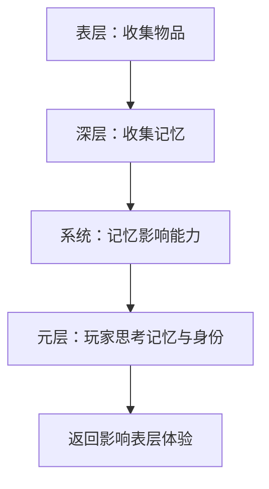

# 第5章：游戏机制与叙事融合

*当选择产生意义*

> "游戏是一系列有意义的选择。" — Sid Meier

## 开篇：理解机制与叙事的共生关系

想象你正在玩一款游戏：每次按下按钮，不仅改变了游戏状态，也推进了故事。在《Brothers: A Tale of Two Sons》中，左右手柄分别控制两兄弟，当哥哥死去后，你必须用原本控制哥哥的右手柄来让弟弟游泳——这个简单的控制变化，通过机制传达了比千言万语更深刻的失去感。

这就是游戏机制与叙事融合的力量：不是把故事"贴"在游戏上，而是让玩法本身成为叙事语言。本章将探讨如何设计这种深度整合，让每个交互都充满叙事意义。

传统媒体中，观众是被动接收者——读者翻页、观众看屏幕。而在游戏中，玩家的每个动作都在书写故事。当你在《Undertale》中选择饶恕而非战斗，你不只是在选择游戏路线，更是在定义角色的道德立场。当你在《This War of Mine》中决定偷窃老夫妇的食物来养活你的团队，这个艰难的选择本身就是最有力的反战叙事。

游戏机制与叙事的融合代表了一种全新的表达方式。正如电影通过蒙太奇创造意义，游戏通过机制的设计和组合来传达深层主题。一个精心设计的游戏不需要冗长的过场动画或大段文字说明——玩家在游玩过程中自然理解并内化了故事的核心。

### 本章学习目标

- 掌握MDA（Mechanics-Dynamics-Aesthetics）框架在叙事设计中的应用
- 理解如何将抽象机制转化为具体的叙事隐喻
- 学会设计与故事节奏同步的游戏循环
- 分析成功案例中机制与叙事的融合策略
- 实践使用专业工具创建互动叙事原型
- 识别并避免常见的设计陷阱
- 建立评估机制叙事效果的标准

## 5.1 游戏机制的叙事潜力

在传统观念中，游戏机制和叙事常被视为两个独立领域——机制负责"好玩"，叙事负责"意义"。但真正优秀的游戏设计证明，机制本身就能成为最有力的叙事工具。当玩家的每个操作都在讲述故事，当系统的每个规则都在强化主题，游戏就实现了其作为互动媒体的独特价值。

### 5.1.1 什么是有叙事性的机制？

并非所有游戏机制都具有叙事性。跳跃可能只是移动方式，但在《Celeste》中，跳跃的难度曲线镜像了主角克服焦虑的心路历程。区别在于：

**纯机制性设计**：
- 功能优先：实现特定的游戏目标
- 抽象规则：与现实世界无直接映射
- 重复可预测：玩家很快形成肌肉记忆
- 案例：《俄罗斯方块》的方块下落——纯粹的空间挑战

**叙事性机制设计**：
- 意义优先：每个动作都承载情感或主题
- 隐喻映射：机制模拟现实或心理状态
- 动态演化：随故事发展而改变含义
- 案例：《Journey》的鸣叫系统——陌生人之间建立联系的过程

**机制叙事性的判断标准**：

```
叙事性强度 = 意义密度 × 情感共鸣 × 主题一致性
```

1. **意义密度**：单一动作承载多少叙事信息
   - 低密度：开门就是开门
   - 高密度：开门意味着信任、探索未知、跨越界限

2. **情感共鸣**：机制触发的情感是否支持故事
   - 机械响应：按钮→门开（无情感）
   - 情感响应：颤抖的手→缓慢转动门把手→吱呀声（紧张感）

3. **主题一致性**：机制是否强化核心主题
   - 不一致：解谜游戏中的格斗系统
   - 高度一致：《Baba Is You》用规则操纵讲述"定义即现实"

**深度案例：《Death Stranding》的步行机制**

小岛秀夫将最基础的"行走"转化为核心叙事体验：

```
传统游戏的移动：
- 按方向键 → 角色移动
- 目的：从A到B
- 体验：过程被忽略

《Death Stranding》的步行：
- 平衡负重 → 规划路线 → 小心地形 → 对抗天气
- 目的：连接被分离的世界
- 体验：每一步都是与孤独的对抗
```

**机制细节的叙事作用**：
- 负重影响平衡 → 责任的重量
- 地形造成跌倒 → 道路的艰辛  
- 其他玩家的痕迹 → 人类互助的温暖
- 货物完好送达 → 使命完成的满足

这不仅仅是"送快递模拟器"，而是通过机制讲述后末日世界中重建人类连接的史诗。

**转化案例研究：从功能到意义**

让我们看看如何将一个简单的"收集"机制转化为叙事工具：

```
基础版本：收集金币
- 功能：增加分数
- 反馈：叮当声 + 数字增加
- 意义：几乎没有

叙事版本1：收集记忆碎片
- 功能：解锁过去的故事片段
- 反馈：闪回画面 + 情感音乐
- 意义：重建破碎的身份

叙事版本2：收集逝者遗物
- 功能：了解已故NPC的生平
- 反馈：遗物描述 + 环境变化
- 意义：哀悼与纪念的仪式

叙事版本3：收集他人的痛苦
- 功能：减轻NPC负担但增加自身难度
- 反馈：世界变亮但移动变缓
- 意义：同理心与自我牺牲的代价
```

每个版本都使用相同的基础机制（接触物品→获得奖励），但通过改变语境、反馈和系统联系，创造了完全不同的情感体验和主题表达。

### 5.1.2 机制的叙事层次

游戏机制的叙事作用并非单一维度，而是存在着多个相互关联的层次。理解这些层次有助于设计师构建更丰富的互动体验。

```
表层叙事：机制的直接表现
    ↓
深层隐喻：机制背后的含义
    ↓
系统叙事：多个机制交互产生的涌现故事
    ↓
元叙事：玩家对游戏本身的反思
```

**理解叙事层次的重要性**：

每个层次都为玩家提供不同深度的意义。casual玩家可能只体验表层，而深度玩家会挖掘所有层次。优秀的设计确保每个层次都有价值，但不强制玩家必须理解所有层次才能享受游戏。

**层次间的相互作用**：



**设计原则：洋葱式叙事**

就像剥洋葱，每一层都完整且有意义：
- 第一层满足基础玩家
- 深层奖励探索玩家
- 核心只为最投入的玩家保留

**深度案例分析：《This War of Mine》的多层次叙事**

让我们通过这个战争生存游戏来理解机制的叙事层次是如何协同工作的：

**第一层 - 表层叙事：看得见的行动**
- 搜集资源：翻找废墟中的物资
- 制作物品：用材料制造工具和家具
- 管理角色：分配食物、安排睡眠、治疗伤病
- 直接含义：这是一个关于在废墟中生存的游戏

**第二层 - 深层隐喻：行动背后的意义**
- 搜集资源 → 在绝境中寻找希望的挣扎
- 制作物品 → 用双手重建被战争摧毁的"正常生活"
- 管理角色 → 在匮乏中维持人性的艰难平衡
- 深层含义：战争如何将普通人推向道德的边缘

**第三层 - 系统叙事：机制交互创造的故事**
```
资源匮乏（系统压力）
    ↓
发现老夫妇家有食物（机会）
    ↓
选择偷窃（玩家决定）
    ↓
角色情绪低落（系统反馈）
    ↓
需要更多资源治疗抑郁（新的压力）
    ↓
恶性循环或道德觉醒（涌现叙事）
```

**第四层 - 元叙事：超越游戏的反思**
- 玩家意识到自己在"玩"他人的苦难
- 游戏的娱乐性与主题的沉重性产生张力
- 促使思考：我们如何消费和理解他人的痛苦？
- 最深层含义：游戏媒体本身的道德责任

**系统叙事的涌现特性**

系统叙事最迷人之处在于其不可预测性。设计师创造规则，但故事由玩家行为和系统反应共同书写：

```python
# 伪代码展示系统叙事的生成
class 战争生存系统:
    def 每日循环(self):
        while 战争继续:
            环境压力 = 计算当前困境()
            玩家选择 = 等待玩家决定()
            
            if 玩家选择.类型 == "道德妥协":
                短期收益 = 获得资源()
                长期代价 = 降低团队士气()
                可能后果 = [
                    "成员患上抑郁",
                    "其他成员质疑领导",
                    "逐渐适应残酷"
                ]
            
            elif 玩家选择.类型 == "坚守原则":
                短期损失 = 资源更加匮乏()
                长期收益 = 保持团队凝聚()
                可能后果 = [
                    "饥饿但团结",
                    "激发创造性解决方案",
                    "吸引其他幸存者帮助"
                ]
            
            # 每个选择改变系统状态
            # 新状态影响下一个选择
            # 独特的故事逐渐展开
```

### 5.1.3 机制语言的语法规则

就像自然语言有语法，游戏机制也遵循特定的"语法规则"来构建意义。理解这些规则能帮助我们更有意识地设计叙事性机制。

**为什么需要机制语法？**

传统叙事依靠文字和影像的既定语法，而游戏作为新兴媒体，其"语法"仍在形成中。掌握这些规则让我们能：
- 更准确地传达设计意图
- 避免无意识的叙事混乱
- 创造新的表达可能

**机制语法的核心要素**：

```
主语（谁） + 动词（做什么） + 宾语（对什么） + 状语（如何/何时/为何）
   ↓              ↓              ↓              ↓
玩家角色    +   核心机制    +   交互对象   +   条件限制
```

**1. 动作的时态 - 时间维度的叙事力**

游戏中的时间不仅是流逝的秒数，更是创造意义的维度：

```
现在时机制：即时反馈，强调当下
- 跳跃、射击、移动
- 叙事效果：紧张、专注、沉浸
- 设计要点：反馈必须立即且清晰
- 案例：《超级马里奥》的跳跃 - 按下即跳，创造直接控制感

过去时机制：探索已发生的事
- 调查、收集线索、重建事件
- 叙事效果：神秘、考古、侦探感
- 设计要点：信息碎片化，鼓励推理
- 案例：《她的故事》- 通过搜索视频片段重构过去

未来时机制：规划和预测
- 建造、种植、设置陷阱
- 叙事效果：希望、策略、成长
- 设计要点：延迟满足，可视化进程
- 案例：《文明》系列 - 每个决策影响未来几个回合甚至整局

条件时机制：基于触发的时间
- 当X发生时，Y将会发生
- 叙事效果：因果关系、蝴蝶效应
- 设计要点：清晰的因果链
- 案例：《奇异人生》- 改变过去影响现在的照片
```

**2. 机制的语态 - 能动性的分配**

语态决定了玩家在故事中的位置和力量：

```
主动语态：玩家直接控制
- "我攻击敌人" / "我打开门" / "我选择道路"
- 强调：能动性、责任感、英雄主义
- 适用场景：力量幻想、英雄叙事
- 设计陷阱：过度的控制可能降低挑战性

被动语态：环境作用于玩家  
- "我被感染了" / "我被追赶" / "我被审判"
- 强调：脆弱性、适应性、生存本能
- 适用场景：恐怖游戏、生存游戏
- 案例：《生化危机》- 被追赶时的无力感

中间语态：互惠互动
- "我们交易物品" / "我们建立联系" / "我们共同决定"
- 强调：社交性、协作性、相互依赖
- 适用场景：多人游戏、社交模拟
- 案例：《双人成行》- 必须协作的谜题

反身语态：作用于自己
- "我改变自己" / "我牺牲能力" / "我重塑记忆"
- 强调：内省、成长、自我认知
- 适用场景：心理主题、成长故事
- 案例：《Gris》- 通过颜色恢复自我
```

**3. 机制的情态 - 可能性空间**

情态定义了什么是可能的、必要的或偶然的：

```
必然性机制（Must）：必须执行的动作
- 呼吸氧气、定期进食、支付租金
- 创造：生存压力、紧迫感
- 叙事功能：建立世界规则的严酷性
- 设计要点：频率要适中，避免变成琐事
- 案例：《缺氧》- 氧气耗尽意味着死亡

可能性机制（Can）：可选但有益的动作
- 探索隐藏区域、收集成就、完成支线
- 创造：好奇心驱动、自主探索
- 叙事功能：丰富世界观、奖励细心
- 设计要点：奖励要有意义但非必需
- 案例：《空洞骑士》- 隐藏区域藏着lore

或然性机制（May）：可能发生的事件
- 随机遭遇、天气变化、NPC心情
- 创造：惊喜与适应、重玩价值
- 叙事功能：世界的生命力和不可预测性
- 设计要点：随机但不任意，符合逻辑
- 案例：《矮人要塞》- 随机事件创造史诗

禁止性机制（Cannot）：不可能的动作
- 不能攻击某些NPC、不能离开区域
- 创造：规则感、道德边界
- 叙事功能：定义角色身份和世界法则
- 设计要点：限制要有叙事理由
- 案例：《Undertale》- 和平路线不能杀敌
```

**4. 机制的体 - 完成度与过程**

动作的完成状态也传达不同的叙事信息：

```
完成体：动作有明确的结束
- 开门（开了就是开了）
- 击败敌人（死了就是死了）
- 叙事效果：确定性、成就感

进行体：动作是持续过程
- 推箱子（可以推一点点）
- 说服NPC（逐渐改变态度）
- 叙事效果：渐进性、努力感

尝试体：动作可能失败
- 试图开锁（可能成功或失败）
- 尝试跳跃（可能够不到）
- 叙事效果：不确定性、技巧需求
```

### 5.1.4 从机制到情感的转译

游戏设计的魔力在于将抽象的规则转化为真实的情感体验。这种转译不是自动发生的，需要精心的设计和调试。

**情感转译的心理学基础**：

人类大脑擅长将抽象模式转化为情感体验。游戏设计师的工作是创造正确的模式：

```
物理刺激 → 认知处理 → 情感响应 → 行为改变
    ↓           ↓           ↓           ↓
按键输入 → 理解规则 → 产生感受 → 调整策略
```

**关键转译技术**：

1. **节奏映射**：机制节奏 = 情感节奏
   - 快速点击 → 紧张焦虑
   - 缓慢推进 → 谨慎思考
   - 突然加速 → 惊吓反应

2. **阻力设计**：努力程度 = 情感投入
   - 轻松获得 → 低价值感
   - 艰难赢得 → 高成就感
   - 反复失败 → 执着或沮丧

3. **反馈强度**：感官刺激 = 情感强度
   - 震动+音效+视效 → 强烈冲击
   - 细微变化 → 潜意识影响
   - 延迟反馈 → 悬念期待

**核心情感映射表：**

| 机制类型 | 直接情感 | 叙事应用 | 经典案例 |
|---------|---------|---------|---------|
| 时间限制 | 焦虑、紧张 | deadline压力、倒计时危机 | 《XCOM》的任务时限 |
| 资源稀缺 | 担忧、谨慎 | 生存困境、分配难题 | 《这是我的战争》的物资 |
| 力量成长 | 成就、自豪 | 英雄之旅、技能精进 | 《空洞骑士》的能力获取 |
| 随机要素 | 惊喜、挫折 | 命运无常、适应变化 | 《FTL》的随机事件 |
| 社交互动 | 连接、背叛 | 关系建立、信任危机 | 《Among Us》的投票 |
| 探索发现 | 好奇、满足 | 揭秘过程、知识累积 | 《Outer Wilds》的星球探索 |
| 创造建设 | 自豪、依恋 | 家园情感、个人印记 | 《动物森友会》的岛屿设计 |
| 破坏毁灭 | 释放、愧疚 | 力量幻想、后果承担 | 《毁灭战士》的暴力美学 |

**深入分析：机制如何唤起情感**

让我们解构几个经典案例，理解情感转译的具体过程：

**案例1：《XCOM》的时间压力系统**
```
机制设计：
- 任务有回合限制（8-12回合）
- 每回合可移动距离有限
- 敌人增援不断到达

情感转译过程：
回合1-3：评估与规划（轻微紧张）
回合4-6：执行与调整（压力上升）
回合7-9：紧急决策（高度焦虑）
最后回合：孤注一掷（极度紧张/解脱）

叙事效果：
- 每个士兵的牺牲都变得有意义
- "不抛弃不放弃"vs"大局为重"的两难
- 时间压力强化了战术错误的代价
```

**案例2：《这是我的战争》的道德困境系统**
```
机制链条：
寒冷天气 → 需要燃料 → 燃料稀缺 → 发现老人家有木材
    ↓
玩家选择：偷窃木材
    ↓
立即后果：老人可能冻死
长期后果：角色抑郁、团队士气下降、玩家内疚

情感深化技巧：
- 老人的恳求声和颤抖动画
- 角色日记："我们还算是人吗？"
- 回到基地后其他角色的质问
- 抑郁角色的行动迟缓和拒绝进食
```

**情感强化的设计技巧**

1. **感官反馈放大**
```javascript
function 强化时间压力() {
    if (剩余时间 < 30秒) {
        音乐节奏.加快(1.5倍);
        心跳声.淡入();
        屏幕边缘.红色脉动();
        控制器.震动(递增强度);
    }
}
```

2. **后果可视化**
```
选择前：显示可能的影响
选择时：慢动作强调重要性
选择后：立即展示初步后果
稍后：展示连锁反应
更后：展示长期影响
```

3. **情感锚定技术**
- 在平静时刻建立情感连接（角色互动、日常对话）
- 危机时刻调用这些连接（"想想你的女儿"）
- 通过音乐主题、视觉符号强化记忆

**情感曲线设计**

```
情感强度
    ^
    |     危机高潮
    |    /\
    |   /  \    解决/释放
    |  /    \  /
    | /      \/
    |/  积累  低谷
起始 ─────────────> 时间

关键点：
- 起始：建立基准情感
- 积累：逐步提升紧张
- 危机：情感爆发点
- 低谷：反思时刻
- 解决：情感宣泄
```

**实践案例：设计一个"信任"机制**

让我们从零开始设计一个传达"信任"主题的机制：

```javascript
class 信任机制 {
    constructor() {
        this.信任值 = 50; // 起始中立
        this.历史记录 = [];
        this.背叛阈值 = 3;
    }
    
    给予信任(对象, 程度) {
        // 机制：将资源/信息托付给NPC
        let 风险 = 计算风险(对象, 程度);
        
        if (程度 === "完全信任") {
            // 玩家完全暴露弱点
            this.脆弱性 = 100;
            触发剧情("深度对话");
        }
        
        // 延迟反馈制造悬念
        setTimeout(() => {
            if (对象.会背叛() && 风险 > 对象.忠诚度) {
                this.遭遇背叛(对象);
            } else {
                this.建立联结(对象);
            }
        }, 游戏内时间(1天));
    }
    
    遭遇背叛(背叛者) {
        // 情感冲击
        屏幕效果.碎裂();
        音效.心碎();
        
        // 长期影响
        this.信任值 -= 30;
        this.疑心 += 1;
        
        // 叙事后果
        if (this.疑心 > this.背叛阈值) {
            解锁结局("孤独者");
        }
    }
}
```

这个机制通过延迟反馈、风险评估和累积后果，将抽象的"信任"概念转化为游戏内的紧张选择和情感体验。

### 5.1.5 机制的文化隐喻

不同文化背景下，相同的机制可能承载完全不同的叙事含义：

**收集机制的文化解读：**

- **西方语境**：个人成就、完成主义、征服欲
  - 案例：《刺客信条》收集羽毛象征对逝者的纪念
  
- **东方语境**：积累功德、缘分相遇、珍惜当下
  - 案例：《阴阳师》的式神收集体现"一期一会"
  
- **后殖民语境**：文化掠夺、归还正义、身份寻回
  - 案例：《Never Alone》收集文化洞察还原原住民故事

**战斗机制的叙事差异：**

```
直接对抗型（西方）
- 面对面决斗
- 强调个人英雄主义
- 例：《荣耀战魂》

间接博弈型（东方）
- 计谋与陷阱
- 强调智慧胜于蛮力
- 例：《全面战争：三国》

和解转化型（原住民）
- 理解而非消灭
- 强调万物互联
- 例：《Spiritfarer》
```

### 5.1.6 机制组合的叙事化学反应

当多个机制组合时，会产生远超各部分之和的叙事效果：

**经典组合公式：**

1. **限制 + 选择 = 道德重量**
   ```
   有限子弹 + 多个敌人 = 谁该活下来的抉择
   《This War of Mine》：有限食物 + 多个饥饿的人 = 分配的道德困境
   ```

2. **知识 + 时间循环 = 成长叙事**
   ```
   保留记忆 + 世界重置 = 通过知识改变命运
   《Outer Wilds》：宇宙知识 + 22分钟循环 = 考古学家的顿悟
   ```

3. **建造 + 破坏 = 无常主题**
   ```
   精心建设 + 随时可能被毁 = 执着与放下的哲学
   《Minecraft》：建造城堡 + 爬行者爆炸 = 创造与毁灭的轮回
   ```

4. **合作 + 信息不对称 = 信任考验**
   ```
   必须协作 + 各有秘密 = 信任与猜疑的张力
   《Way Out》：分工合作 + 隐藏动机 = 友谊的终极考验
   ```

### 5.1.7 反叙事机制：颠覆期待

有时最强大的叙事效果来自对机制期待的颠覆：

**颠覆类型：**

1. **机制剥夺**
   - 夺走玩家习惯的能力
   - 案例：《最后生还者2》某角色死亡后的操控转换
   - 效果：失落感、角色认同危机

2. **机制欺骗**
   - 机制的实际作用与表面不同
   - 案例：《The Stanley Parable》的假选择
   - 效果：自由意志的哲学思考

3. **机制反转**
   - 原本有益的变为有害
   - 案例：《Braid》时间倒流揭示真相
   - 效果：视角转换、道德重审

4. **机制拒绝**
   - 玩家可以选择不使用核心机制
   - 案例：《Undertale》的和平路线
   - 效果：玩家能动性的真正体现

## 5.2 MDA框架在叙事设计中的应用

MDA框架将游戏体验分解为三个层次，在叙事设计中，每层都有独特作用：

```
设计师视角：Mechanics → Dynamics → Aesthetics
玩家视角：  Aesthetics ← Dynamics ← Mechanics
```

理解这个反向关系至关重要：设计师创造规则，但玩家首先感受情感。优秀的叙事设计需要在两个方向上都保持连贯。

**MDA在叙事设计中的独特价值**：

1. **系统化思考**：将模糊的"叙事体验"分解为可设计的组件
2. **迭代指南**：明确问题在哪一层，针对性调整
3. **沟通工具**：团队成员用共同语言讨论叙事设计

### 5.2.1 机制层（Mechanics）：动词的设计

在传统写作中，我们用动词推进故事。在互动叙事中，机制就是玩家能使用的"动词"。

**动词设计的叙事原则**：

```
角色身份 → 可用动词 → 故事可能性
侦探 → 调查、询问、推理 → 解谜故事
战士 → 攻击、防御、激励 → 英雄史诗
医生 → 诊断、治疗、安慰 → 人性故事
```

**动词的语义权重**：

不同动词承载不同的道德和情感重量：
- "杀死" vs "击败" vs "消除" — 暴力程度递减
- "偷窃" vs "借用" vs "获取" — 道德色彩变化
- "说服" vs "欺骗" vs "威胁" — 互动方式差异

**核心动词类型**：

1. **探索类动词**
   - 移动、观察、搜索
   - 叙事功能：揭示世界观、推进情节
   - 案例：《Gone Home》中翻找物品揭露家庭秘密

2. **交互类动词**
   - 对话、交易、赠予
   - 叙事功能：塑造人物关系、展现性格
   - 案例：《Oxenfree》的对话系统塑造青少年群像

3. **改造类动词**
   - 建造、破坏、改变
   - 叙事功能：展现成长、环境叙事
   - 案例：《Minecraft》故事模式中的创造与毁灭

4. **选择类动词**
   - 决策、分配、牺牲
   - 叙事功能：道德困境、分支剧情
   - 案例：《Life is Strange》的时间倒流与选择

**设计原则**：
- 动词要与角色身份匹配（医生→治疗，侦探→调查）
- 动词组合产生叙事复杂性（偷窃+赠予=罗宾汉）
- 限制动词创造特定体验（只能逃跑=恐怖氛围）

**动词组合的化学反应**：

单一动词很少产生深度叙事，真正的复杂性来自动词间的交互：

```python
# 动词组合示例
class 动词系统:
    def 组合效果(self, 动词1, 动词2):
        组合 = {
            ("隐藏", "观察"): "间谍行为",
            ("破坏", "修复"): "破坏后重建",
            ("记录", "分享"): "历史见证者",
            ("收集", "分发"): "资源管理者"
        }
        return 组合.get((动词1, 动词2), "普通组合")
```

**案例分析：《Dishonored》的动词设计**

```
核心动词集：
├── 潜行（stealth）
├── 刺杀（assassinate）  
├── 附身（possess）
├── 瞬移（blink）
└── 时停（time stop）

叙事效果：
- 高混沌路线：频繁使用杀戮动词 → 世界变得更黑暗
- 低混沌路线：创造性使用非致命动词 → 世界保持希望
- 每个动词都是一种解决问题的哲学
```

**动词的情境敏感性**：

同一动词在不同情境下产生不同叙事效果：

```javascript
function 使用动词(动词, 情境) {
    switch(动词) {
        case "推":
            if (情境 === "悬崖边") return "谋杀";
            if (情境 === "秋千上") return "玩耍";
            if (情境 === "危险外") return "救援";
            break;
    }
}
```

### 5.2.2 动态层（Dynamics）：涌现的故事

当玩家使用机制时，产生的行为模式和结果构成动态层。优秀的设计让玩家行为本身成为故事。

**涌现叙事的类型**：

1. **玩家驱动的故事弧**
   ```
   初始状态 → 玩家行动 → 系统反馈 → 新状态 → 玩家适应
        ↑                                          ↓
        ←←←←←←←←←← 循环直到达成目标 ←←←←←←←←←←←←
   ```

2. **系统产生的戏剧冲突**
   - 资源稀缺迫使道德选择
   - 随机事件打破玩家计划
   - NPC的自主行为创造意外

3. **多玩家互动的叙事**
   - 合作产生友谊故事
   - 竞争创造对抗剧情
   - 背叛形成戏剧转折

**案例分析：《冰汽时代》(Frostpunk)**
- 机制：资源管理、法律制定、人口调度
- 动态：极寒→资源紧张→严苛法律→民众不满→更严苛统治
- 涌现故事：玩家从仁慈领袖逐渐变成独裁者的转变过程

#### 动态层的设计模式

**1. 正反馈循环（Positive Feedback Loop）**
```
成功 → 获得资源 → 更容易成功 → 获得更多资源
风险：滚雪球效应，破坏平衡
叙事应用：权力腐化、成功的傲慢、强者愈强
案例：《文明》中领先文明的科技优势不断扩大
```

**2. 负反馈循环（Negative Feedback Loop）**
```
领先 → 吸引敌意 → 遭受阻碍 → 优势缩小
作用：保持竞争性，延长游戏时间
叙事应用：高处不胜寒、众矢之的、平衡之道
案例：《马里奥赛车》的道具系统照顾落后玩家
```

**3. 螺旋式升级（Escalating Spiral）**
```
小冲突 → 报复 → 更大冲突 → 全面战争
特点：逐步升级，难以逆转
叙事应用：仇恨循环、冤冤相报、雪崩效应
案例：《十字军之王》的家族世仇系统
```

**4. 振荡平衡（Oscillating Balance）**
```
优势 ↔ 劣势 ↔ 优势（周期性变化）
作用：创造节奏感，防止单调
叙事应用：潮起潮落、命运无常、阴阳转换
案例：《XCOM》的战略层面优势与战术层面危机
```

#### 涌现叙事的催化剂

**1. 意外交互（Unexpected Interactions）**
```python
def 意外交互示例():
    火焰法术 + 雨天 = 蒸汽掩护
    冰冻敌人 + 推击 = 粉碎效果
    说服技能 + 商人 = 价格操纵
    
    # 叙事效果：玩家创造力的体现
```

**2. 系统冲突（System Conflicts）**
```
经济系统：需要砍树获得木材
生态系统：砍树破坏动物栖息地
社交系统：原住民抗议环境破坏

结果：玩家必须在多个系统间权衡
```

**3. 时机要素（Timing Elements）**
```
白天：商店开门，守卫警觉
黄昏：商店关门，守卫换班
夜晚：商店可偷窃，守卫昏昏欲睡

玩家选择何时行动 = 不同的故事路径
```

#### 动态层的叙事工具箱

**1. 涌现型角色塑造**

不预设角色性格，而是通过玩家行为累积定义：

```
行为追踪系统：
├── 暴力倾向（攻击次数 / 总遭遇）
├── 贪婪指数（掠夺财物 / 可用机会）
├── 同情心值（帮助他人 / 见死不救）
└── 冒险精神（探索区域 / 安全路线）

NPC反应：
if 暴力倾向 > 0.7:
    "我听说过你...那个嗜血的家伙"
elif 同情心值 > 0.8:
    "你就是那个见义勇为的英雄！"
```

**2. 关系网络动力学**

```
     A (玩家)
    / \     \
   B   C     D
   |\ /|     |
   | X |     E
   |/ \|
   F   G

- 帮助B → C因为是B的朋友也友好
- 伤害C → B和G都会敌对
- D独立于主网络，不受影响
- 复杂的连锁反应创造故事
```

**3. 情境记忆系统**

NPC和环境"记住"玩家行为：

```javascript
class 情境记忆 {
    记录事件(event) {
        this.历史.push({
            时间: 当前游戏时间,
            地点: 玩家位置,
            行为: event.类型,
            对象: event.目标,
            见证者: 附近NPC列表
        });
    }
    
    生成对话() {
        if (this.历史.包含("偷窃")) {
            if (时间差 < 1天) {
                return "小偷！就是昨天你偷了我的苹果！";
            } else if (时间差 < 1周) {
                return "我记得你...你就是那个小偷。";
            } else {
                return "你看起来很眼熟...";
            }
        }
    }
}
```

#### 动态层的测试与平衡

**1. 蒙特卡洛模拟**
```python
def 测试涌现行为(系统, 迭代次数=10000):
    结果分布 = {}
    
    for i in range(迭代次数):
        # 随机玩家行为
        玩家 = 生成随机玩家性格()
        结果 = 运行模拟(系统, 玩家)
        
        # 记录涌现的故事类型
        故事类型 = 分类故事(结果)
        结果分布[故事类型] += 1
    
    # 确保多样性
    assert len(结果分布) > 10, "故事类型过少"
    assert max(结果分布.values()) < 迭代次数 * 0.3, "某类故事过于常见"
```

**2. 玩家路径分析**
```
起点 ━━━━━━━━━━━━━━━━━━━━━━━━━━━━━ 终点
  ├─→ 和平路线 (15%) ─────────────→ 结局A
  ├─→ 暴力路线 (25%) ──┬─────────→ 结局B
  │                    └─────────→ 结局C
  ├─→ 外交路线 (30%) ─────────────→ 结局D
  └─→ 混合策略 (30%) ──┬─────────→ 结局E
                       ├─────────→ 结局F
                       └─────────→ 结局G

目标：确保每条路径都有独特的故事体验
```

### 5.2.3 美学层（Aesthetics）：情感体验

美学层是玩家最终获得的情感体验，是机制和动态的最终目的。

**八种核心游戏美学与叙事应用**：

1. **感官愉悦（Sensation）**
   - 叙事应用：通过视听营造氛围
   - 案例：《Journey》的视觉诗意

2. **幻想（Fantasy）**
   - 叙事应用：角色扮演与代入感
   - 案例：《巫师3》的道德灰度

3. **叙事（Narrative）**
   - 叙事应用：剧情本身作为奖励
   - 案例：《底特律》的分支剧情

4. **挑战（Challenge）**
   - 叙事应用：困难即是故事主题
   - 案例：《黑暗之魂》的绝望与希望

5. **社交（Fellowship）**
   - 叙事应用：玩家间产生的故事
   - 案例：《Sea of Thieves》的海盗传说

6. **发现（Discovery）**
   - 叙事应用：探索推动剧情展开
   - 案例：《Outer Wilds》的考古叙事

7. **表达（Expression）**
   - 叙事应用：玩家创造自己的故事
   - 案例：《模拟人生》的生活叙事

8. **归顺（Submission）**
   - 叙事应用：沉浸于故事节奏
   - 案例：《俄罗斯方块效应》的禅意

#### 美学组合的叙事深度

单一美学很少能创造丰富的叙事体验，真正的深度来自多种美学的精心组合：

**经典美学组合模式：**

1. **悲剧英雄组合**
   ```
   挑战 + 叙事 + 感官 = 悲壮史诗
   案例：《影子巨像》
   - 挑战：击败巨大的巨像
   - 叙事：拯救爱人的执念
   - 感官：荒凉壮美的世界
   结果：每次胜利都带着悲伤
   ```

2. **社交推理组合**
   ```
   社交 + 发现 + 表达 = 狼人杀体验
   案例：《Among Us》
   - 社交：玩家间的讨论投票
   - 发现：寻找内鬼的蛛丝马迹
   - 表达：扮演无辜或撒谎
   结果：每局都是独特的推理剧
   ```

3. **探索成长组合**
   ```
   发现 + 幻想 + 挑战递增 = 能力解锁叙事
   案例：《银河战士》系列
   - 发现：探索新区域
   - 幻想：从弱小到强大
   - 挑战：新能力开启新挑战
   结果：地图即是角色成长的见证
   ```

#### 情感设计的微观技巧

**1. 情感预热（Emotional Priming）**
```
音乐渐变 → 光线变化 → 节奏放缓 → 关键时刻
案例：《旅途》相遇时的音乐和视觉暗示
效果：放大情感冲击力
```

**2. 对比强化（Contrast Enhancement）**
```
平静 → 激烈 → 更深的平静
幽默 → 恐怖 → 更强的恐怖感
案例：《传送门》GLaDOS的黑色幽默与威胁
```

**3. 情感锚定（Emotional Anchoring）**
```javascript
class 情感锚定 {
    建立锚点(对象, 情感, 触发器) {
        // 第一次：对象 + 情感 + 音乐/视觉
        // 之后：仅音乐/视觉就能唤起情感
        
        if (首次遭遇) {
            播放主题曲();
            展示特定视觉元素();
            触发情感事件();
        } else {
            // 后续仅凭主题曲就能唤起回忆
            播放主题曲变奏();
            玩家.情感 = 回忆起(首次情感);
        }
    }
}
```

**4. 情感积累（Emotional Build-up）**
```
微小暗示 → 明显征兆 → 直接威胁 → 全面爆发

案例：《瘟疫传说》老鼠群的递进：
1. 远处吱吱声
2. 地面轻微震动  
3. 墙缝渗出黑影
4. 铺天盖地的鼠潮
```

#### 文化情感差异设计

不同文化背景的玩家对相同美学有不同响应：

**文化美学偏好矩阵：**

| 文化背景 | 偏好美学 | 回避美学 | 设计考虑 |
|---------|---------|---------|---------|
| 东亚 | 归顺、社交、发现 | 过度表达 | 含蓄叙事、集体主义主题 |
| 北美 | 挑战、表达、幻想 | 过度归顺 | 个人英雄主义、自由选择 |
| 欧洲 | 叙事、发现、感官 | 过度竞争 | 艺术表达、哲学深度 |
| 拉美 | 社交、表达、感官 | 孤立体验 | 家庭纽带、情感表达 |

#### 美学失衡的警示信号

**1. 单一美学过载**
```
症状：
- 纯挑战 → 玩家疲劳
- 纯叙事 → 缺乏参与感
- 纯社交 → 内向玩家流失

解决：
添加对立美学作为"调味剂"
```

**2. 美学冲突**
```
问题组合：
- 紧张挑战 + 轻松社交 = 精神分裂
- 严肃叙事 + 荒诞表达 = 基调混乱

解决：
选择主导美学，其他服务于主导
```

**3. 美学真空期**
```
现象：
某些游戏段落没有明确美学目标

后果：
玩家失去动力，不知为何继续

解决：
确保每个段落至少服务一种美学
```

## 5.3 机制作为隐喻：系统讲述的故事

游戏机制最强大之处在于其隐喻能力——通过抽象规则传达复杂概念。不同于文字直接描述，机制让玩家"体验"概念。

### 5.3.1 资源管理与生存主题

资源系统是最常见的机制隐喻，但其叙事潜力常被低估。

**基础资源类型的叙事含义**：

1. **有限资源 = 稀缺性叙事**
   - 生命值 → 脆弱性、死亡威胁
   - 弹药 → 暴力的代价、谨慎选择
   - 时间 → 紧迫感、优先级困境
   - 案例：《最后生还者》的资源稀缺强化末日氛围

2. **可再生资源 = 循环与希望**
   - 体力值 → 劳累与休息的节奏
   - 魔力值 → 力量的潮汐涨落
   - 信任度 → 关系的修复与破坏
   - 案例：《哈迪斯》的死亡重生循环

3. **转化资源 = 牺牲与交换**
   - 健康换伤害 → 自我牺牲的英雄主义
   - 道德换效率 → 目的与手段的权衡
   - 记忆换能力 → 遗忘的代价
   - 案例：《疫病传说》中老鼠群的双重性

**复合资源系统的叙事设计**：

```
玩家状态
├── 物理层
│   ├── 健康（生存压力）
│   ├── 饥饿（时间压力）
│   └── 疲劳（节奏控制）
├── 心理层
│   ├── 理智（心理恐怖）
│   ├── 士气（领导力挑战）
│   └── 压力（决策负担）
└── 社交层
    ├── 声望（社会地位）
    ├── 关系（人际网络）
    └── 忠诚（团队管理）
```

### 5.3.2 时间机制与记忆叙事

时间在游戏中不仅是资源，更是强大的叙事工具。

**时间机制的叙事应用**：

1. **实时推进**
   - 创造紧迫感和真实感
   - 案例：《Lifeline》的等待创造真实关系

2. **时间回溯**
   - 探索"如果"的可能性
   - 案例：《Braid》用时间机制隐喻懊悔

3. **时间循环**
   - 知识累积vs世界重置的张力
   - 案例：《Outer Wilds》22分钟的宇宙轮回

4. **非线性时间**
   - 记忆碎片的拼接
   - 案例：《她的故事》通过搜索重构真相

**时间压力的叙事效果**：

```python
def 时间压力类型:
    倒计时 = "明确的死线创造紧张感"
    衰减系统 = "逐渐恶化迫使行动"
    机会窗口 = "稍纵即逝强调决断"
    同步要求 = "协调多个时间线"
```

### 5.3.3 选择树与道德困境

选择是互动叙事的核心，但真正的叙事力量来自选择的设计方式。

**有效选择的特征**：

1. **不可逆性**
   - 选择产生永久后果
   - 创造"承担后果"的重量感

2. **信息不完整**
   - 选择时无法预知所有后果
   - 模拟真实决策的不确定性

3. **道德模糊**
   - 没有绝对的对错
   - 迫使玩家思考自己的价值观

4. **情感投入**
   - 选择涉及玩家关心的人/事
   - 理性vs情感的内心冲突

**选择设计模式**：

```
1. 两难选择（Dilemma）
   A利益 vs B利益（零和）
   例：救一个人还是救五个人

2. 牺牲选择（Sacrifice）
   短期损失 vs 长期收益
   例：现在花资源加固防御 vs 保存资源应对未来

3. 道德选择（Moral）
   原则坚持 vs 实际利益
   例：说真话但失去盟友 vs 撒谎维持关系

4. 身份选择（Identity）
   定义角色是谁
   例：选择对话风格塑造人格
```

**案例深度分析：《Papers, Please》的选择系统**

这个游戏将道德选择嵌入到最平凡的官僚工作中：

- **表面机制**：检查证件、盖章批准/拒绝
- **隐藏选择**：
  - 严格执法 vs 人道主义
  - 个人利益 vs 家庭需要
  - 服从命令 vs 道德良知
- **系统压力**：
  - 工资与罚款系统迫使道德妥协
  - 时间限制创造疏忽的可能
  - 家人生病增加情感负担
- **叙事效果**：玩家体验"平庸之恶"的形成过程

## 5.4 叙事节奏与游戏循环

游戏循环是玩家重复体验的行为模式，精心设计的循环能创造引人入胜的叙事节奏。

### 5.4.1 张力曲线设计

传统三幕结构在游戏中需要适应互动性：

```
经典三幕结构：
起 ────→ 承 ────→ 转 ────→ 合

游戏叙事结构：
引入 → 探索 → 掌握 → 扭转 → 升级 → 精通 → 高潮 → 结局
  ↑                                              ↓
  ←←←←←←←←← 可选的循环点 ←←←←←←←←←←←←←←←←←←←←
```

**微观循环与宏观叙事**：

1. **核心循环（30秒-2分钟）**
   - 基础玩法的重复
   - 例：战斗→拾取→前进

2. **任务循环（10-30分钟）**
   - 完整的小故事弧
   - 例：接任务→准备→执行→奖励

3. **章节循环（1-3小时）**
   - 主要剧情节点
   - 例：新区域→新机制→Boss战→剧情推进

4. **游戏循环（10-40小时）**
   - 完整的叙事体验
   - 例：英雄之旅的完整循环

### 5.4.2 奖励系统与故事推进

奖励不仅是游戏激励，更是叙事工具：

**叙事性奖励类型**：

1. **故事碎片**
   - 日记、录音、视频片段
   - 逐步揭示背景故事
   - 例：《Bioshock》的录音日志

2. **能力即故事**
   - 新能力反映角色成长
   - 能力来源解释世界观
   - 例：《Metroid》的能力获得

3. **关系进展**
   - NPC好感度影响剧情
   - 解锁角色背景故事
   - 例：《质量效应》的队友任务

4. **世界变化**
   - 玩家行动改变环境
   - 之前区域出现新内容
   - 例：《空洞骑士》的感染扩散

### 5.4.3 失败的叙事价值

在游戏中，失败不仅是挑战的一部分，更可以成为强大的叙事工具：

**失败的叙事功能**：

1. **强化主题**
   - 失败即是故事的一部分
   - 例：《黑暗之魂》"你死了"强化绝望氛围

2. **角色塑造**
   - 通过失败展现角色韧性
   - 例：《哈迪斯》主角的不断尝试

3. **知识获取**
   - 失败提供新信息
   - 例：《Outer Wilds》通过死亡学习

4. **情感投入**
   - 失败增加成功的甜美
   - 例：《Celeste》攀登的挫折与成就

**失败设计原则**：
- 失败要有意义（学到东西）
- 失败要公平（玩家理解原因）
- 失败要有趣（想要再试）
- 失败要推进故事（即使输了也有进展）

## 5.5 案例深度分析

### 5.5.1 《80 Days》：程序化叙事的典范

《80 Days》展示了如何将经典文学改编为互动体验，通过机制创造独特的叙事。

**核心机制分析**：

1. **路线选择系统**
   - 表面：选择下一个目的地
   - 深层：风险vs速度的权衡
   - 叙事：每条路线都是独特故事

2. **资源管理**
   - 金钱：限制选择，创造困境
   - 时间：核心压力，推动决策
   - 主人健康：人性化的限制

3. **对话系统**
   - 塑造主仆关系
   - 收集世界信息
   - 影响后续选项

**程序化叙事技术**：

```
城市节点
├── 固定内容
│   ├── 城市描述
│   ├── 历史背景
│   └── 地标事件
├── 条件内容
│   ├── 基于时间（季节、日期）
│   ├── 基于路线（从哪来）
│   └── 基于状态（金钱、健康）
└── 随机事件
    ├── 市场遭遇
    ├── 交通意外
    └── 社交机会
```

**叙事涌现性**：
- 170+城市 × 多条路线 × 随机事件 = 无限故事组合
- 每次游玩都是独特的环球冒险
- 玩家选择塑造个人版本的故事

**设计启示**：
1. 模块化内容支持重玩性
2. 主题一致性统一碎片化体验
3. 玩家代理感通过选择实现

### 5.5.2 《Lifeline》：实时机制创造情感连接

《Lifeline》用最简单的机制创造深刻的情感体验。

**核心创新：实时等待**

传统游戏：
```
玩家选择 → 立即看到结果 → 下一个选择
```

Lifeline模式：
```
玩家选择 → 等待（真实时间）→ 收到回复 → 思考时间 → 下一选择
```

**等待的叙事功能**：

1. **真实感**
   - Taylor需要时间执行你的建议
   - 睡觉、行走都需要真实时间
   - 创造"真人"的错觉

2. **悬念建立**
   - "我让他进入那个洞穴了吗？"
   - 等待期间的担忧增强情感投入
   - 推送通知创造惊喜时刻

3. **责任感**
   - 你的建议可能害死Taylor
   - 等待期间会反思决定
   - 失败带来真实的愧疚感

4. **生活融入**
   - 游戏融入日常生活节奏
   - 工作时收到求助增强沉浸感
   - 模糊游戏与现实的边界

**对话设计原则**：
- 保持角色声音的一致性
- 回应要承认玩家的选择
- 适时的幽默缓解紧张
- 关键时刻的情感爆发

### 5.5.3 《Papers, Please》：机制即故事

这个游戏将"盖章"这个平凡动作转化为道德拷问的工具。

**机制层次分析**：

1. **表层机制**
   ```
   检查文件 → 发现不符 → 盖章决定 → 下一位
   ```

2. **系统压力**
   ```
   时间压力（工资按人头）
        ↓
   准确要求（错误扣钱）
        ↓
   道德冲突（规则vs人性）
        ↓
   家庭需求（取暖、食物、药品）
   ```

3. **叙事涌现**
   - 第一天：仔细检查每个细节
   - 第五天：开始识别模式，加快速度
   - 第十天：面对sob story时的犹豫
   - 第十五天：为了效率牺牲人性
   - 第二十天：完全的机械化或坚持的挣扎

**道德机制设计**：

```python
class 道德困境:
    def __init__(self):
        self.规则 = "必须遵守的法律"
        self.同情 = "想要帮助的冲动"
        self.后果 = "违规的代价"
        self.奖励 = "遵守的收益"
    
    def 创造张力(self):
        return self.规则 vs self.同情 + self.后果的重量
```

**关键设计决策**：

1. **没有明确的对错**
   - 拒绝难民可能导致其死亡
   - 接受可能危害国家安全
   - 玩家必须自己权衡

2. **累积的压力**
   - 家人逐渐生病
   - 规则越来越严苛
   - 道德妥协变得"合理"

3. **多重结局**
   - 20个结局反映不同选择路径
   - 没有"完美"结局
   - 每个结局都是对玩家选择的评判

**影响力**：
- 证明简单机制可以承载复杂主题
- 启发"道德选择"游戏子类型
- 展示游戏作为社会评论的潜力

## 5.6 实践工具与框架

### 5.6.1 互动叙事创作工具

**入门级工具**：

1. **Twine**
   - 优势：可视化节点编辑，HTML输出
   - 适用：分支叙事，文字冒险
   - 学习曲线：低

2. **Ink**
   - 优势：强大的脚本语言，Unity集成
   - 适用：复杂对话系统，动态叙事
   - 学习曲线：中

3. **ChatMapper**
   - 优势：专业对话树设计，团队协作
   - 适用：RPG对话，视觉小说
   - 学习曲线：中

**进阶框架**：

1. **Yarn Spinner**
   - 特点：轻量级，易于集成
   - 最佳实践：对话密集型游戏

2. **Fungus (Unity)**
   - 特点：可视化脚本，无需编程
   - 最佳实践：Unity视觉小说

3. **RenPy**
   - 特点：Python基础，丰富功能
   - 最佳实践：完整视觉小说

### 5.6.2 状态管理最佳实践

```javascript
// 叙事状态管理示例
class NarrativeState {
    constructor() {
        this.flags = {};      // 布尔标记
        this.variables = {};  // 数值变量
        this.relationships = {}; // 关系数值
        this.inventory = [];  // 物品清单
    }
    
    // 检查复杂条件
    checkCondition(condition) {
        // 解析并评估条件字符串
        // 例："hasItem('key') && relationship('npc1') > 50"
    }
    
    // 记录玩家选择
    recordChoice(choiceId, consequences) {
        // 更新状态
        // 触发后果
        // 记录历史
    }
}
```

### 5.6.3 叙事测试方法

**自动化测试**：
1. 路径覆盖测试（所有分支可达）
2. 状态一致性测试（无逻辑矛盾）
3. 边界条件测试（极端情况）

**人工测试**：
1. 情感曲线测试（节奏是否合理）
2. 角色一致性测试（对话符合人设）
3. 主题传达测试（机制支持主题）

## 5.7 本章小结

游戏机制与叙事的融合代表了互动媒体的独特优势。通过本章学习，我们理解了：

### 核心概念回顾

1. **MDA框架的叙事应用**
   - Mechanics（机制）：玩家可用的动词，定义可能的行动
   - Dynamics（动态）：机制交互产生的行为模式和涌现故事
   - Aesthetics（美学）：最终的情感体验和叙事效果

2. **机制作为隐喻**
   - 资源系统映射生存压力、道德选择
   - 时间机制创造紧迫感、循环感、记忆重构
   - 选择设计通过不可逆性、信息不完整性产生意义

3. **叙事节奏设计**
   - 微观循环（核心玩法）到宏观循环（完整体验）的嵌套
   - 张力曲线适应互动性，创造多个高潮点
   - 失败作为叙事工具，而非单纯惩罚

4. **成功案例的启示**
   - 《80 Days》：模块化内容 + 程序化生成 = 无限故事
   - 《Lifeline》：实时等待 + 推送通知 = 情感连接
   - 《Papers, Please》：简单机制 + 系统压力 = 道德拷问

### 关键设计原则

- **一致性**：机制必须与故事主题、角色身份、世界观保持一致
- **涌现性**：好的设计让玩家行为本身成为故事
- **意义性**：每个机制都应承载叙事或情感价值
- **选择性**：提供有意义的选择，而非表面分支
- **系统性**：多个机制的交互创造复杂叙事

### 未来趋势

1. **AI驱动的动态叙事**：根据玩家行为实时生成个性化故事
2. **跨媒体叙事**：游戏机制延伸到现实世界（ARG）
3. **情感识别技术**：根据玩家情绪调整叙事节奏
4. **去中心化叙事**：玩家共创的持续演化世界

记住：最好的游戏叙事不是"看"的，而是"玩"出来的。机制与叙事的完美融合，让玩家成为故事的共同创作者。

## 5.8 练习题

### 基础题（理解概念）

**练习5.1：MDA框架分析**
选择一款你熟悉的游戏，分析其中一个核心机制：
- 描述机制层（具体规则）
- 分析动态层（产生的行为）
- 识别美学层（情感体验）

*提示：选择单一机制深入分析，如《马里奥》的跳跃或《黑魂》的死亡。*

<details>
<summary>参考答案</summary>

以《黑暗之魂》的死亡机制为例：

**机制层**：
- 死亡后在篝火重生
- 掉落所有灵魂（货币）
- 敌人全部复活
- 可以捡回掉落的灵魂

**动态层**：
- 玩家变得极度谨慎
- 形成"推进-死亡-学习-再试"循环
- 创造风险评估行为（是否继续前进）
- 产生"灵魂回收"的紧张任务

**美学层**：
- 挑战：克服困难的成就感
- 叙事：死亡循环符合不死人设定
- 感官：死亡画面的压迫感
- 发现：通过死亡学习敌人模式

</details>

**练习5.2：资源隐喻设计**
为一个关于"记忆消失"主题的游戏设计资源系统。列出3-5种资源及其叙事含义。

*提示：思考什么可以代表记忆？失去记忆会影响什么？*

<details>
<summary>参考答案</summary>

**记忆碎片**（主要资源）
- 获取：探索熟悉场景、与人对话
- 消耗：使用特殊能力、回忆过去
- 叙事：记忆既是力量也是负担

**身份点数**（次要资源）
- 获取：做符合过去身份的行动
- 失去：行为不一致、记忆冲突
- 叙事：我是谁的持续追问

**关系纽带**（社交资源）
- 建立：帮助他人、分享记忆
- 消耗：请求帮助、获取信息
- 叙事：他人记忆中的自己

**时间沙漏**（限制资源）
- 不可再生，持续流失
- 某些行动加速流失
- 叙事：彻底遗忘的最终期限

**梦境能量**（特殊资源）
- 睡眠时获得
- 用于进入记忆世界
- 叙事：潜意识的探索

</details>

**练习5.3：时间机制应用**
描述如何在一个侦探游戏中使用时间循环机制来增强叙事效果。

*提示：考虑《逆转裁判》式的调查，但加入时间循环元素。*

<details>
<summary>参考答案</summary>

**24小时谋杀循环**：

**基础设定**：
- 玩家是能看见时间循环的侦探
- 每24小时凶案会重复发生
- 其他人不记得之前的循环

**叙事应用**：
1. **知识累积**：每次循环收集新线索
2. **多视角**：跟踪不同嫌疑人的行动
3. **干预实验**：改变小细节观察蝴蝶效应
4. **情感深化**：反复目睹悲剧增加救人动机
5. **时间压力**：有限循环次数的meta设定

**机制特色**：
- 记笔记系统记录跨循环信息
- 关键时刻的介入选择
- 改变过多会导致时间线崩溃
- 最终目标：阻止凶案而非抓住凶手

</details>

### 挑战题（应用创新）

**练习5.4：道德选择系统设计**
设计一个不使用传统善恶值的道德系统。要求：
- 至少3个价值维度
- 每个维度都有叙事意义
- 选择影响但不限制后续选项

*提示：参考现实中的价值冲突，如自由vs安全。*

<details>
<summary>参考答案</summary>

**三维价值系统：理想主义者的困境**

**维度设计**：

1. **真相 vs 和谐**
   - 真相：揭露事实，不惜代价
   - 和谐：维护稳定，必要时隐瞒
   - 叙事：新闻记者的职业道德困境

2. **个体 vs 集体**
   - 个体：每个人的权利神圣不可侵犯
   - 集体：为多数人利益可以牺牲少数
   - 叙事：资源分配的领导困境

3. **当下 vs 未来**
   - 当下：解决眼前苦难
   - 未来：为长远打算储备
   - 叙事：环保vs发展的现实选择

**系统特点**：
- 没有"正确"答案
- 不同NPC认同不同价值
- 选择塑造主角性格而非限制
- 结局反映价值取向的后果

**实例选择**：
"工厂污染但提供就业"
- 关闭工厂：真相+1，未来+1，个体-1
- 改造工厂：和谐+1，当下-1
- 维持现状：集体+1，真相-1

</details>

**练习5.5：失败叙事设计**
为一个攀登主题的游戏设计"有意义的失败"。说明失败如何推进故事。

*提示：失败不只是重来，而是故事的一部分。*

<details>
<summary>参考答案</summary>

**《最后的登顶》失败系统**

**核心概念**：每次失败都是主角回忆中的一次真实尝试

**失败类型与叙事**：

1. **体力耗尽**
   - 解锁：过去训练的回忆
   - 永久提升：学会配速
   - 叙事：年轻时的鲁莽

2. **装备损坏**
   - 解锁：导师教诲的片段
   - 改进：装备检查机制
   - 叙事：准备的重要性

3. **天气恶化**
   - 解锁：其他登山者的故事
   - 新增：天气预测能力
   - 叙事：自然的无情

4. **心理崩溃**
   - 解锁：失去的同伴记忆
   - 获得：意志力机制
   - 叙事：为何要登顶

**累积效果**：
- 失败次数影响结局旁白
- 特定失败组合解锁隐藏剧情
- "完美登顶"vs"伤痕累累的胜利"
- 失败日志成为游戏内收集品

**设计哲学**：
"山不会变矮，但你可以变得更强"

</details>

**练习5.6：机制组合创新**
选择两个看似无关的游戏机制，设计它们的组合如何产生新的叙事可能。

*提示：如"俄罗斯方块的下落"+"对话选择的时限"。*

<details>
<summary>参考答案</summary>

**组合：建造机制 + 对话系统 = 《巴别塔谈判》**

**核心玩法**：
- 玩家同时进行外交谈判和建造巴别塔
- 建造进度影响谈判筹码
- 谈判结果影响可用资源

**机制融合**：

1. **高度即权力**
   - 塔越高，对话选项越强势
   - 但也更容易引起敌意
   - 叙事：权力的傲慢

2. **建材即承诺**
   - 使用他国提供的材料=外交承诺
   - 混合建材=复杂的联盟关系
   - 叙事：互相依赖的危险

3. **倒塌即重置**
   - 塔倒塌=外交关系清零
   - 但保留语言理解度
   - 叙事：文明的轮回

4. **语言即迷雾**
   - 初期对话选项被"加密"
   - 建造解锁语言理解
   - 叙事：沟通的渐进性

**涌现叙事**：
- 快速建造vs稳固联盟的抉择
- 背叛盟友获取稀有材料的诱惑
- 多结局：统一语言/永恒战争/孤立高塔

</details>

### 开放思考题

**练习5.7：未来机制预想**
随着技术发展（VR、AR、AI、脑机接口等），预想一种全新的游戏机制如何创造前所未有的叙事体验。描述这种机制的运作方式和叙事潜力。

**练习5.8：个人项目规划**
基于本章所学，为你的非传统书项目设计一个核心游戏机制。说明：
- 机制如何体现你的主题
- 预期的玩家行为
- 可能产生的涌现叙事

## 5.9 常见陷阱与错误

### 5.9.1 机制与叙事脱节

**错误表现**：
- 机制和故事像油和水，互不相干
- "先做好玩的游戏，再加故事"的思维
- 强行在机制上"贴"叙事元素

**典型案例**：
```
错误：跳跃收集游戏 + 深刻的战争反思故事
问题：机制的轻松与主题的沉重不匹配
```

**解决方案**：
1. 从主题出发设计机制
2. 让机制本身讲故事
3. 确保每个系统都服务于核心体验

### 5.9.2 选择泛滥症

**错误表现**：
- 每个对话都有5+选项
- 选择分支呈指数级增长
- 大部分选择无实质影响

**问题分析**：
- 开发成本失控
- 玩家选择疲劳
- 稀释重要选择的分量

**最佳实践**：
```
少而精的选择 > 多而浅的选择
有意义的默认 > 无意义的选项
系统性影响 > 一次性分支
```

### 5.9.3 Ludonarrative Dissonance（游戏机制与叙事的不协调）

**经典例子**：
- 主角是和平主义者，但游戏要求杀死上百敌人
- 剧情强调时间紧迫，但玩家可以无限期做支线
- 角色濒死却能继续战斗

**识别方法**：
问自己："如果这是电影，观众会觉得合理吗？"

**解决策略**：
1. **机制合理化**：为游戏行为找到叙事解释
2. **限制设计**：移除不符合叙事的选项
3. **拥抱荒诞**：承认并利用这种不协调

### 5.9.4 过度依赖数值

**错误表现**：
- "好感度+10"的露骨显示
- 道德值的简单二元对立
- 关系完全由数字决定

**问题**：
- 破坏沉浸感
- 鼓励"刷数值"而非真实选择
- 将复杂情感简化为算术

**改进方向**：
- 隐藏具体数值，用描述性反馈
- 多维度的关系系统
- 质变重于量变

### 5.9.5 节奏控制失当

**常见问题**：

1. **前置过长**
   - 30分钟教程才能开始真正游戏
   - 解决：立即给予核心体验

2. **高潮缺失**
   - 平淡的战斗接平淡的对话
   - 解决：设计情感曲线

3. **强制步调**
   - 不允许玩家控制节奏
   - 解决：提供"呼吸"空间

### 5.9.6 AI生成内容的陷阱

**错误使用**：
- 完全依赖AI生成对话
- 缺乏人工把关和编辑
- 忽视一致性和个性

**正确方向**：
- AI作为辅助而非替代
- 建立严格的品质控制
- 保持角色声音的独特性

## 5.10 最佳实践检查清单

### 设计阶段

- [ ] **主题与机制一致性**
  - 核心机制体现核心主题
  - 所有系统服务于整体体验
  - 移除与主题冲突的元素

- [ ] **玩家动词设计**
  - 列出所有玩家可执行动作
  - 确保每个动作有叙事意义
  - 动词组合创造有趣可能

- [ ] **选择设计原则**
  - 每个选择都有真实后果
  - 提供足够信息但保留不确定性
  - 避免明显的"正确"答案

- [ ] **失败处理策略**
  - 失败推进而非阻碍故事
  - 提供学习和成长机会
  - 保持玩家继续的动力

### 实现阶段

- [ ] **状态管理架构**
  - 清晰的变量命名规范
  - 模块化的条件检查系统
  - 可扩展的存档结构

- [ ] **内容创作流程**
  - 统一的写作风格指南
  - 版本控制和协作工具
  - 定期的叙事一致性审查

- [ ] **测试计划**
  - 全路径可达性测试
  - 情感节奏测试
  - 真实玩家反馈收集

### 优化阶段

- [ ] **性能考虑**
  - 大量分支的内存管理
  - 动态加载内容策略
  - 流畅的状态转换

- [ ] **可访问性**
  - 难度选项不影响叙事
  - 重要信息的多渠道传达
  - 允许玩家按需调整节奏

- [ ] **长期维护**
  - 模块化内容便于更新
  - 清晰的文档和注释
  - 预留扩展接口

### 发布准备

- [ ] **完整性检查**
  - 所有路径都有满意结局
  - 没有未完成的剧情线
  - 承诺的选择都有回应

- [ ] **本地化准备**
  - 文本与代码分离
  - 考虑文化差异的选择
  - UI适应不同语言长度

- [ ] **社区功能**
  - 分享精彩时刻的机制
  - 讨论不同选择的空间
  - 收集玩家故事的渠道

记住：最好的游戏叙事设计是看不见的——玩家只感受到完整、自然、有意义的体验。