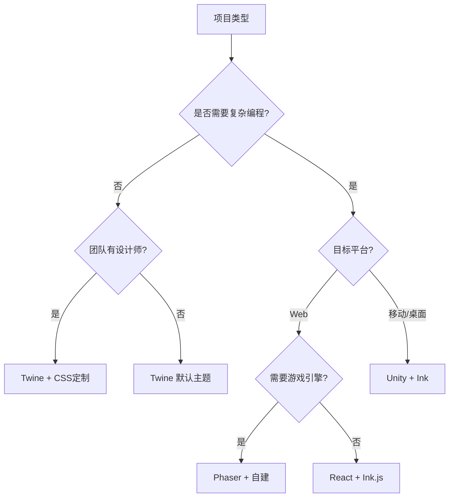

# 第7章：技术实现与工具链
*从概念到产品的技术路径*

> "好的工具是思想的延伸，而非限制。" — Alan Kay

当你的非传统书籍概念已经成型，接下来最关键的决定就是：如何将它变为现实？本章将深入探讨技术实现的核心问题，帮助你选择合适的工具链，设计高效的工作流程，并优化最终产品的性能表现。

## 学习目标

完成本章后，你将能够：

- **评估和选择**适合项目需求的技术栈
- **设计**适应非线性内容特性的版本控制策略
- **实现**可扩展的内容加载和状态管理系统
- **优化**大规模非传统书籍的性能表现
- **构建**从原型到产品的完整技术流程

## 7.1 技术栈选择：生态系统对比

选择正确的工具就像选择正确的编程语言——没有绝对的对错，只有是否适合。让我们深入了解主流工具的特性和适用场景。

### 7.1.1 Twine：可视化的力量

[Twine](https://twinery.org/) 是最受欢迎的交互式叙事工具之一，它的核心优势在于可视化编辑。

**架构特点：**
```
┌─────────────┐     ┌─────────────┐     ┌─────────────┐
│   Passage   │────▶│   Passage   │────▶│   Passage   │
│  "开始"     │     │  "选择A"    │     │  "结局1"    │
└─────────────┘     └─────────────┘     └─────────────┘
       │                                          ▲
       └──────────▶ ┌─────────────┐             │
                    │   Passage   │─────────────┘
                    │  "选择B"    │
                    └─────────────┘
```

**优势：**
- 零编程门槛，作家友好
- 内置多种故事格式（Harlowe, SugarCube, Snowman）
- 强大的社区和扩展生态
- 导出为单一HTML文件，易于分发

**限制：**
- 复杂交互逻辑实现困难
- 大型项目管理混乱
- 自定义UI需要深入了解底层

**最佳实践：**
```javascript
// SugarCube 格式的状态管理示例
<<set $inventory to []>>
<<set $karma to 0>>

:: 商店 
<<if $gold >= 10>>
    [[购买宝剑|购买确认][$gold -= 10; $inventory.push("宝剑")]]
<<else>>
    金币不足！
<</if>>
```

### 7.1.2 Ink：程序员的叙事语言

[Ink](https://www.inklestudios.com/ink/) 由Inkle Studios开发，是一种专为叙事设计的标记语言。

**语法示例：**
```ink
=== 咖啡馆 ===
你走进了一家安静的咖啡馆。
* [点一杯拿铁] -> 拿铁
* [点一杯美式] -> 美式
* [什么都不点] -> 离开

=== 拿铁 ===
~ karma += 1
香醇的拿铁让你感到温暖。
-> 继续故事

=== 美式 ===
~ karma -= 1  
苦涩的美式让你更加清醒。
-> 继续故事
```

**优势：**
- 纯文本格式，Git友好
- 强大的变量和函数系统
- 可嵌入Unity、Unreal等游戏引擎
- 支持外部函数调用

**限制：**
- 需要编程思维
- UI需要单独实现
- 学习曲线较陡

**集成示例（JavaScript）：**
```javascript
// 使用ink.js运行时
const Story = require('inkjs').Story;
const inkContent = require('./story.ink.json');

const story = new Story(inkContent);

while(story.canContinue) {
    console.log(story.Continue());
    
    if(story.currentChoices.length > 0) {
        story.currentChoices.forEach((choice, i) => {
            console.log(`${i + 1}. ${choice.text}`);
        });
        // 等待用户输入...
    }
}
```

### 7.1.3 自建框架：完全掌控

对于有特殊需求的项目，自建框架可能是最佳选择。

**架构设计示例：**
```typescript
// 核心叙事引擎
interface StoryNode {
    id: string;
    content: string;
    choices?: Choice[];
    conditions?: Condition[];
    effects?: Effect[];
}

interface Choice {
    text: string;
    target: string;
    conditions?: Condition[];
}

class NarrativeEngine {
    private nodes: Map<string, StoryNode>;
    private state: GameState;
    private history: string[];
    
    constructor() {
        this.nodes = new Map();
        this.state = new GameState();
        this.history = [];
    }
    
    loadStory(storyData: StoryData) {
        // 解析和验证故事数据
    }
    
    getCurrentNode(): StoryNode {
        return this.nodes.get(this.state.currentNodeId);
    }
    
    makeChoice(choiceIndex: number) {
        const currentNode = this.getCurrentNode();
        const choice = currentNode.choices[choiceIndex];
        
        // 检查条件
        if (this.checkConditions(choice.conditions)) {
            // 应用效果
            this.applyEffects(currentNode.effects);
            // 记录历史
            this.history.push(this.state.currentNodeId);
            // 跳转
            this.state.currentNodeId = choice.target;
        }
    }
}
```

**技术栈组合建议：**

1. **Web优先方案：**
   - Frontend: React/Vue + TypeScript
   - State: MobX/Zustand
   - Styling: Emotion/Tailwind
   - Build: Vite/Webpack

2. **游戏引擎方案：**
   - Unity + Ink
   - Godot + 自定义脚本
   - Ren'Py（视觉小说专用）

3. **原生应用方案：**
   - React Native + 自建引擎
   - Flutter + Dart
   - Electron + Web技术栈

### 7.1.4 工具选择决策树



## 7.2 版本控制：管理非线性的复杂性

传统的线性文本用Git管理很简单，但非线性内容带来了独特挑战。

### 7.2.1 内容组织策略

**1. 原子化内容文件：**
```
project/
├── story/
│   ├── chapters/
│   │   ├── ch01/
│   │   │   ├── start.ink
│   │   │   ├── branch_a.ink
│   │   │   └── branch_b.ink
│   │   └── ch02/
│   ├── characters/
│   │   ├── protagonist.json
│   │   └── npc_merchant.json
│   └── world/
│       ├── locations.json
│       └── items.json
├── assets/
│   ├── images/
│   ├── audio/
│   └── fonts/
└── src/
    ├── engine/
    ├── ui/
    └── utils/
```

**2. 内容引用系统：**
```yaml
# story/chapters/ch01/metadata.yml
chapter:
  id: ch01
  title: "觉醒"
  entry_point: "start"
  
nodes:
  - id: "start"
    file: "start.ink"
    connects_to: ["branch_a", "branch_b"]
    
  - id: "branch_a"
    file: "branch_a.ink"
    requires: ["item:key_card"]
    
dependencies:
  characters: ["protagonist", "npc_merchant"]
  locations: ["spaceship_bridge", "cargo_bay"]
```

### 7.2.2 分支策略

**内容分支 vs 代码分支：**

```bash
# 功能分支
git checkout -b feature/inventory-system

# 内容分支（章节）
git checkout -b content/chapter-3

# 实验性分支路线
git checkout -b experiment/alternate-ending

# 本地化分支
git checkout -b localization/zh-cn
```

**合并策略：**
```bash
# 使用 --no-ff 保留内容开发历史
git merge --no-ff content/chapter-3

# 内容冲突解决脚本
#!/bin/bash
# merge-story-conflicts.sh
for file in $(git diff --name-only --diff-filter=U); do
    if [[ $file == *.ink ]]; then
        echo "Resolving story conflict in $file"
        # 自定义合并逻辑
    fi
done
```

### 7.2.3 协作工作流

**1. 内容锁定机制：**
```javascript
// 防止同时编辑冲突
class ContentLock {
    async acquireLock(nodeId, userId) {
        const lockFile = `.locks/${nodeId}.lock`;
        
        if (await fs.exists(lockFile)) {
            const lock = await fs.readJson(lockFile);
            if (lock.userId !== userId) {
                throw new Error(`Node ${nodeId} is locked by ${lock.userId}`);
            }
        }
        
        await fs.writeJson(lockFile, {
            userId,
            timestamp: Date.now(),
            nodeId
        });
    }
}
```

**2. 内容审核流程：**
```yaml
# .github/workflows/content-review.yml
name: Content Review
on:
  pull_request:
    paths:
      - 'story/**'
      
jobs:
  validate:
    runs-on: ubuntu-latest
    steps:
      - uses: actions/checkout@v2
      
      - name: Validate Story Structure
        run: |
          npm run validate:story
          npm run check:links
          npm run test:narratives
          
      - name: Generate Preview
        run: |
          npm run build:preview
          npm run deploy:preview
          
      - name: Comment PR
        uses: actions/github-script@v6
        with:
          script: |
            github.rest.issues.createComment({
              issue_number: context.issue.number,
              owner: context.repo.owner,
              repo: context.repo.repo,
              body: `📖 Preview available at: https://preview.example.com/pr-${context.issue.number}`
            })
```

## 7.3 性能优化：让复杂保持流畅

大规模非线性内容的性能优化不同于传统Web应用，需要特别关注内容加载、状态管理和资源调度。

### 7.3.1 智能内容加载

**1. 预测性预加载：**
```javascript
class PredictiveLoader {
    constructor(engine) {
        this.engine = engine;
        this.loadedChunks = new Set();
        this.loadingChunks = new Map();
    }
    
    async predictAndLoad(currentNodeId) {
        const currentNode = this.engine.getNode(currentNodeId);
        const predictions = this.calculatePredictions(currentNode);
        
        // 基于用户历史和当前状态预测可能路径
        for (const prediction of predictions) {
            if (prediction.probability > 0.3) {
                this.preloadChunk(prediction.nodeId, prediction.priority);
            }
        }
    }
    
    calculatePredictions(node) {
        const predictions = [];
        
        // 直接可达节点
        node.choices?.forEach(choice => {
            predictions.push({
                nodeId: choice.target,
                probability: 1.0 / node.choices.length,
                priority: 'high'
            });
        });
        
        // 基于用户行为模式
        const userPattern = this.analyzeUserPattern();
        
        // 基于故事结构
        const structuralPredictions = this.analyzeStoryStructure(node);
        
        return this.mergePredictions(predictions, userPattern, structuralPredictions);
    }
    
    async preloadChunk(nodeId, priority = 'low') {
        if (this.loadedChunks.has(nodeId) || this.loadingChunks.has(nodeId)) {
            return;
        }
        
        const loadPromise = this.loadChunk(nodeId);
        this.loadingChunks.set(nodeId, loadPromise);
        
        if (priority === 'high') {
            await loadPromise;
        } else {
            // 低优先级使用 requestIdleCallback
            requestIdleCallback(() => loadPromise);
        }
    }
}
```

**2. 分块加载策略：**
```typescript
// 内容分块配置
interface ChunkConfig {
    id: string;
    dependencies: string[];
    size: number;
    priority: 'critical' | 'high' | 'normal' | 'low';
    cache: 'memory' | 'disk' | 'none';
}

class ChunkManager {
    private chunks: Map<string, ChunkConfig> = new Map();
    private loaded: Set<string> = new Set();
    private cache: LRUCache<string, any>;
    
    constructor(cacheSize: number = 50 * 1024 * 1024) { // 50MB
        this.cache = new LRUCache({ 
            max: cacheSize,
            length: (chunk) => chunk.size
        });
    }
    
    async loadChunk(chunkId: string): Promise<any> {
        // 检查缓存
        if (this.cache.has(chunkId)) {
            return this.cache.get(chunkId);
        }
        
        const config = this.chunks.get(chunkId);
        
        // 加载依赖
        await Promise.all(
            config.dependencies.map(dep => this.loadChunk(dep))
        );
        
        // 加载实际内容
        const content = await this.fetchChunk(chunkId);
        
        // 根据策略缓存
        if (config.cache !== 'none') {
            this.cache.set(chunkId, content);
        }
        
        this.loaded.add(chunkId);
        return content;
    }
}
```

### 7.3.2 状态管理优化

**1. 增量存档系统：**
```javascript
class SaveSystem {
    constructor() {
        this.baseState = null;
        this.stateDeltas = [];
        this.autoSaveInterval = 30000; // 30秒
    }
    
    // 使用增量保存减少存储大小
    save(currentState) {
        if (!this.baseState) {
            this.baseState = structuredClone(currentState);
            return this.compress(this.baseState);
        }
        
        const delta = this.createDelta(this.baseState, currentState);
        this.stateDeltas.push({
            timestamp: Date.now(),
            delta
        });
        
        // 定期合并deltas
        if (this.stateDeltas.length > 100) {
            this.compactDeltas();
        }
        
        return this.compress({
            base: this.baseState,
            deltas: this.stateDeltas
        });
    }
    
    load(saveData) {
        const { base, deltas } = this.decompress(saveData);
        let state = structuredClone(base);
        
        // 应用所有增量
        for (const { delta } of deltas) {
            state = this.applyDelta(state, delta);
        }
        
        return state;
    }
    
    createDelta(oldState, newState) {
        // 使用 JSON Patch 格式
        return jsonpatch.compare(oldState, newState);
    }
}
```

**2. 状态快照与时间旅行：**
```typescript
class TimeTravel {
    private snapshots: StateSnapshot[] = [];
    private maxSnapshots: number = 50;
    
    captureSnapshot(state: GameState, description: string) {
        const snapshot: StateSnapshot = {
            id: crypto.randomUUID(),
            timestamp: Date.now(),
            state: this.serializeState(state),
            description,
            nodeId: state.currentNodeId
        };
        
        this.snapshots.push(snapshot);
        
        // 保持快照数量限制
        if (this.snapshots.length > this.maxSnapshots) {
            // 保留关键快照（章节开始、重要选择等）
            this.snapshots = this.intelligentPrune(this.snapshots);
        }
    }
    
    rewindTo(snapshotId: string): GameState {
        const snapshot = this.snapshots.find(s => s.id === snapshotId);
        if (!snapshot) {
            throw new Error(`Snapshot ${snapshotId} not found`);
        }
        
        // 清理此后的快照
        const index = this.snapshots.indexOf(snapshot);
        this.snapshots = this.snapshots.slice(0, index + 1);
        
        return this.deserializeState(snapshot.state);
    }
}
```

### 7.3.3 资源优化策略

**1. 多媒体资源管理：**
```javascript
class ResourceOptimizer {
    constructor() {
        this.qualityLevels = {
            high: { image: 1.0, audio: 320, video: 1080 },
            medium: { image: 0.7, audio: 128, video: 720 },
            low: { image: 0.4, audio: 64, video: 480 }
        };
    }
    
    async optimizeForDevice() {
        const connection = navigator.connection;
        const memory = performance.memory;
        
        // 基于网络状况
        if (connection?.effectiveType === '2g' || connection?.saveData) {
            return 'low';
        }
        
        // 基于设备内存
        if (memory?.totalJSHeapSize > 500 * 1024 * 1024) {
            return 'medium';
        }
        
        // 基于屏幕分辨率
        const pixelRatio = window.devicePixelRatio || 1;
        if (pixelRatio < 2) {
            return 'medium';
        }
        
        return 'high';
    }
    
    generateResourceURL(resource, quality) {
        const base = resource.url;
        const ext = path.extname(base);
        const name = path.basename(base, ext);
        
        switch (resource.type) {
            case 'image':
                return `${name}_${quality}${ext}`;
            case 'audio':
                return `${name}_${this.qualityLevels[quality].audio}kbps${ext}`;
            case 'video':
                return `${name}_${this.qualityLevels[quality].video}p${ext}`;
            default:
                return base;
        }
    }
}
```

**2. 懒加载与虚拟化：**
```typescript
// 用于长列表（如存档列表、成就系统）的虚拟滚动
class VirtualScroller {
    private container: HTMLElement;
    private itemHeight: number;
    private items: any[];
    private visibleRange: { start: number; end: number };
    
    constructor(container: HTMLElement, items: any[], itemHeight: number) {
        this.container = container;
        this.items = items;
        this.itemHeight = itemHeight;
        
        this.setupVirtualScroll();
    }
    
    private setupVirtualScroll() {
        // 创建占位元素
        const totalHeight = this.items.length * this.itemHeight;
        const spacer = document.createElement('div');
        spacer.style.height = `${totalHeight}px`;
        
        this.container.appendChild(spacer);
        
        // 监听滚动
        this.container.addEventListener('scroll', () => {
            this.updateVisibleItems();
        });
        
        this.updateVisibleItems();
    }
    
    private updateVisibleItems() {
        const scrollTop = this.container.scrollTop;
        const containerHeight = this.container.clientHeight;
        
        const start = Math.floor(scrollTop / this.itemHeight);
        const end = Math.ceil((scrollTop + containerHeight) / this.itemHeight);
        
        // 添加缓冲区
        const buffer = 5;
        this.visibleRange = {
            start: Math.max(0, start - buffer),
            end: Math.min(this.items.length, end + buffer)
        };
        
        this.renderVisibleItems();
    }
}
```
