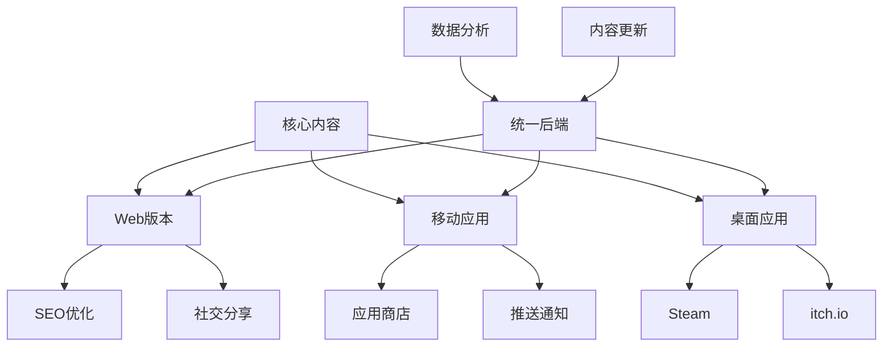
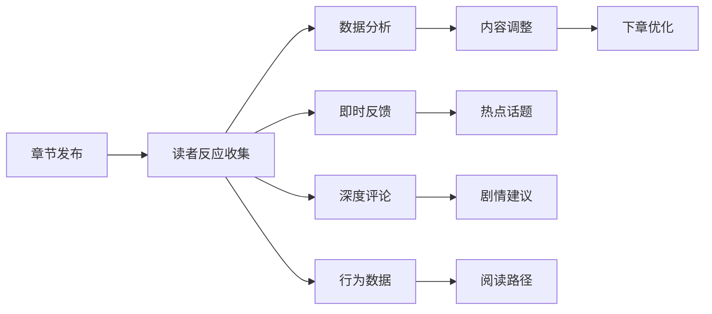
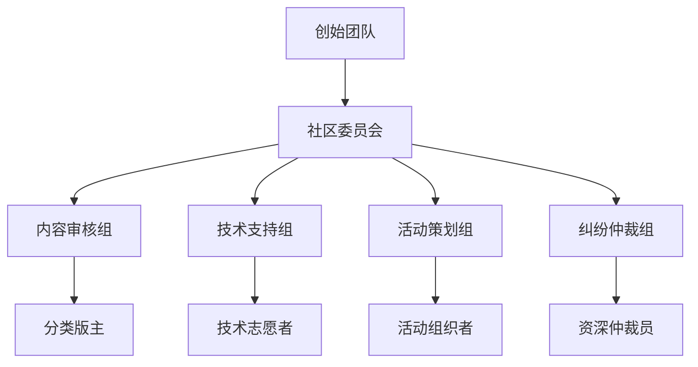

# 第8章：发布、迭代与社区
*让你的作品活起来*

> "发布不是结束，而是对话的开始。" — Craig Mod

## 🎯 本章学习目标

在本章中，你将学习如何将非传统书从创作阶段推向读者，并建立持续演化的生态系统：

- **平台选择策略**：理解不同发布平台的特性，选择最适合你作品的渠道
- **迭代更新哲学**：掌握内容更新的节奏和方法，保持作品的生命力
- **社区运营艺术**：将读者转化为共创者，建立繁荣的创作社区
- **数据驱动优化**：通过分析读者行为改进作品体验
- **商业模式探索**：在创意表达和可持续发展之间找到平衡

## 📊 章节概览

```
发布策略
    ├── 平台生态系统
    │   ├── Web平台（自主性vs流量）
    │   ├── 应用商店（审核vs分发）
    │   └── 游戏平台（Steam/itch.io）
    │
    ├── 更新与版本管理
    │   ├── 季节制更新
    │   ├── 章节式发布
    │   └── 永续演化模式
    │
    └── 社区建设
        ├── 读者参与机制
        ├── UGC内容管理
        └── 社区文化培育
```

---

## 8.1 平台策略：选择你的战场

### 8.1.1 Web平台：自由与责任

Web仍然是非传统书最灵活的发布平台。没有审核限制，完全掌控更新节奏，但也意味着你需要自己解决所有技术和推广问题。

#### 自建网站的优势与挑战

**优势：**
- 完全的创意控制
- 即时更新能力
- 无平台抽成
- SEO可控性
- 数据完全掌握

**挑战：**
- 技术维护成本
- 流量获取困难
- 安全责任
- 性能优化
- 跨设备适配

#### 技术架构选择

```yaml
静态生成（SSG）:
  优点: 
    - 性能极佳
    - 易于CDN分发
    - 安全性高
  缺点:
    - 动态内容受限
    - 重建时间随内容增长
  适用: 
    - 内容相对稳定的作品
    - 《17776》类型的滚动叙事

服务端渲染（SSR）:
  优点:
    - SEO友好
    - 动态内容支持
    - 首屏加载快
  缺点:
    - 服务器成本
    - 复杂度较高
  适用:
    - 需要个性化内容的作品
    - 多用户协作平台

客户端应用（SPA）:
  优点:
    - 丰富的交互体验
    - 离线能力
    - 原生应用体验
  缺点:
    - SEO挑战
    - 首次加载慢
    - 浏览器兼容性
  适用:
    - 游戏化程度高的作品
    - 复杂状态管理需求
```

#### 推广渠道矩阵

1. **搜索引擎优化（SEO）**
   - 结构化数据标记
   - 内容可索引性
   - 移动优先设计
   - 页面加载速度

2. **社交媒体策略**
   - 可分享的片段设计
   - 社交预览优化
   - 病毒传播机制
   - 社区话题创造

3. **内容平台联动**
   - Medium/知乎专栏预热
   - YouTube/B站视频导流
   - Podcast访谈推广
   - Newsletter订阅转化

### 8.1.2 应用商店：规范化的力量

iOS App Store和Google Play提供了巨大的用户基础，但也带来了严格的审核和分成机制。

#### 审核准备清单

- [ ] 内容分级准确标注
- [ ] 无版权争议素材
- [ ] 隐私政策完备
- [ ] 应用内购买合规
- [ ] 儿童保护措施
- [ ] 无恶意代码
- [ ] 界面符合平台规范
- [ ] 本地化质量达标

#### 商业模式设计

```
付费下载模式:
  优点: 收入前置，用户筛选
  缺点: 获客成本高，试用门槛
  
免费增值模式:
  优点: 用户基数大，转化灵活  
  缺点: 变现率低，平衡困难

订阅模式:
  优点: 持续收入，用户粘性
  缺点: 内容压力，退订风险

广告模式:
  优点: 用户免费，规模效应
  缺点: 体验损害，收入不稳定
```

#### ASO（应用商店优化）策略

1. **标题优化**：包含核心关键词，突出独特卖点
2. **描述撰写**：前三行决定转化，使用要点列表
3. **视觉设计**：图标辨识度，截图叙事性
4. **评分管理**：主动引导正面评价，快速响应负面反馈
5. **更新说明**：把更新当作营销机会

### 8.1.3 游戏平台：社区的力量

Steam、itch.io、Epic Games Store等平台拥有成熟的玩家社区，特别适合游戏化程度高的非传统书。

#### Steam发布策略

**准备阶段：**
1. Steam Direct费用（$100）
2. 税务信息准备
3. 年龄分级评定
4. 本地化要求（至少英文）

**商店页面优化：**
- 引人入胜的预告片（前15秒关键）
- 10张展示核心特色的截图
- 详细的"关于这款游戏"描述
- 清晰的系统需求说明
- 合理的标签选择（最多15个）

**社区功能利用：**
- Steam创意工坊（UGC内容）
- 社区中心（讨论和指南）
- 实时更新推送
- 成就系统设计
- 交易卡片系统

#### itch.io的独立精神

itch.io为实验性作品提供了更自由的空间：

- **灵活定价**：支持"付费自定"模式
- **即时发布**：无需审核等待
- **社区友好**：创作者之间互相支持
- **实验包容**：适合非常规作品

### 8.1.4 跨平台发布策略



#### 版本差异化策略

不同平台的版本不应只是简单移植，而要充分利用各平台特性：

**Web版本特色：**
- 免费试读章节
- 社交媒体集成
- SEO友好URL
- 轻量快速加载

**移动版本特色：**
- 离线阅读能力
- 推送通知更新
- 触摸手势优化
- 竖屏阅读模式

**桌面版本特色：**
- 完整功能体验
- 模组支持
- 批量内容管理
- 专业创作工具

---

## 8.2 更新哲学：作品的生命周期

非传统书的一大优势是可以持续更新。但如何更新、何时更新、更新什么，都需要深思熟虑的策略。

### 8.2.1 季节制更新：预期与仪式感

季节制更新借鉴了电视剧和网络游戏的成功经验，为内容更新创造期待感。

#### 季节规划框架

```
第一季：建立世界观
├── 1.1 核心机制介绍
├── 1.2 主要角色/概念登场
├── 1.3 基础交互系统
└── 1.4 第一个完整故事弧

第二季：深化与扩展
├── 2.1 新机制引入
├── 2.2 支线内容丰富
├── 2.3 社区功能开放
└── 2.4 跨媒体联动

第三季：颠覆与重构
├── 3.1 核心玩法革新
├── 3.2 多结局分支
├── 3.3 用户生成内容
└── 3.4 元叙事层面
```

#### 季节更新的心理学

**期待感营造：**
- 预告片和倒计时
- 社区猜测和讨论
- 开发日志分享
- Beta测试招募

**仪式感设计：**
- 季节主题视觉
- 限时活动内容
- 社区庆祝活动
- 回顾与展望

#### 案例研究：《Fallen London》的节日更新

Failbetter Games的《Fallen London》展示了季节性更新的艺术：

- **固定节日**：每年圣诞节、万圣节等特殊内容
- **故事季节**：每3-4个月的大型故事更新
- **月度内容**：小型故事和机制调整
- **例外惊喜**：不定期的特殊事件

### 8.2.2 章节式发布：连载的艺术

章节式发布让创作者可以根据读者反馈调整方向，同时保持稳定的内容输出。

#### 发布节奏设计

```python
# 理想的章节发布节奏模型
class ChapterRelease:
    def __init__(self):
        self.frequency = "双周"  # 平衡创作压力和读者期待
        self.buffer = 3  # 始终保持3章存稿
        self.special_events = {
            "season_finale": "加长章节",
            "anniversary": "番外内容",
            "milestone": "互动特辑"
        }
    
    def release_strategy(self, chapter_num):
        if chapter_num % 10 == 0:
            return "剧情高潮 + 社区活动"
        elif chapter_num % 5 == 0:
            return "阶段总结 + 读者调查"
        else:
            return "常规更新 + 预告下章"
```

#### 章节钩子设计

每章结尾都应该留下让读者期待下一章的元素：

1. **悬念钩子**：关键问题未解答
2. **情感钩子**：角色命运未确定
3. **机制钩子**：新系统即将解锁
4. **社交钩子**：社区讨论话题

#### 读者反馈整合



### 8.2.3 永续演化：活的作品

一些非传统书选择永不"完结"，而是持续演化。这需要不同的设计思路。

#### 内容层级系统

```
核心内容（Core）
├── 不变的基础设定
├── 核心玩法机制
└── 主线故事框架

扩展内容（Extension）
├── 支线故事
├── 额外机制
└── 世界观补充

临时内容（Temporal）
├── 限时事件
├── 节日活动
└── 社区挑战

生成内容（Generated）
├── AI生成故事
├── 程序化关卡
└── 动态事件
```

#### 版本控制策略

**语义化版本号：**
```
主版本.次版本.修订版本
  │      │        └── 错误修复，小调整
  │      └────────── 新功能，内容更新
  └────────────────── 重大改变，不兼容更新
```

**分支管理：**
- `main`：稳定发布版本
- `develop`：开发中版本
- `feature/*`：新功能分支
- `community/*`：社区贡献分支
- `experimental/*`：实验性内容

#### 数据迁移策略

当作品结构发生重大改变时，如何处理用户的进度数据：

1. **向后兼容**：新版本能读取旧数据
2. **迁移脚本**：自动转换数据格式
3. **优雅降级**：缺失功能的替代方案
4. **存档分离**：多版本存档共存

### 8.2.4 更新传播机制

#### 多渠道通知系统

```yaml
应用内通知:
  - 启动画面公告
  - 新内容标记
  - 更新日志弹窗

推送通知:
  - 重要更新提醒
  - 个性化内容推荐
  - 社区活动邀请

社交媒体:
  - Twitter/微博快讯
  - Instagram/小红书视觉预览
  - Discord/QQ群详细讨论

邮件通讯:
  - 月度总结
  - 深度开发日志
  - 独家内容预览

RSS/API:
  - 自动化更新流
  - 第三方集成
  - 开发者友好
```

#### 更新日志的艺术

好的更新日志不只是技术文档，更是与用户的对话：

```markdown
## 版本 2.3.0 - "深海来信"
*2024年3月15日*

### 🌊 新增内容
- **深海探索**：全新的海底世界等待你的发现
  - 15个新场景，包含独特的生物发光效果
  - 水压系统：深度影响你的选择
  - 海底文明：发现失落已久的亚特兰蒂斯分支

### 🎮 玩法改进
- **选择记忆**：系统现在会记住你的偏好
  - 相似情况下提供快捷选项
  - 但小心，记忆可能会被某些事件篡改...
  
### 🐛 修复问题
- 修复了月圆之夜某些玩家会变成狼人的bug
  - 好吧，这其实是个feature，但现在可以选择关闭了
  
### 💝 社区贡献
- 感谢 @deep_reader 提供的10个新结局构思
- 感谢 @wordsmith 校对了全部文本（天哪！）

### 🔮 下次预告
潮汐将带来新的访客...准备好你的灯塔了吗？
```

---

## 8.3 社区共创：从读者到贡献者

社区是非传统书的生命线。它不仅提供反馈和传播，更能成为内容创作的重要力量。

### 8.3.1 社区参与层级设计

构建一个健康的社区需要为不同参与度的用户提供合适的角色。

#### 参与金字塔模型

```
                创作者
                  /\
                 /  \
                /核心\
               /贡献者\
              /──────\
             /  活跃  \
            /  参与者  \
           /──────────\
          /   普通用户  \
         /──────────────\
        /    潜水读者    \
       /──────────────────\
```

**各层级特征与激励：**

1. **潜水读者（70%）**
   - 行为：只读不评
   - 需求：优质内容
   - 激励：无压力体验

2. **普通用户（20%）**
   - 行为：偶尔互动
   - 需求：表达机会
   - 激励：简单反馈机制

3. **活跃参与者（7%）**
   - 行为：频繁讨论
   - 需求：社交认同
   - 激励：身份标识、特权

4. **核心贡献者（2.5%）**
   - 行为：创作内容
   - 需求：创作工具
   - 激励：署名权、收益分享

5. **创作者（0.5%）**
   - 行为：主导方向
   - 需求：社区支持
   - 激励：作品成功

### 8.3.2 UGC（用户生成内容）系统设计

#### 内容贡献类型矩阵

```yaml
低门槛贡献:
  评分投票:
    实现: 五星评分、喜欢/不喜欢
    价值: 内容筛选、推荐算法
    
  标签添加:
    实现: 预设标签选择、自定义标签
    价值: 内容分类、搜索优化
    
  错误报告:
    实现: 一键报告、截图标注
    价值: 质量提升、快速修复

中等门槛贡献:
  评论讨论:
    实现: 段落评论、章节讨论
    价值: 深度反馈、社区活跃
    
  翻译本地化:
    实现: 众包翻译平台
    价值: 全球化扩展
    
  wiki编辑:
    实现: 设定资料补充
    价值: 世界观完善

高门槛贡献:
  同人创作:
    实现: 故事分支、插画音乐
    价值: 内容丰富、粉丝文化
    
  模组开发:
    实现: 脚本系统、资源替换
    价值: 玩法扩展、长尾效应
    
  官方内容:
    实现: 审核采纳、合作创作
    价值: 正史扩展、专业品质
```

#### 创作工具链

为社区创作者提供易用而强大的工具：

```javascript
// 社区编辑器配置示例
const communityEditor = {
  // 基础编辑功能
  basic: {
    richText: true,
    markdown: true,
    preview: true,
    autoSave: true
  },
  
  // 高级创作功能
  advanced: {
    variableSystem: true,     // 变量和条件
    branchingTools: true,     // 分支可视化
    assetLibrary: true,       // 素材库访问
    collaborationMode: true   // 多人协作
  },
  
  // 发布流程
  publishing: {
    draftMode: true,         // 草稿保存
    peerReview: true,        // 同行评议
    moderatorQueue: true,    // 审核队列
    versionControl: true     // 版本管理
  },
  
  // 激励机制
  rewards: {
    viewCount: true,         // 阅读统计
    userRating: true,        // 用户评分
    creatorPoints: true,     // 创作积分
    revenue_share: true      // 收益分成
  }
};
```

### 8.3.3 社区文化培育

#### 核心价值观建立

成功的社区需要清晰的价值观指引：

1. **创造性优先**：鼓励实验和创新
2. **建设性批评**：反馈应帮助改进
3. **包容性环境**：欢迎各种背景
4. **协作精神**：共同构建世界
5. **尊重原创**：保护知识产权

#### 社区仪式设计

**定期活动：**
- 创作马拉松（Game Jam形式）
- 每月主题挑战
- 创作者聚光灯访谈
- 社区投票活动
- 周年庆典

**荣誉系统：**
```
🌟 新星创作者 - 首次贡献被采纳
📚 知识守护者 - Wiki贡献超过100条
🎨 视觉大师 - 优秀插画贡献者
🏆 年度贡献者 - 年度最佳社区成员
👑 传奇创作者 - 长期核心贡献者
```

### 8.3.4 社区治理机制

#### 分布式管理结构



#### 内容审核标准

**自动过滤 + 人工审核：**

```python
class ContentModeration:
    def __init__(self):
        self.auto_filters = {
            "spam": self.check_spam,
            "offensive": self.check_offensive,
            "copyright": self.check_copyright,
            "quality": self.check_quality
        }
        
    def moderate(self, content):
        # 第一层：自动过滤
        for filter_name, filter_func in self.auto_filters.items():
            if not filter_func(content):
                return f"Failed {filter_name} check"
        
        # 第二层：社区评议
        if content.type == "major_contribution":
            return "Pending community review"
        
        # 第三层：人工终审
        if content.controversy_score > 0.7:
            return "Escalated to moderators"
        
        return "Approved"
```

#### 争议解决机制

1. **预防为主**：明确的社区准则
2. **快速响应**：24小时内初步处理
3. **公平听证**：双方陈述机会
4. **透明决策**：公开处理原则
5. **申诉渠道**：二次审查机会

### 8.3.5 社区数据分析

#### 关键指标体系

```yaml
参与度指标:
  DAU/MAU: 日活/月活用户
  平均停留时间: 用户粘性
  互动率: 评论/创作比例
  
质量指标:
  内容采纳率: UGC质量
  举报率: 社区健康度
  新用户留存: 入门友好度

增长指标:
  用户增长率: 社区扩张
  内容增长率: 创作活跃度
  传播系数: 病毒传播力

价值指标:
  ARPU: 用户平均收入
  LTV: 用户生命周期价值
  转化率: 付费转化
```

#### 数据驱动决策

基于数据洞察优化社区运营：

```javascript
// 社区健康度评分系统
function calculateCommunityHealth(metrics) {
  const weights = {
    userEngagement: 0.3,
    contentQuality: 0.25,
    userGrowth: 0.2,
    monetization: 0.15,
    moderation: 0.1
  };
  
  let healthScore = 0;
  
  // 用户参与度
  healthScore += weights.userEngagement * (
    metrics.dau_mau * 0.4 +
    metrics.avg_session_time * 0.3 +
    metrics.interaction_rate * 0.3
  );
  
  // 内容质量
  healthScore += weights.contentQuality * (
    metrics.ugc_adoption_rate * 0.5 +
    metrics.content_rating * 0.5
  );
  
  // 其他维度计算...
  
  return {
    score: healthScore,
    insights: generateInsights(metrics),
    recommendations: generateActions(healthScore)
  };
}
```