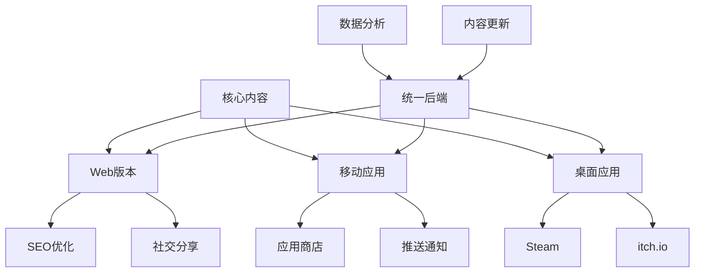
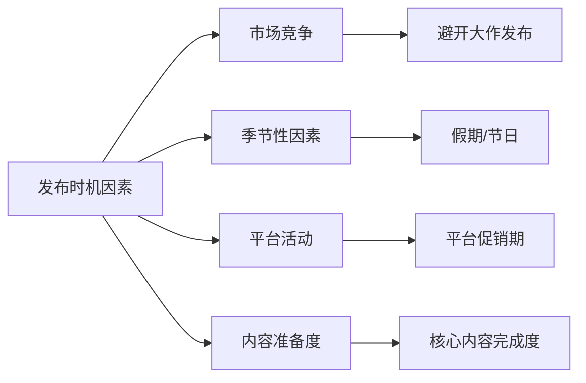
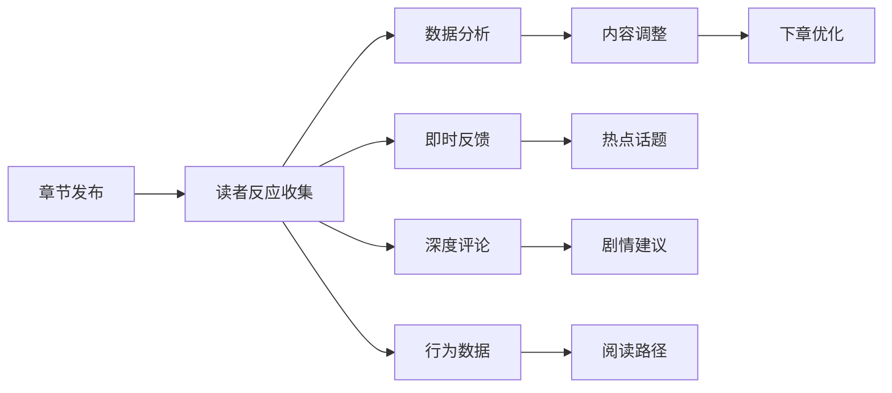
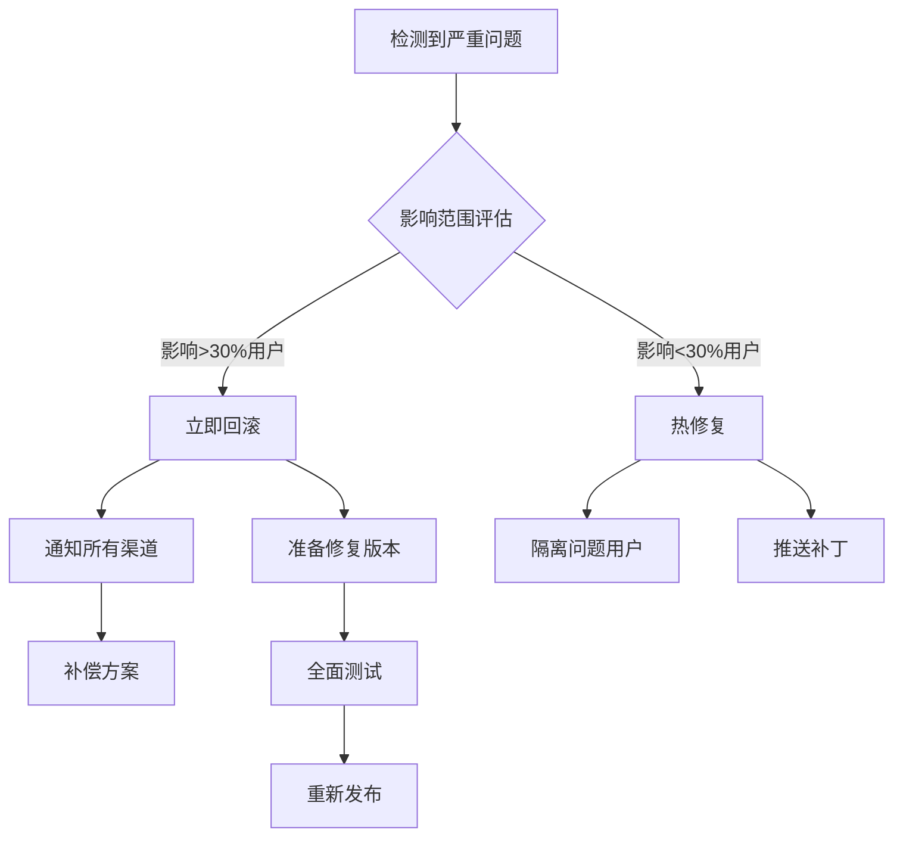
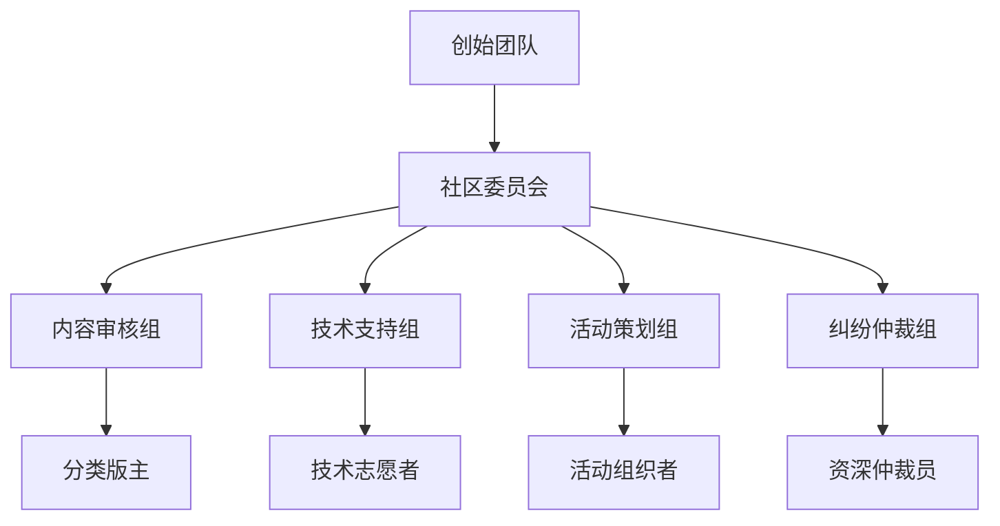

# 第8章：发布、迭代与社区
*让你的作品活起来*

> "发布不是结束，而是对话的开始。" — Craig Mod

## 🎯 本章学习目标

在本章中，你将学习如何将非传统书从创作阶段推向读者，并建立持续演化的生态系统：

- **平台选择策略**：理解不同发布平台的特性，选择最适合你作品的渠道
- **迭代更新哲学**：掌握内容更新的节奏和方法，保持作品的生命力
- **社区运营艺术**：将读者转化为共创者，建立繁荣的创作社区
- **数据驱动优化**：通过分析读者行为改进作品体验
- **商业模式探索**：在创意表达和可持续发展之间找到平衡

## 📊 章节概览

```
发布策略
    ├── 平台生态系统
    │   ├── Web平台（自主性vs流量）
    │   ├── 应用商店（审核vs分发）
    │   └── 游戏平台（Steam/itch.io）
    │
    ├── 更新与版本管理
    │   ├── 季节制更新
    │   ├── 章节式发布
    │   └── 永续演化模式
    │
    └── 社区建设
        ├── 读者参与机制
        ├── UGC内容管理
        └── 社区文化培育
```

---

## 8.1 平台策略：选择你的战场

### 8.1.1 Web平台：自由与责任

Web仍然是非传统书最灵活的发布平台。没有审核限制，完全掌控更新节奏，但也意味着你需要自己解决所有技术和推广问题。

#### 自建网站的优势与挑战

**优势：**
- 完全的创意控制
- 即时更新能力
- 无平台抽成
- SEO可控性
- 数据完全掌握

**挑战：**
- 技术维护成本
- 流量获取困难
- 安全责任
- 性能优化
- 跨设备适配

#### 技术架构选择

```yaml
静态生成（SSG）:
  优点: 
    - 性能极佳（TTFB < 100ms）
    - 易于CDN分发（全球访问延迟低）
    - 安全性高（无服务端漏洞）
    - 托管成本极低（可用GitHub Pages）
  缺点:
    - 动态内容受限
    - 重建时间随内容增长（1000页约需5分钟）
    - 实时交互需要额外服务
  适用: 
    - 内容相对稳定的作品
    - 《17776》类型的滚动叙事
    - 文档类知识库项目
  技术栈推荐:
    - Gatsby + MDX（React生态）
    - Hugo + Shortcodes（极速构建）
    - 11ty + Nunjucks（灵活轻量）

服务端渲染（SSR）:
  优点:
    - SEO友好（爬虫可见全部内容）
    - 动态内容支持（个性化推荐）
    - 首屏加载快（无需等待JS）
    - 数据实时性强
  缺点:
    - 服务器成本（月均$20-500）
    - 复杂度较高（需要运维）
    - 扩展性挑战（高并发处理）
  适用:
    - 需要个性化内容的作品
    - 多用户协作平台
    - 社交功能丰富的项目
  技术栈推荐:
    - Next.js + Vercel（开发友好）
    - Nuxt.js + Netlify（Vue生态）
    - SvelteKit + Cloudflare（性能优先）

客户端应用（SPA）:
  优点:
    - 丰富的交互体验（流畅动画）
    - 离线能力（PWA支持）
    - 原生应用体验（无刷新）
    - 状态管理灵活
  缺点:
    - SEO挑战（需要预渲染）
    - 首次加载慢（Bundle size）
    - 浏览器兼容性（IE困扰）
  适用:
    - 游戏化程度高的作品
    - 复杂状态管理需求
    - 重交互轻内容项目
  技术栈推荐:
    - React + Redux（成熟生态）
    - Vue3 + Pinia（渐进式）
    - Solid.js（高性能）

混合方案（Hybrid）:
  优点:
    - 兼具SEO和交互性
    - 渐进式增强
    - 灵活的渲染策略
  缺点:
    - 架构复杂度高
    - 开发成本增加
  适用:
    - 大型综合项目
    - 渐进式迁移需求
  技术栈推荐:
    - Astro（多框架混合）
    - Remix（全栈React）
    - Qwik（可恢复性）
```

#### 性能优化策略

针对非传统书的特殊需求，性能优化至关重要：

```javascript
// 1. 渐进式加载策略
class ProgressiveLoader {
  constructor() {
    this.loadedChapters = new Set();
    this.preloadQueue = [];
  }
  
  // 智能预加载：根据阅读速度和方向预测
  predictNextContent(currentChapter, readingSpeed) {
    const predictions = [];
    
    // 预测下一章
    predictions.push(currentChapter + 1);
    
    // 快速阅读者多预加载
    if (readingSpeed > FAST_READER_THRESHOLD) {
      predictions.push(currentChapter + 2);
    }
    
    // 分支选择的可能路径
    const branches = this.getBranchesFrom(currentChapter);
    predictions.push(...branches.slice(0, 2));
    
    return predictions;
  }
  
  // 内容优先级加载
  async loadWithPriority(chapter) {
    // 文本最优先
    await this.loadText(chapter);
    
    // 关键图片次优先
    await this.loadCriticalImages(chapter);
    
    // 其他资源延迟加载
    requestIdleCallback(() => {
      this.loadSecondaryAssets(chapter);
    });
  }
}

// 2. 图片优化策略
const imageOptimization = {
  // 响应式图片配置
  generateSrcSet: (imagePath) => {
    const sizes = [320, 640, 1024, 1920];
    return sizes.map(size => 
      `${imagePath}?w=${size} ${size}w`
    ).join(', ');
  },
  
  // 延迟加载with占位符
  lazyLoadConfig: {
    rootMargin: '50px 0px',
    threshold: 0.01,
    placeholder: 'blur', // 模糊占位符
  },
  
  // WebP自动转换
  modernFormats: ['webp', 'avif'],
};

// 3. 缓存策略
const cacheStrategy = {
  // Service Worker缓存配置
  cacheRules: [
    {
      urlPattern: /^https:\/\/api\.*/,
      handler: 'NetworkFirst',
      options: {
        cacheName: 'api-cache',
        expiration: {
          maxEntries: 50,
          maxAgeSeconds: 5 * 60, // 5分钟
        },
      },
    },
    {
      urlPattern: /\.(png|jpg|webp|avif)$/,
      handler: 'CacheFirst',
      options: {
        cacheName: 'image-cache',
        expiration: {
          maxEntries: 200,
          maxAgeSeconds: 30 * 24 * 60 * 60, // 30天
        },
      },
    },
  ],
};
```

#### 推广渠道矩阵

1. **搜索引擎优化（SEO）**
   
   ```html
   <!-- 结构化数据标记示例 -->
   <script type="application/ld+json">
   {
     "@context": "https://schema.org",
     "@type": "Book",
     "name": "量子叙事：多重现实的探索",
     "author": {
       "@type": "Person",
       "name": "张明"
     },
     "genre": "Interactive Fiction",
     "interactionStatistic": {
       "@type": "InteractionCounter",
       "interactionType": "https://schema.org/ReadAction",
       "userInteractionCount": 150000
     }
   }
   </script>
   ```
   
   - **技术SEO清单**：
     - 页面加载速度 < 3秒
     - Core Web Vitals 全绿
     - 移动适配得分 > 95
     - 结构化数据实施
     - XML站点地图更新
     - robots.txt 优化
   
   - **内容SEO策略**：
     - 长尾关键词布局
     - 主题集群构建
     - 内部链接网络
     - 更新频率信号

2. **社交媒体策略**
   
   ```javascript
   // 社交分享优化配置
   const socialShareConfig = {
     // 动态生成分享卡片
     generateShareCard: (chapter, selection) => {
       return {
         title: `${chapter.title} - 精彩片段`,
         description: selection.text.substring(0, 100) + '...',
         image: generateQuoteImage(selection),
         tags: ['#非传统书', '#互动叙事', `#${book.title}`]
       };
     },
     
     // 平台特定优化
     platforms: {
       twitter: {
         cardType: 'summary_large_image',
         maxLength: 280,
         threading: true // 自动分段长内容
       },
       weibo: {
         maxLength: 2000,
         topicTags: true,
         superTopic: '非传统书创作'
       },
       instagram: {
         storyTemplates: true,
         carouselPosts: true,
         reelsIntegration: true
       }
     }
   };
   ```
   
   - **病毒传播机制设计**：
     - 成就分享系统
     - 剧情选择投票
     - 个性化结局卡片
     - 社交挑战活动

3. **内容平台联动**
   
   ```yaml
   内容矩阵策略:
     知乎/Medium:
       内容类型: 深度解析文章
       发布频率: 每周1-2篇
       目的: 建立专业形象，SEO引流
       示例主题:
         - "如何设计非线性叙事的分支结构"
         - "从程序员视角看互动小说架构"
     
     YouTube/B站:
       内容类型: 
         - 开发日志视频
         - 玩家反应集锦
         - 技术教程
       发布频率: 双周更新
       目的: 视觉展示，社区互动
     
     Podcast/播客:
       内容类型: 创作者访谈
       发布频率: 月度节目
       目的: 深度交流，行业影响力
     
     Newsletter/邮件通讯:
       内容类型: 
         - 独家预览
         - 幕后故事
         - 社区精选
       发布频率: 双周刊
       目的: 核心用户维护
   ```

4. **社区营销策略**
   
   ```python
   class CommunityMarketing:
       def __init__(self):
           self.platforms = {
               'reddit': {
                   'subreddits': [
                       'r/interactivefiction',
                       'r/gamedev',
                       'r/worldbuilding'
                   ],
                   'approach': 'value_first',  # 先贡献价值
                   'frequency': 'weekly'
               },
               'discord': {
                   'servers': ['IF社区', '独立游戏开发者'],
                   'activities': ['每周创作分享', 'AMA活动']
               },
               'forums': {
                   'targets': ['触乐', '机核', 'IndieDB'],
                   'content': '开发日志和技术分享'
               }
           }
       
       def community_engagement_plan(self):
           return {
               'phase1': '潜伏学习，了解社区文化',
               'phase2': '价值贡献，分享有用内容',
               'phase3': '适度推广，征求反馈',
               'phase4': '深度互动，co-creation'
           }
   ```

5. **KOL与评测策略**
   
   - **评测者名单建立**：
     - 游戏媒体记者
     - YouTube/B站UP主
     - 知名玩家/读者
     - 行业专家学者
   
   - **评测包准备**：
     - 新闻稿资料
     - 高清截图/视频
     - 独家访问权限
     - 创作者采访机会

### 8.1.2 应用商店：规范化的力量

iOS App Store和Google Play提供了巨大的用户基础，但也带来了严格的审核和分成机制。

#### 审核准备清单

- [ ] 内容分级准确标注
- [ ] 无版权争议素材
- [ ] 隐私政策完备
- [ ] 应用内购买合规
- [ ] 儿童保护措施
- [ ] 无恶意代码
- [ ] 界面符合平台规范
- [ ] 本地化质量达标

#### 商业模式设计

```yaml
付费下载模式:
  优点: 
    - 收入前置，现金流清晰
    - 用户质量高，减少恶意行为
    - 无需持续运营成本
  缺点: 
    - 获客成本高（CPI $2-5）
    - 试用门槛阻碍传播
    - 退款率需要控制
  定价策略:
    - 入门作品: $0.99-2.99
    - 标准作品: $3.99-6.99
    - 精品作品: $9.99-14.99
  成功案例: 
    - Device 6 ($3.99)
    - 80 Days ($4.99)
  
免费增值模式:
  优点: 
    - 用户基数大（下载量10x）
    - 转化灵活，多样化变现
    - 病毒传播潜力高
  缺点: 
    - 变现率低（2-5%）
    - 平衡设计复杂
    - 可能引起付费争议
  变现点设计:
    内容解锁:
      - 额外章节/结局
      - 支线故事
      - 角色视角
    功能增强:
      - 去除广告
      - 云存档
      - 高级自定义
    虚拟商品:
      - 提示道具
      - 装饰物品
      - 加速道具

订阅模式:
  优点: 
    - 持续收入（LTV提升3x）
    - 用户粘性强
    - 预测性好
  缺点: 
    - 内容更新压力大
    - 退订率需要管理（月均5-10%）
    - 初期收入低
  订阅层级:
    基础版 ($2.99/月):
      - 主线内容访问
      - 基础云存档
    高级版 ($4.99/月):
      - 全部内容解锁
      - 优先体验新内容
      - 社区特权
    创作者版 ($9.99/月):
      - 创作工具使用
      - 收益分成参与
      - 专属社区

广告模式:
  优点: 
    - 用户完全免费
    - 规模效应明显
    - 适合休闲内容
  缺点: 
    - 体验可能受损
    - 收入不稳定（eCPM波动）
    - 需要大量用户
  广告类型优化:
    - 奖励视频广告（完成章节后可选）
    - 原生广告（融入叙事）
    - 品牌合作（定制内容）
  收入预估:
    - eCPM: $5-15（视地区）
    - 日活跃用户价值: $0.02-0.05
    - 需要10万+DAU才能盈利

混合模式案例:
  Choices（故事游戏）:
    - 基础: 免费+广告
    - 钻石: 应用内购买
    - VIP: 订阅去广告+奖励
    - 月收入: $5M+
  
  Episode（互动剧集）:
    - 免费阅读+等待时间
    - 付费加速（通行证）
    - 付费选项（钻石）
    - 创作者分成计划
```

#### 应用内购买优化

```javascript
// IAP优化策略实现
class IAPOptimization {
  constructor() {
    this.pricingTiers = {
      'micro': [0.99, 1.99, 2.99],      // 冲动消费
      'standard': [4.99, 9.99, 14.99],   // 价值购买
      'premium': [19.99, 49.99, 99.99]   // 大额支持
    };
  }
  
  // 动态定价策略
  getDynamicPrice(user) {
    const factors = {
      region: this.getRegionalMultiplier(user.country),
      behavior: this.getUserValueScore(user.history),
      timing: this.getTimingMultiplier(user.lastPurchase)
    };
    
    return this.basePrice * factors.region * factors.behavior * factors.timing;
  }
  
  // 首充优惠设计
  getFirstPurchaseOffer(user) {
    if (!user.hasPurchased) {
      return {
        discount: 0.5,  // 50%折扣
        bonusContent: 'exclusive_chapter',
        limitTime: 72   // 72小时限时
      };
    }
  }
  
  // 购买转化漏斗优化
  optimizePurchaseFunnel() {
    return {
      awareness: '在关键剧情点展示付费内容价值',
      interest: '提供内容预览和用户评价',
      desire: '限时优惠和独家内容',
      action: '简化支付流程，一键购买'
    };
  }
}
```

#### ASO（应用商店优化）策略

1. **标题优化**
   ```
   公式：品牌名 + 核心关键词 + 独特卖点
   示例：
   - "墨水迷宫：AI驱动的无限故事生成器"
   - "时间编织者 - 改变历史的互动小说"
   - "梦境日志：每晚不同的超现实冒险"
   
   字符限制：
   - iOS: 30字符
   - Android: 50字符
   ```

2. **描述撰写技巧**
   ```markdown
   # 黄金前三行模板
   第一行：一句话说明这是什么 + 核心亮点
   第二行：独特价值主张（为什么与众不同）
   第三行：社会证明（奖项/用户数/评分）
   
   # 描述结构
   【开篇勾子】用问题或场景吸引注意力
   "如果每个选择都能改变故事的结局..."
   
   【核心特性】用列表展示3-5个关键功能
   ✦ AI生成的独特剧情，永不重复
   ✦ 多线程叙事，上百种结局
   ✦ 社区共创，读者变作者
   
   【用户评价】精选1-2条好评
   "从未见过如此创新的阅读体验！" - 资深读者小明
   
   【行动召唤】明确告诉用户下一步
   立即下载，开启你的专属故事！
   ```

3. **视觉设计系统**
   
   ```javascript
   // 应用图标设计原则
   const iconDesignPrinciples = {
     simplicity: '2-3个核心元素',
     scalability: '16px到1024px都清晰',
     uniqueness: '5米测试 - 远看能识别',
     consistency: '与品牌视觉语言统一',
     
     colorStrategy: {
       primary: '主品牌色',
       contrast: '高对比度确保可见性',
       meaning: '颜色传达产品情感'
     }
   };
   
   // 截图叙事策略
   const screenshotNarrative = {
     shot1: '展示核心玩法',
     shot2: '突出独特功能',
     shot3: '展现视觉风格',
     shot4: '社交/社区元素',
     shot5: '成就/进度系统',
     
     designTips: {
       captions: '每张图配简短说明文字',
       device: '使用最新设备框架',
       localization: '本地化文字和内容'
     }
   };
   ```

4. **评分管理系统**
   
   ```python
   class RatingManagement:
       def __init__(self):
           self.target_rating = 4.5
           self.response_time = 24  # 小时
           
       def smart_review_prompt(self, user):
           """智能评价引导"""
           triggers = {
               'completed_chapter': 3,
               'achievement_unlocked': True,
               'session_length': 30,  # 分钟
               'positive_events': 5
           }
           
           if self.should_prompt(user, triggers):
               return self.show_rating_dialog(user)
               
       def review_response_template(self, rating):
           """评价回复模板"""
           templates = {
               5: "感谢您的五星好评！很高兴您喜欢{feature}。",
               4: "感谢反馈！我们会继续改进{issue}。",
               3: "感谢您的建议。能否详细说明{problem}？",
               2: "抱歉没有达到期望。我们已经在处理{issue}。",
               1: "非常抱歉！请联系support@解决您的问题。"
           }
           return templates[rating]
   ```

5. **更新说明营销化**
   
   ```yaml
   更新说明模板:
     版本号: "2.5.0 赛博之春"
     
     开场白: |
       "数字花朵在代码中绽放..."
       
     新功能:
       - 🌸 春季限定故事线：《电子樱花》
       - 🤖 AI同伴系统：你的专属故事引导者
       - 📱 全新UI：赛博朋克美学升级
       
     优化:
       - ⚡ 加载速度提升200%
       - 🔋 电池续航优化
       - 🌍 新增5种语言支持
       
     修复:
       - 修复了月圆之夜会出现的神秘bug
       - 解决了第七章的时间悖论
       
     彩蛋:
       "在设置中输入↑↑↓↓←→←→BA解锁神秘内容"
   ```

#### A/B测试策略

```javascript
// 应用商店A/B测试框架
class AppStoreABTesting {
  constructor() {
    this.experiments = {
      icon: {
        variants: ['minimalist', 'illustrated', 'typographic'],
        metric: 'conversion_rate',
        duration: 7 // 天
      },
      
      screenshots: {
        variants: ['feature_focused', 'story_focused', 'social_proof'],
        metric: 'install_rate',
        duration: 14
      },
      
      description: {
        variants: ['emotional', 'functional', 'social'],
        metric: 'read_more_rate',
        duration: 7
      }
    };
  }
  
  runExperiment(element) {
    // Google Play Console实验配置
    const config = {
      traffic_split: 0.5,
      min_sample_size: 1000,
      confidence_level: 0.95
    };
    
    return this.trackResults(element, config);
  }
}
```

### 8.1.3 游戏平台：社区的力量

Steam、itch.io、Epic Games Store等平台拥有成熟的玩家社区，特别适合游戏化程度高的非传统书。

#### Steam发布策略

**准备阶段：**
1. Steam Direct费用（$100）
2. 税务信息准备
3. 年龄分级评定
4. 本地化要求（至少英文）

**商店页面优化：**
- 引人入胜的预告片（前15秒关键）
- 10张展示核心特色的截图
- 详细的"关于这款游戏"描述
- 清晰的系统需求说明
- 合理的标签选择（最多15个）

**社区功能利用：**
- Steam创意工坊（UGC内容）
- 社区中心（讨论和指南）
- 实时更新推送
- 成就系统设计
- 交易卡片系统

#### itch.io的独立精神

itch.io为实验性作品提供了更自由的空间：

- **灵活定价**：支持"付费自定"模式
- **即时发布**：无需审核等待
- **社区友好**：创作者之间互相支持
- **实验包容**：适合非常规作品

### 8.1.4 跨平台发布策略



#### 版本差异化策略

不同平台的版本不应只是简单移植，而要充分利用各平台特性：

**Web版本特色：**
- 免费试读章节
- 社交媒体集成
- SEO友好URL
- 轻量快速加载
- 无需安装的即时体验
- 跨设备书签同步
- 评论系统集成
- 网页分析工具集成

**移动版本特色：**
- 离线阅读能力
- 推送通知更新
- 触摸手势优化
- 竖屏阅读模式
- 本地存储管理
- 深色模式自适应
- 系统级分享功能
- 生物识别锁定私密内容

**桌面版本特色：**
- 完整功能体验
- 模组支持
- 批量内容管理
- 专业创作工具
- 多窗口操作
- 键盘快捷键系统
- 本地备份导出
- 高级数据分析

#### 平台适配决策树

```python
def choose_platforms(project_analysis):
    platforms = []
    
    # 核心受众分析
    if project_analysis.audience_age < 25:
        platforms.append("mobile_first")  # 年轻用户优先移动
    elif project_analysis.audience_tech_savvy > 0.7:
        platforms.append("web_first")     # 技术用户偏好Web
    
    # 内容特性分析
    if project_analysis.interactivity > 0.8:
        platforms.append("desktop")       # 高交互需要大屏
    if project_analysis.update_frequency == "daily":
        platforms.append("web")           # 频繁更新适合Web
    
    # 商业模式分析
    if project_analysis.monetization == "premium":
        platforms.extend(["ios", "steam"])  # 付费意愿高的平台
    elif project_analysis.monetization == "ads":
        platforms.extend(["android", "web"])  # 广告友好平台
    
    return optimize_platform_mix(platforms)
```

#### 跨平台数据同步架构

实现无缝的跨平台体验需要精心设计的同步机制：

```yaml
同步策略:
  conflict_resolution:
    - 时间戳优先原则
    - 设备优先级设置
    - 手动冲突解决
  
  sync_items:
    进度数据:
      - 当前章节位置
      - 阅读历史
      - 书签收藏
    
    用户生成:
      - 笔记批注
      - 自定义选择
      - 成就解锁
    
    设置偏好:
      - 界面主题
      - 字体大小
      - 阅读速度
  
  sync_frequency:
    实时: 关键进度点
    定期: 每5分钟
    手动: 用户触发
```

### 8.1.5 发布时机与市场策略

#### 发布时机选择



**最佳发布窗口分析：**

1. **避开竞争高峰**
   - 3A游戏发布季（10-11月）
   - 重要文学奖公布期
   - 同类型爆款作品热度期

2. **利用季节优势**
   - 暑假：学生群体充裕时间
   - 圣诞季：礼物购买需求
   - 春节：休闲娱乐高峰

3. **平台活动联动**
   - Steam夏季/冬季特卖
   - App Store编辑推荐周期
   - 独立游戏节展示机会

#### 软发布策略

```python
class SoftLaunchStrategy:
    def __init__(self):
        self.phases = {
            "alpha": {
                "audience": "核心粉丝群",
                "size": 100,
                "duration": "2周",
                "focus": "核心玩法验证"
            },
            "beta": {
                "audience": "早期支持者",
                "size": 1000,
                "duration": "1月",
                "focus": "内容完整性测试"
            },
            "early_access": {
                "audience": "付费测试者",
                "size": 10000,
                "duration": "3月",
                "focus": "商业模式验证"
            },
            "full_release": {
                "audience": "所有用户",
                "size": "unlimited",
                "focus": "规模化增长"
            }
        }
```

#### 定价策略矩阵

```yaml
定价模型选择:
  一次性购买:
    优势: 
      - 收入可预测
      - 用户预期明确
    劣势:
      - 获客成本高
      - 更新动力不足
    建议价格区间: $4.99-$19.99
    
  订阅模式:
    优势:
      - 持续收入流
      - 降低进入门槛
    劣势:
      - 内容压力大
      - 流失率管理
    建议价格: $2.99-$9.99/月
    
  免费增值:
    优势:
      - 用户基数大
      - 病毒传播潜力
    劣势:
      - 转化率低
      - 平衡设计难
    付费点设计:
      - 额外章节解锁
      - 特殊路线开放
      - 去广告体验
      - 创作工具访问
```

---

## 8.2 更新哲学：作品的生命周期

非传统书的一大优势是可以持续更新。但如何更新、何时更新、更新什么，都需要深思熟虑的策略。

### 8.2.1 季节制更新：预期与仪式感

季节制更新借鉴了电视剧和网络游戏的成功经验，为内容更新创造期待感。

#### 季节规划框架

```
第一季：建立世界观
├── 1.1 核心机制介绍
├── 1.2 主要角色/概念登场
├── 1.3 基础交互系统
└── 1.4 第一个完整故事弧

第二季：深化与扩展
├── 2.1 新机制引入
├── 2.2 支线内容丰富
├── 2.3 社区功能开放
└── 2.4 跨媒体联动

第三季：颠覆与重构
├── 3.1 核心玩法革新
├── 3.2 多结局分支
├── 3.3 用户生成内容
└── 3.4 元叙事层面
```

#### 季节更新的心理学

**期待感营造：**
- 预告片和倒计时
- 社区猜测和讨论
- 开发日志分享
- Beta测试招募

**仪式感设计：**
- 季节主题视觉
- 限时活动内容
- 社区庆祝活动
- 回顾与展望

#### 案例研究：《Fallen London》的节日更新

Failbetter Games的《Fallen London》展示了季节性更新的艺术：

- **固定节日**：每年圣诞节、万圣节等特殊内容
- **故事季节**：每3-4个月的大型故事更新
- **月度内容**：小型故事和机制调整
- **例外惊喜**：不定期的特殊事件

### 8.2.2 章节式发布：连载的艺术

章节式发布让创作者可以根据读者反馈调整方向，同时保持稳定的内容输出。

#### 发布节奏设计

```python
# 理想的章节发布节奏模型
class ChapterRelease:
    def __init__(self):
        self.frequency = "双周"  # 平衡创作压力和读者期待
        self.buffer = 3  # 始终保持3章存稿
        self.special_events = {
            "season_finale": "加长章节",
            "anniversary": "番外内容",
            "milestone": "互动特辑"
        }
    
    def release_strategy(self, chapter_num):
        if chapter_num % 10 == 0:
            return "剧情高潮 + 社区活动"
        elif chapter_num % 5 == 0:
            return "阶段总结 + 读者调查"
        else:
            return "常规更新 + 预告下章"
```

#### 章节钩子设计

每章结尾都应该留下让读者期待下一章的元素：

1. **悬念钩子**：关键问题未解答
2. **情感钩子**：角色命运未确定
3. **机制钩子**：新系统即将解锁
4. **社交钩子**：社区讨论话题

#### 读者反馈整合



### 8.2.3 永续演化：活的作品

一些非传统书选择永不"完结"，而是持续演化。这需要不同的设计思路。

#### 内容层级系统

```
核心内容（Core）
├── 不变的基础设定
├── 核心玩法机制
└── 主线故事框架

扩展内容（Extension）
├── 支线故事
├── 额外机制
└── 世界观补充

临时内容（Temporal）
├── 限时事件
├── 节日活动
└── 社区挑战

生成内容（Generated）
├── AI生成故事
├── 程序化关卡
└── 动态事件
```

#### 版本控制策略

**语义化版本号：**
```
主版本.次版本.修订版本
  │      │        └── 错误修复，小调整
  │      └────────── 新功能，内容更新
  └────────────────── 重大改变，不兼容更新
```

**分支管理：**
- `main`：稳定发布版本
- `develop`：开发中版本
- `feature/*`：新功能分支
- `community/*`：社区贡献分支
- `experimental/*`：实验性内容

#### 数据迁移策略

当作品结构发生重大改变时，如何处理用户的进度数据：

1. **向后兼容**：新版本能读取旧数据
2. **迁移脚本**：自动转换数据格式
3. **优雅降级**：缺失功能的替代方案
4. **存档分离**：多版本存档共存

### 8.2.4 更新传播机制

#### 多渠道通知系统

```yaml
应用内通知:
  - 启动画面公告
  - 新内容标记
  - 更新日志弹窗
  - 进度条提示
  - 浮动小红点

推送通知:
  - 重要更新提醒
  - 个性化内容推荐
  - 社区活动邀请
  - 续读提醒
  - 成就解锁通知

社交媒体:
  - Twitter/微博快讯
  - Instagram/小红书视觉预览
  - Discord/QQ群详细讨论
  - Reddit/贴吧社区帖
  - TikTok/抖音短视频

邮件通讯:
  - 月度总结
  - 深度开发日志
  - 独家内容预览
  - 个性化推荐
  - 周年回顾

RSS/API:
  - 自动化更新流
  - 第三方集成
  - 开发者友好
  - Webhook支持
  - GraphQL接口
```

#### 更新节奏心理学

```python
class UpdateCadence:
    def __init__(self):
        self.patterns = {
            "predictable": {
                "frequency": "固定周期",
                "advantage": "建立用户习惯",
                "risk": "内容质量压力"
            },
            "surprise": {
                "frequency": "不定期",
                "advantage": "保持新鲜感",
                "risk": "用户流失"
            },
            "hybrid": {
                "frequency": "固定+惊喜",
                "advantage": "平衡期待与新鲜",
                "risk": "规划复杂"
            }
        }
    
    def optimal_schedule(self, content_type):
        if content_type == "story_driven":
            return "双周更新 + 月度大更新"
        elif content_type == "sandbox":
            return "月度更新 + 季度扩展包"
        elif content_type == "live_service":
            return "周更新 + 双周活动"
```

#### 更新日志的艺术

好的更新日志不只是技术文档，更是与用户的对话：

```markdown
## 版本 2.3.0 - "深海来信"
*2024年3月15日*

### 🌊 新增内容
- **深海探索**：全新的海底世界等待你的发现
  - 15个新场景，包含独特的生物发光效果
  - 水压系统：深度影响你的选择
  - 海底文明：发现失落已久的亚特兰蒂斯分支

### 🎮 玩法改进
- **选择记忆**：系统现在会记住你的偏好
  - 相似情况下提供快捷选项
  - 但小心，记忆可能会被某些事件篡改...
  
### 🐛 修复问题
- 修复了月圆之夜某些玩家会变成狼人的bug
  - 好吧，这其实是个feature，但现在可以选择关闭了
  
### 💝 社区贡献
- 感谢 @deep_reader 提供的10个新结局构思
- 感谢 @wordsmith 校对了全部文本（天哪！）

### 🔮 下次预告
潮汐将带来新的访客...准备好你的灯塔了吗？
```

#### 更新包装策略

将技术更新转化为叙事体验：

```yaml
更新主题化:
  季节主题:
    春季: "新生与觉醒"
    夏季: "冒险与探索"
    秋季: "收获与沉思"
    冬季: "终结与重生"
  
  叙事包装:
    bug修复: "时空裂缝修复"
    性能优化: "世界运转更流畅"
    新功能: "解锁新的可能性"
    平衡调整: "宇宙法则微调"

更新仪式感:
  倒计时页面:
    - 神秘预告图
    - 社区猜谜活动
    - 逐步解锁信息
  
  发布直播:
    - 开发者解说
    - 实时游玩展示
    - Q&A环节
    - 独家内容首发
```

### 8.2.5 版本回滚与灾备

#### 紧急情况处理流程



#### 版本管理最佳实践

```python
class VersionControl:
    def __init__(self):
        self.version_history = []
        self.rollback_points = []
        
    def create_checkpoint(self, version):
        """创建可回滚检查点"""
        checkpoint = {
            "version": version,
            "timestamp": datetime.now(),
            "database_snapshot": self.snapshot_db(),
            "assets_hash": self.hash_assets(),
            "config_backup": self.backup_config()
        }
        self.rollback_points.append(checkpoint)
        
    def emergency_rollback(self, target_version):
        """紧急回滚到指定版本"""
        # 1. 停止新用户进入
        self.maintenance_mode(True)
        
        # 2. 备份当前状态
        self.backup_current_state()
        
        # 3. 恢复目标版本
        checkpoint = self.find_checkpoint(target_version)
        self.restore_from_checkpoint(checkpoint)
        
        # 4. 验证恢复成功
        if self.verify_restoration():
            self.maintenance_mode(False)
            self.notify_users("版本已回滚")
        else:
            self.escalate_to_team("回滚失败，需要人工干预")
```

---

## 8.3 社区共创：从读者到贡献者

社区是非传统书的生命线。它不仅提供反馈和传播，更能成为内容创作的重要力量。

### 8.3.1 社区参与层级设计

构建一个健康的社区需要为不同参与度的用户提供合适的角色。

#### 参与金字塔模型

```
                创作者
                  /\
                 /  \
                /核心\
               /贡献者\
              /──────\
             /  活跃  \
            /  参与者  \
           /──────────\
          /   普通用户  \
         /──────────────\
        /    潜水读者    \
       /──────────────────\
```

**各层级特征与激励：**

1. **潜水读者（70%）**
   - 行为：只读不评
   - 需求：优质内容
   - 激励：无压力体验

2. **普通用户（20%）**
   - 行为：偶尔互动
   - 需求：表达机会
   - 激励：简单反馈机制

3. **活跃参与者（7%）**
   - 行为：频繁讨论
   - 需求：社交认同
   - 激励：身份标识、特权

4. **核心贡献者（2.5%）**
   - 行为：创作内容
   - 需求：创作工具
   - 激励：署名权、收益分享

5. **创作者（0.5%）**
   - 行为：主导方向
   - 需求：社区支持
   - 激励：作品成功

### 8.3.2 UGC（用户生成内容）系统设计

#### 内容贡献类型矩阵

```yaml
低门槛贡献:
  评分投票:
    实现: 五星评分、喜欢/不喜欢
    价值: 内容筛选、推荐算法
    
  标签添加:
    实现: 预设标签选择、自定义标签
    价值: 内容分类、搜索优化
    
  错误报告:
    实现: 一键报告、截图标注
    价值: 质量提升、快速修复

中等门槛贡献:
  评论讨论:
    实现: 段落评论、章节讨论
    价值: 深度反馈、社区活跃
    
  翻译本地化:
    实现: 众包翻译平台
    价值: 全球化扩展
    
  wiki编辑:
    实现: 设定资料补充
    价值: 世界观完善

高门槛贡献:
  同人创作:
    实现: 故事分支、插画音乐
    价值: 内容丰富、粉丝文化
    
  模组开发:
    实现: 脚本系统、资源替换
    价值: 玩法扩展、长尾效应
    
  官方内容:
    实现: 审核采纳、合作创作
    价值: 正史扩展、专业品质
```

#### 创作工具链

为社区创作者提供易用而强大的工具：

```javascript
// 社区编辑器配置示例
const communityEditor = {
  // 基础编辑功能
  basic: {
    richText: true,
    markdown: true,
    preview: true,
    autoSave: true
  },
  
  // 高级创作功能
  advanced: {
    variableSystem: true,     // 变量和条件
    branchingTools: true,     // 分支可视化
    assetLibrary: true,       // 素材库访问
    collaborationMode: true   // 多人协作
  },
  
  // 发布流程
  publishing: {
    draftMode: true,         // 草稿保存
    peerReview: true,        // 同行评议
    moderatorQueue: true,    // 审核队列
    versionControl: true     // 版本管理
  },
  
  // 激励机制
  rewards: {
    viewCount: true,         // 阅读统计
    userRating: true,        // 用户评分
    creatorPoints: true,     // 创作积分
    revenue_share: true      // 收益分成
  }
};
```

### 8.3.3 社区文化培育

#### 核心价值观建立

成功的社区需要清晰的价值观指引：

1. **创造性优先**：鼓励实验和创新
2. **建设性批评**：反馈应帮助改进
3. **包容性环境**：欢迎各种背景
4. **协作精神**：共同构建世界
5. **尊重原创**：保护知识产权

#### 社区仪式设计

**定期活动：**
- 创作马拉松（Game Jam形式）
- 每月主题挑战
- 创作者聚光灯访谈
- 社区投票活动
- 周年庆典

**荣誉系统：**
```
🌟 新星创作者 - 首次贡献被采纳
📚 知识守护者 - Wiki贡献超过100条
🎨 视觉大师 - 优秀插画贡献者
🏆 年度贡献者 - 年度最佳社区成员
👑 传奇创作者 - 长期核心贡献者
```

### 8.3.4 社区治理机制

#### 分布式管理结构



#### 内容审核标准

**自动过滤 + 人工审核：**

```python
class ContentModeration:
    def __init__(self):
        self.auto_filters = {
            "spam": self.check_spam,
            "offensive": self.check_offensive,
            "copyright": self.check_copyright,
            "quality": self.check_quality
        }
        
    def moderate(self, content):
        # 第一层：自动过滤
        for filter_name, filter_func in self.auto_filters.items():
            if not filter_func(content):
                return f"Failed {filter_name} check"
        
        # 第二层：社区评议
        if content.type == "major_contribution":
            return "Pending community review"
        
        # 第三层：人工终审
        if content.controversy_score > 0.7:
            return "Escalated to moderators"
        
        return "Approved"
```

#### 争议解决机制

1. **预防为主**：明确的社区准则
2. **快速响应**：24小时内初步处理
3. **公平听证**：双方陈述机会
4. **透明决策**：公开处理原则
5. **申诉渠道**：二次审查机会

### 8.3.5 社区数据分析

#### 关键指标体系

```yaml
参与度指标:
  DAU/MAU: 日活/月活用户
  平均停留时间: 用户粘性
  互动率: 评论/创作比例
  
质量指标:
  内容采纳率: UGC质量
  举报率: 社区健康度
  新用户留存: 入门友好度

增长指标:
  用户增长率: 社区扩张
  内容增长率: 创作活跃度
  传播系数: 病毒传播力

价值指标:
  ARPU: 用户平均收入
  LTV: 用户生命周期价值
  转化率: 付费转化
```

#### 数据驱动决策

基于数据洞察优化社区运营：

```javascript
// 社区健康度评分系统
function calculateCommunityHealth(metrics) {
  const weights = {
    userEngagement: 0.3,
    contentQuality: 0.25,
    userGrowth: 0.2,
    monetization: 0.15,
    moderation: 0.1
  };
  
  let healthScore = 0;
  
  // 用户参与度
  healthScore += weights.userEngagement * (
    metrics.dau_mau * 0.4 +
    metrics.avg_session_time * 0.3 +
    metrics.interaction_rate * 0.3
  );
  
  // 内容质量
  healthScore += weights.contentQuality * (
    metrics.ugc_adoption_rate * 0.5 +
    metrics.content_rating * 0.5
  );
  
  // 其他维度计算...
  
  return {
    score: healthScore,
    insights: generateInsights(metrics),
    recommendations: generateActions(healthScore)
  };
}
```

---

## 本章小结

在本章中，我们深入探讨了非传统书从创作到运营的完整生命周期：

### 核心要点回顾

1. **平台策略的多样性**
   - Web平台提供最大的创作自由度，但需要自主解决流量和技术问题
   - 应用商店带来庞大用户基础，但受限于审核机制和平台分成
   - 游戏平台拥有成熟的社区生态，特别适合互动性强的作品
   - 跨平台发布需要差异化设计，充分利用各平台特性

2. **更新哲学的艺术**
   - 季节制更新创造期待感和仪式感
   - 章节式发布保持读者粘性，允许根据反馈调整
   - 永续演化模式需要清晰的内容层级和版本管理
   - 更新不仅是技术行为，更是与用户的持续对话

3. **社区共创的力量**
   - 建立多层级参与体系，为不同用户提供合适角色
   - UGC系统设计需要平衡质量控制和创作自由
   - 社区文化需要有意识地培育和维护
   - 数据驱动的运营决策确保社区健康发展

### 关键公式与模型

1. **平台选择决策模型**
   ```
   平台适配度 = α × 目标受众匹配度 + β × 技术可行性 + γ × 商业潜力
   其中：α + β + γ = 1，根据项目特性调整权重
   ```

2. **更新频率优化公式**
   ```
   最优更新周期 = 创作时间 + 缓冲时间 + max(用户消化时间, 传播周期)
   ```

3. **社区健康度指标**
   ```
   社区健康度 = 0.3 × 参与度 + 0.25 × 内容质量 + 0.2 × 增长率 + 
                0.15 × 商业表现 + 0.1 × 治理效率
   ```

---

## 练习题

### 基础题

#### 练习8.1：平台分析练习
为一个"基于地理位置的AR互动小说"项目选择合适的发布平台组合，并说明理由。

<details>
<summary>💡 提示</summary>

考虑以下因素：
- AR功能的技术要求
- 地理位置服务的隐私问题
- 目标用户的设备类型
- 内容更新的频率需求

</details>

<details>
<summary>📝 参考答案</summary>

**推荐平台组合：**

1. **iOS优先发布**（第一阶段）
   - ARKit支持完善，用户设备性能好
   - 用户付费意愿高，适合创新应用
   - 隐私控制严格，用户信任度高

2. **Android跟进**（第二阶段）
   - ARCore覆盖更广泛用户群
   - Google Maps集成便利
   - 需要适配更多设备型号

3. **Web AR补充**（第三阶段）
   - 无需下载，降低体验门槛
   - 便于社交分享和病毒传播
   - 功能受限，作为精简版体验

**不建议的平台：**
- Steam/桌面端：缺乏移动性，违背核心玩法
- 纯Web初期发布：AR性能和功能限制太大

</details>

#### 练习8.2：更新节奏设计
为一个"AI协作写作的连载小说"设计更新策略，包括更新频率、内容规划和用户参与机制。

<details>
<summary>💡 提示</summary>

思考以下问题：
- AI生成内容的质量控制
- 读者投票影响剧情的时间窗口
- 创作者审核和编辑的时间需求
- 如何平衡AI效率和人工创意

</details>

<details>
<summary>📝 参考答案</summary>

**更新策略设计：**

1. **基础更新节奏**
   - 主线章节：每周一次，周五晚8点发布
   - AI生成支线：每周三次，根据读者选择
   - 特别篇：每月一次，深度人工创作

2. **内容生成流程**
   ```
   周一：AI根据大纲生成3个版本
   周二：编辑选择和修改
   周三：社区投票选择支线方向
   周四：最终编辑和配图
   周五：发布并收集即时反馈
   ```

3. **用户参与机制**
   - 关键决策投票（48小时窗口）
   - 角色命名权（贡献度奖励）
   - 月度剧情方向调查
   - AI提示词众包

4. **质量保障**
   - 人工编辑把关率：100%
   - AI重新生成阈值：用户评分<3.5
   - 紧急剧情修正：24小时内可调整

</details>

### 挑战题

#### 练习8.3：社区治理方案设计
设计一个去中心化的社区内容审核系统，既要保证内容质量，又要避免审查过度。

<details>
<summary>💡 提示</summary>

参考要素：
- 信誉系统设计
- 多级审核机制
- 申诉流程
- 激励机制
- 防止审核者偏见

</details>

<details>
<summary>📝 参考答案</summary>

**去中心化审核系统设计：**

1. **信誉积分体系**
   ```python
   class UserReputation:
       def __init__(self):
           self.creation_score = 0     # 创作信誉
           self.review_score = 0       # 审核信誉
           self.accuracy_rate = 1.0    # 审核准确率
           
       def calculate_voting_weight(self):
           # 投票权重与信誉成正比，但设置上限
           return min(1 + log(self.review_score), 5)
   ```

2. **三级审核流程**
   - **自动过滤**：基础违规内容
   - **社区评议**：5-7名随机审核员
   - **专家仲裁**：争议内容终审

3. **防偏见机制**
   - 审核员匿名且随机分配
   - 同一内容由多元背景审核员评估
   - 定期轮换审核员池
   - 审核决策需说明理由

4. **激励与惩罚**
   - 准确审核奖励信誉分
   - 恶意审核扣除权限
   - 优秀审核员获得徽章
   - 申诉成功返还信誉

5. **透明度保障**
   - 月度审核报告公开
   - 匿名化案例分析
   - 社区规则动态调整
   - 决策理由可查询

</details>

#### 练习8.4：危机处理预案
你的非传统书项目突然因为一个bug导致30%用户丢失进度数据，设计完整的危机处理方案。

<details>
<summary>💡 提示</summary>

考虑以下方面：
- 即时响应措施
- 用户沟通策略
- 数据恢复可能性
- 补偿方案设计
- 长期信任重建

</details>

<details>
<summary>📝 参考答案</summary>

**危机处理完整方案：**

1. **即时响应（0-2小时）**
   ```yaml
   紧急措施:
     - 立即停止问题版本推送
     - 开启维护模式防止更多损失
     - 启动紧急响应小组
     - 评估数据恢复可能性
   
   初步沟通:
     - 所有渠道发布简短说明
     - 承认问题，表达歉意
     - 承诺24小时内详细更新
     - 开设专门反馈通道
   ```

2. **短期处理（2-24小时）**
   - 技术团队全力恢复数据
   - 为受影响用户建立白名单
   - 准备多层次补偿方案
   - CEO亲自撰写道歉信

3. **补偿方案**
   ```
   数据完全恢复用户：
     - 3个月免费订阅
     - 限定纪念徽章
   
   数据部分恢复用户：
     - 6个月免费订阅
     - 专属内容解锁
     - 快速通道重玩支持
   
   数据无法恢复用户：
     - 12个月免费订阅
     - 全部付费内容解锁
     - 个性化重建协助
     - 实物周边补偿
   ```

4. **长期信任重建**
   - 公开事故调查报告
   - 实施双重备份机制
   - 月度透明度报告
   - 用户数据保险计划
   - 定期灾难演练

5. **预防措施升级**
   - 强制code review
   - 自动化测试覆盖率>90%
   - 灰度发布扩大到10%
   - 用户数据实时备份
   - 建立赏金bug计划

</details>

#### 练习8.5：商业模式创新
设计一个结合NFT和社区共创的新型商业模式，确保可持续发展同时不影响用户体验。

<details>
<summary>💡 提示</summary>

需要平衡的要素：
- NFT的稀缺性vs内容的可访问性
- 投机行为vs真实价值创造
- 早期支持者vs新用户公平性
- 去中心化vs质量控制

</details>

<details>
<summary>📝 参考答案</summary>

**NFT+社区共创商业模式：**

1. **NFT设计理念**
   - NFT代表创作权和收益权，不影响内容访问
   - 分为创世NFT（限量）和贡献NFT（动态生成）
   - NFT持有者参与内容方向投票
   - 自动分红机制，按贡献度分配

2. **价值创造机制**
   ```solidity
   contract StoryDAO {
       struct Contribution {
           address creator;
           uint256 quality_score;
           uint256 adoption_rate;
           uint256 revenue_share;
       }
       
       function calculateRewards() {
           // 30% 给原创团队
           // 40% 给NFT持有者
           // 30% 给活跃贡献者
       }
   }
   ```

3. **防投机设计**
   - NFT交易冷却期（7天）
   - 持有时长加成收益
   - 贡献度权重>持有量
   - 社区基金回购机制

4. **新用户友好**
   - 免费阅读基础内容
   - 通过贡献获得NFT
   - 租赁机制体验权益
   - 奖学金计划资助

5. **可持续发展**
   - 多元收入来源（订阅+NFT+周边）
   - 社区基金（10%收入）
   - 内容质量投票机制
   - 定期权益调整投票

6. **用户体验保障**
   - NFT功能可选参与
   - 不影响核心阅读体验
   - 简化的参与流程
   - 清晰的价值说明

</details>

---

## 常见陷阱与错误 (Gotchas)

### 1. 平台选择陷阱

**❌ 错误：** 盲目追求全平台同步发布
```
后果：资源分散，每个平台都做不好
解决：先做好一个平台，再逐步扩展
```

**❌ 错误：** 忽视平台特性强行移植
```
后果：用户体验差，差评如潮
解决：为每个平台定制优化体验
```

### 2. 更新节奏误区

**❌ 错误：** 为了保持更新频率牺牲质量
```
症状：用户流失率上升，评分下降
预防：建立内容缓冲区，保持3-5章存稿
```

**❌ 错误：** 毫无预告的突然大改
```
症状：用户愤怒，社区炸锅
预防：重大改动提前沟通，设置过渡期
```

### 3. 社区管理失误

**❌ 错误：** 过度依赖自动化审核
```
问题：误杀优质内容，放过隐性违规
方案：人机结合，定期审查规则
```

**❌ 错误：** 创作者高高在上不参与社区
```
问题：社区缺乏凝聚力，用户流失
方案：定期互动，展现真实一面
```

### 4. 技术债务累积

**❌ 错误：** 快速迭代忽视代码质量
```javascript
// 错误示例
function updateContent() {
    // TODO: 临时方案，下版本优化
    // 3个月后：这段代码没人敢动
}
```

**✅ 正确做法：**
```javascript
// 设置技术债务上限
if (technicalDebt > threshold) {
    nextSprint.priority = "refactoring";
}
```

### 5. 数据安全疏忽

**❌ 错误：** 用户数据备份不及时
```
灾难场景：服务器故障，数据全失
预防措施：实时备份 + 异地容灾
```

---

## 最佳实践检查清单

### 发布前检查清单 ✓

- [ ] **内容完整性**
  - [ ] 核心内容完成度≥80%
  - [ ] 关键路径无断点
  - [ ] 新手引导流程完整
  - [ ] 至少3个完整故事线

- [ ] **技术准备度**
  - [ ] 性能测试通过（加载时间<3秒）
  - [ ] 多设备兼容性测试
  - [ ] 数据备份机制就绪
  - [ ] 回滚方案准备完毕

- [ ] **平台合规性**
  - [ ] 年龄分级准确
  - [ ] 隐私政策更新
  - [ ] 必要的许可证
  - [ ] 支付系统测试

- [ ] **营销准备**
  - [ ] 商店页面优化
  - [ ] 首批评测者名单
  - [ ] 社交媒体预热
  - [ ] 发布日宣传计划

### 日常运营检查清单 ✓

- [ ] **内容更新**
  - [ ] 更新计划公示
  - [ ] 内容质量审查
  - [ ] 玩家反馈整合
  - [ ] 下期内容预告

- [ ] **社区健康**
  - [ ] 日活/周活监控
  - [ ] 热点话题追踪
  - [ ] 违规内容处理
  - [ ] 优质内容推广

- [ ] **技术维护**
  - [ ] 服务器性能监控
  - [ ] 错误日志分析
  - [ ] 安全漏洞扫描
  - [ ] 数据备份验证

- [ ] **商业指标**
  - [ ] 收入趋势分析
  - [ ] 用户获取成本
  - [ ] 留存率追踪
  - [ ] 付费转化优化

### 危机处理检查清单 ✓

- [ ] **快速响应**
  - [ ] 问题确认（15分钟内）
  - [ ] 影响评估（30分钟内）
  - [ ] 初步公告（1小时内）
  - [ ] 应急预案启动

- [ ] **用户沟通**
  - [ ] 多渠道同步通知
  - [ ] 进度实时更新
  - [ ] 专人答疑响应
  - [ ] 情绪安抚措施

- [ ] **问题解决**
  - [ ] 根源分析
  - [ ] 修复方案制定
  - [ ] 测试验证
  - [ ] 灰度发布

- [ ] **后续跟进**
  - [ ] 补偿方案执行
  - [ ] 事故报告发布
  - [ ] 流程改进
  - [ ] 信任重建计划

### 社区培育检查清单 ✓

- [ ] **文化建设**
  - [ ] 价值观明确传达
  - [ ] 正面行为奖励
  - [ ] 负面行为引导
  - [ ] 榜样用户树立

- [ ] **参与机制**
  - [ ] 低门槛入门任务
  - [ ] 进阶成长路径
  - [ ] 创作工具完善
  - [ ] 协作机会提供

- [ ] **激励体系**
  - [ ] 积分/等级设计
  - [ ] 荣誉系统运作
  - [ ] 实质奖励发放
  - [ ] 长期权益规划

- [ ] **治理透明**
  - [ ] 规则清晰公示
  - [ ] 决策过程公开
  - [ ] 申诉渠道畅通
  - [ ] 定期社区报告
```